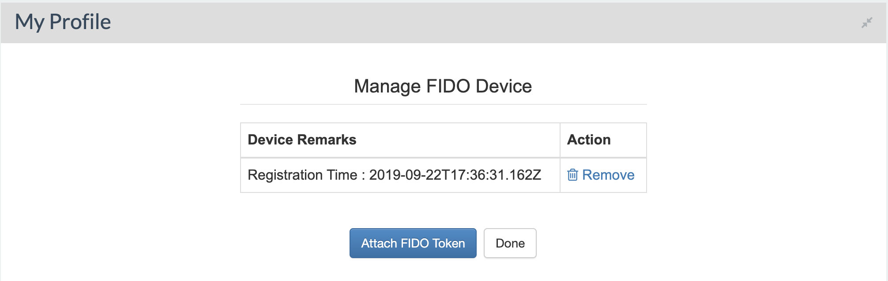
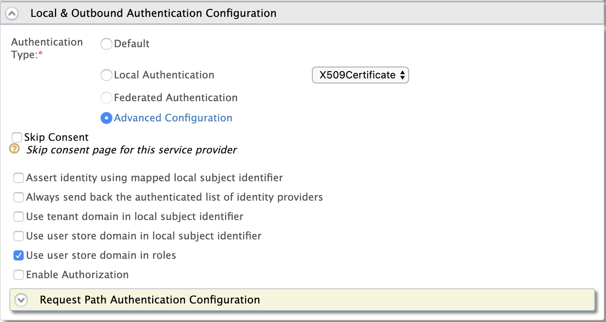
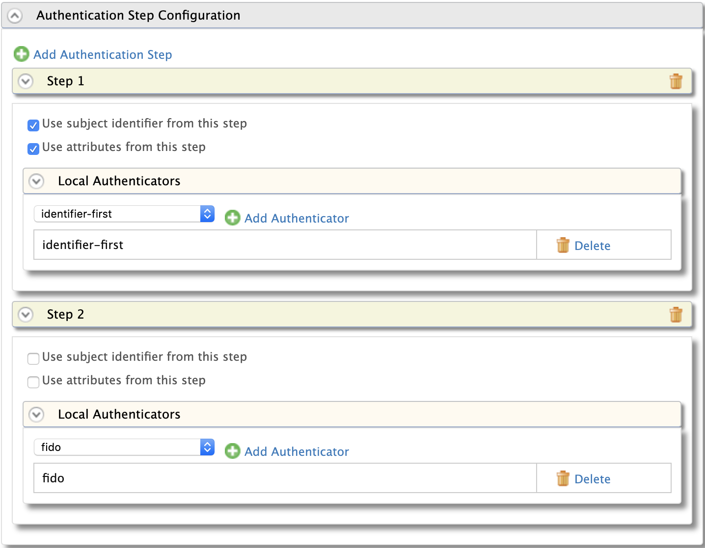

 # Configuring Passwordless Authentication
 WSO2 Identity Server supports passwordless authentication using FIDO2, which is a phishing proof, passwordless authentication protocol that is developed as a joint effort between the FIDO Alliance and the World Wide Web Consortium (W3C).
 
 Following are the three major players in FIDO2 flow
 1. FIDO2 Authenticator, e.g., Yubikey, USB Token, and smartphone
 2. Client or the browser that operates as a mediator, i.e., Relying Party (RP)
 3. WebAuthn Relying Party (WSO2 Identity Server)
 
 There are two types of workflows in FIDO2 
 1. Registration: In this flow a new key will be enrolled to your account for future use 
 2. Authentication: In this flow the registered key will be used to prove the user identity.
 ### Configuration
 #### Adding FIDO Device
 1. Sign in in to the WSO2 Identity Server end-user dashboard.
 2. Navigate to the My Profile section by clicking the associated View Details button.
 Click **Manage FIDO Devices**.
 3. To add a new FIDO device to your account, click **Attach FIDO Token**
 
 
 #### Configuring FIDO as an authenticator
 1. Sign in to the WSO2 Identity Server Management Console
 2. To add a service provider:
 a. On the Main menu, click **Manage** > **Service Providers** > **Add**.
 b. Fill in the **Service Provider Name** and provide a brief description. 
 c. Click **Register**.
 3. Access the service provider you just created and expand **Local & Outbound Authentication Configuration**.
 
 
 4. Select **Advanced Configuration** to configure multi-factor authentication.
 5. Click **Add Authentication Step** and add **Identifier first** authenticator via the **Local Authenticators** section.
 
 6. Click **Add Authentication step** and add FIDO authenticator via  the Local Authenticators section. This enables the FIDO2 passwordless authentication.
 
 
 7. Click the **Update**. Note that you will be navigated back to the previous screen with your newly configured authentication steps.
 
 
 
 
 
 
 
 
 
 
 
 
 
 
 
 
 
 
 
  
 
   