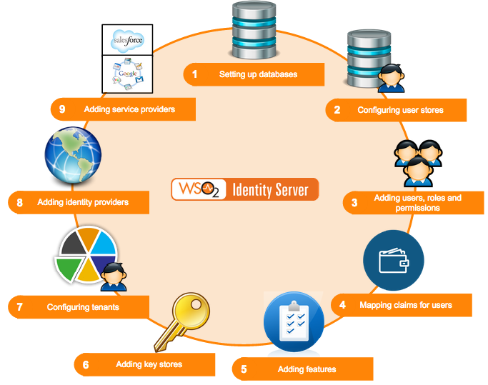

# Configuring the Identity Server

This section provides you with detailed information on how to configure
the WSO2 Identity Server from the start. The following diagram depicts
the normal flow of events you would follow.

As per the above diagram, when setting up WSO2 Identity Server, you would
configure the following in the order mentioned.

-   **[Databases](../../setup/working-with-databases)**  
    When configuring WSO2 Identity Server, the first step to do is to
    set up the databases. This includes creating the database and
    populating it with the various tables that are required. Once you
    have set up the databases, configure the datasources to point to the
    databases created. See [Setting up the Physical
    Database](../../setup/working-with-databases)
    for information on setting up the database with its tables and
    configuring the datasources.  

-   **[User stores](../../setup/configuring-the-realm)**  
    The next step is to configure user stores. These can be either
    primary or secondary user stores. Instead of using the user store
    that comes inbuilt with the product, you can configure your own user
    store with the Identity Server. See [Configuring User
    Stores](../../setup/configuring-user-stores) or information on user store
    configurations.

-   **[Users, roles and permissions](../../learn/configuring-users-roles-and-permissions)**  
    You can now add users and assign roles to the user stores. Each role
    can have specific permissions. See [Configuring Users, Roles and
    Permissions](../../learn/configuring-users-roles-and-permissions) for more
    information on working with users, roles and permissions.  
      

-   **[Claims](../../learn/claim-management)**  
    You can map a set of attributes from the underlying user store to a
    set of defined claims. See [Claim Management](../../learn/claim-management) to
    work with claim dialects and provide mapping instructions.  
      

-   **[Setting up Keystores](../../administer/using-asymmetric-encryption)**  
    Create and add a keystore to manage keys that are stored in the
    database. This is very useful in WS-Security scenarios. See [Using
    Asymmetric
    Encryption](../../administer/using-asymmetric-encryption)
    in the WSO2 Product Administration Guide for more information.  

-   **[Tenants](../../learn/creating-and-managing-tenants)**  
    Add and view tenants. This feature enables users to have a
    customized experience. See
    [Creating and Managing Tenants](../../learn/creating-and-managing-tenants)
    for more information. Also see
    [Email Templates](../../learn/customizing-automated-emails) for more
    information on customizing automated emails for users configured
    under specific tenants.

-   **[Management console](../../setup/getting-started-with-the-management-console)**  
    Once you have configured the user stores, you can configure
    various tools available to you in the [management
    console](../../setup/getting-started-with-the-management-console). See [Using
    WSO2 Identity Server](../../learn/tutorials) for information
    on working with the features in the **Main** menu.

-   **[Identity providers](../../learn/adding-and-configuring-an-identity-provider)**  
    Once everything else is configured, you can add an identity
    provider. You can link this to the user store you configured and
    also specify which protocols you wish to use to configure your IdP.
    See the [architecture](../../get-started/architecture) of the Identity Server to see
    how the identity provider configurations are used in the bigger
    picture.  
-   **[Service providers](../../learn/adding-and-configuring-a-service-provider)**  
    Finally, configure the service provider to integrate with the
    identity provider and the Identity Server. You can link this to the
    user store you configured and also specify which protocols you wish
    to use to configure your SP. See the [architecture](../../get-started/architecture)
    of the Identity Server to see how the service provider
    configurations are used in the bigger picture.  
