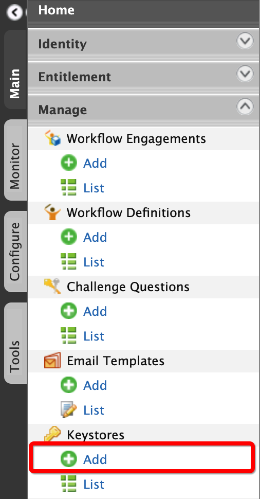
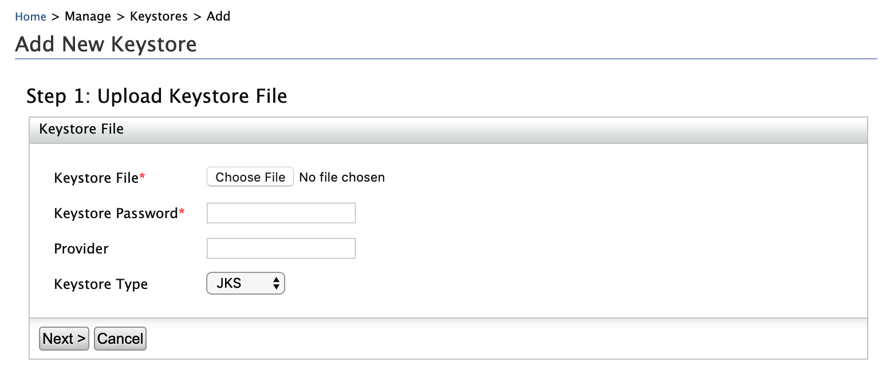

# Managing Keystores via UI

WSO2 Identity Server Management Console enables viewing keystore details such as the available certificates. To do this, you must first upload the relevant keystore via the Management Console. 
    
!!! tip "Before you begin"

    Make sure to create and store all the required keystore files in the `<IS_HOME>/repository/resources/security` directory.      

!!! info 
    -   For instructions on creating new keystore files, see [Creating New Keystores](../../administer/creating-new-keystores).
    -   For instructions updating configuration files with the keystore information, see [Configuring Keystores](../../administer/configuring-keystores-in-wso2-products).

!!! warning 
    Do not delete the default `wso2carbon.jks`.

## Uploading keystores  

Follow the instructions below to upload a keystore file to via the Management Console.

<ol>
    <li>
        
In the <b>Main</b> menu of the <a href="../../setup/getting-started-with-the-management-console/">Management Console</a>, click <b>Manage > Keystores > Add</b>.

        

        
The <b>Add Key Store</b> page appears.

        

    </li>
    <li>
        
Provide the required information:

        
            
            <ul>
                <li><b>Keystore password</b>: This is required to access the private key and provider.</li>
                <li><b>Provider</b></li>
                <li><b>Keystore Type</b>: This is to speficy type of the keystore file that you are uploading as JKS or PKCS12.
                    <ul>
                        <li><b>JKS</b>: Java Key Store (JKS) allows you to read and store key entries and certificate entries. However, the key entries can store only private keys.</li>
                        <li><b>PKCS12</b>: Public Key Cryptography Standards (PKCS12) allows you to read a keystore in this format and export the information from that keystore. However, you cannot modify the keystore. This is used to import certificates from different browsers into your Java Key store.</li>
                    </ul>
                </li>
            </ul>
        
        
    </li> 
    <li>Click <b>Next</b>.</li>
    <li>Enter the private key password.</li>
    <li>
        
Click <b>Finish</b> to add the new keystore to the list.

        

            

                
tip

                
This keystore file is now saved to the WSO2 Identity Server registry. To see the registry path:
                    <ol>
                        <li>On <b>Main</b> tab, click <b>Manage > Registry > Browse</b>.</li>
                        <li>
                            
Enter <code>/_system/governance/repository/security/key-stores/</code> in the <b>Location</b> text box and click <b>Go</b>.

                            
Note that the keystores added via the Management Console get listed out.

                        </li>
                    </ol>
                

            

        

    </li>
</ol>

## Viewing keystores 

Follow the instructions below to view the details of the keystore that you uploaded. 

<ol>
    <li>In the <b>Main</b> menu of the Management Console, click <b>Manage > Keystores > List</b>. The <b>Key Store List</b> page appears.</li>
    <li>
        
Click <b>View</b> of the corresponding keystore that you want to view. The <b>View Key Store</b> screen appears with the following information:
            <ul>
                <li>
                    

<b>Private key certificates</b>
 
                    

                </li>
                <li>
                    
<b>Available certificates</b>

                    

                </li>
            </ul> 
        
  
    </li>
    <li>Click <b>Finish</b> to get back to the <b>Keystores</b> screen.</li>
</ol>
