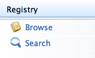

# Managing the Registry

1.  Log in to the product's management console and select Browse from
    the Registry menu that is under the Main menu.  
     
2.  The **Browse** page opens. For example,  
    
3.  Click a registry artifact from the tree view and you will be
    navigated to its detail view. For example,  
       
    It gives the following four main components:
    -   [Metadata](Metadata)
    -   [Properties](Properties)
    -   [Entries and Content](../../administer/entries-and-content)
    -   [Role Permissions](../../administer/role-permissions)
