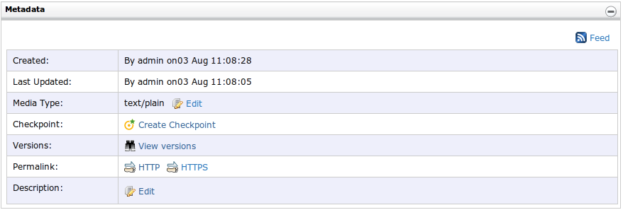
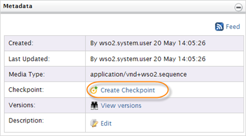

# Metadata

**The Metadata panel** allows you to manage resource metadata and
revisions using the Create Checkpoint and View Versions options. Each time you create a check
point, it is added as a new reversion of the resource. Revisions is a
useful way to facilitate Disaster Recovery and Fault Tolerance in the
registry. By creating a revision, a user essentially saves a snapshot of
the current state of a resource or collection that can be restored at a
later date. The registry's checkpoint and restoration mechanisms are
similar to that of System Restore of Microsoft Windows.

The **Metadata** panel displays the following properties of the resource
or the collection:

-   **Created** - Time the resource was created and the author of the
    resource.
-   **Last Updated** - Time the resource was updated and the author of
    the alterations.
-   **Media Type** - An associated Media type of the
    resource/collection. For more information about Media types, see
    [Adding a Resource](../../administer/adding-a-resource).
-   **Checkpoint** - Allows to create a checkpoint (URL for the
    permanent link) of a resource/collection.
-   **Versions** - Allows to view versions of a resource/collection.
-   **Permalink** - Holds the resource URL in both HTTP and HTTPS.
    (e.g.,
    `                     http://10.100.2.76:9763/registry/resource/_system/governance/trunk/services/test                   `
    )
-   **Description** - Description of the resource/collection.

For example,  

 

#### Creating a checkpoint

To create a checkpoint, click on the **Create Checkpoint** link:

#### Viewing Versions

To view the resource versions, click on the **View versions** link:

  

It opens the versions. For example,

 

This page gives the following information:  

-   The number of a resource/collection version
-   Last date of modifications and the author who did the last
    alterations
-   **Actions**  
    -   **Details** - Opens the **Browse** page of a resource/collection
        version to view its details
    -   **Restore** - Restores a selected version
    -   **Delete Version History** - Delete the version history
