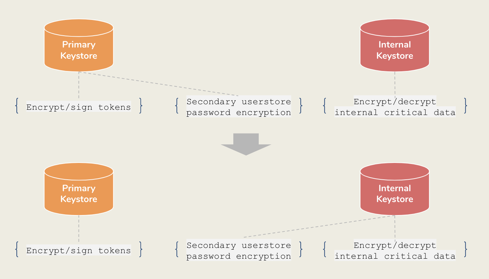

# Migrating the Secondary Userstore Password to the Internal Keystore 

WSO2 Identity Server by default has one keystore. To mitigate security incidents it is advisable to maintain multiple keystores. For example, if one keystores gets compromised, you can continue with the other keystores that are intact. Mainly, you may maintain three keystores:

-	A keystore to store tokens, which is mentioned in the `deployment.toml` file.
-	An internal keystore to store internal critical data such as encrypted passwords. 
-	A keystore for Tomcat SSL connection, which is the secondary keystore of the WSO2 Identity Server.

Ideally, the internal keystore should be used for encrypting internal critical data. However, currently, the secondary userstore passwords are encrypted using the primary keystore, which is also used to sign and encrypt tokens. Thus, it is preferable to move the secondary userstore password encryption functionality from the primary keystore to the internal keystore.



After moving the secondary userstore password encryption functionality to the internal keystore, WSO2 Identity Server secondary userstore password encryption tool allows you to decrypt all the existing secondary userstore passwords using the primary keystore and re-encrypt them using the internal keystore.

Let's get started! 

!!! note

	-	If you are using an NFS-like file system, make sure to isolate the newly-downloaded binary from others.
	-	The secondary userstore password encryption tool is a one-time tool. Do not use the WSO2 Identity Server pack that contains this tool in production.

## Set up

1.	To add the details about the primary keystore and internal keystore, add the following configurations to the `deployment.toml` file in the `<IS_HOME>/repository/conf` directory.

	```
	[keystore]
	userstore_password_encryption="InternalKeyStore"
	```

2. Copy the following files and directories from your existing WSO2 Identity Server pack to the respective directories of the newly-downloaded pack.

    <div class="tg-wrap"><table>
    <tr>
        <th>File/Directory</th>
        <th>Purpose</th>
    </tr>
    <tr>
        <td>The `/repository/tenants` directory.</td>
        <td>This contains the tenant's secondary userstore configurations.</td>
    </tr>
    <tr>
        <td>The `/repository/deployment/server/userstores` directory.</td>
        <td>This contains the super tenant secondary userstore configurations.</td>
    </tr>
    <tr>
        <td>The keystore in the `/repository/resources/security` directory.</td>
        <td>This is the primary keystore.</td>
    </tr>
    <tr>
        <td>The internal keystore in the `/repository/security` directory.</td>
        <td>This is the internal keystore.</td>
    </tr>
    </table></div>

3. If you are using a cipher tool, copy the following files in the `<IS_HOME>/repository/conf/security` directory in your existing WSO2 Identity Server pack to the respective directory of the newly-downloaded pack.

    -	`cipher-tool.properties`
    -	`cipher-text.properties`
    -	`secret-conf.properties`

4. Open the `secret-conf.properties` file in an editor and replace the `keystore.identity.location` element value with the directory path of the current internal keystore.

## Re-encrypt the secondary userstore passwords

Follow the steps below to re-encrypt the secondary userstore passwords:

1. Download the password encryption tool from [here](http://maven.wso2.org/nexus/content/groups/wso2-public/org/wso2/carbon/identity/tools/org.wso2.is.password.reencrypt/1.0.1/org.wso2.is.password.reencrypt-1.0.1.jar) and copy the `.jar` into the `<IS_HOME>/repository/components/dropins` directory.

2. To start the modified WSO2 Identity Server pack: 

    1. Navigate to the directory where the modified WSO2 Identity Server pack is located in a command prompt.

    2. Execute the following command. 

    ```
    sh wso2server.sh -DreEncryptSecondaryUserStorePassword
    ```

3. Observer the logs in the `wso2carbon.log` file in the `<IS_HOME>/repository/logs` directory to monitor the re-encryption of the secondary userstore passwords.

    1. The following appears when the `.jar` file is being read by the server. 

    ```
    "secondary userstore password re-encryption component activated"
    ```

    2. The following appears when the migration starts. 

    ```
    "secondary userstore password re-encryption started"
    ```

    3. The following appears when the migration ends. 

    ```
     "secondary userstore password re-encryption ended"
    ```

4. Once the process ends, stop the WSO2 Identity Server.

## Copy the userstore to the existing WSO2 Identity Server pack

To copy the user store to the existing WSO2 Identity Server pack, copy the following directories in the modified WSO2 Identity Server pack into the respective directories of the original pack. 

!!! warning
    -	As a precautionary measure, take a backup of the existing userstore.
    -	During the directory copying process, the userstores may get unavailable for a few seconds.


| Directory                                                | Purpose                                                             |
|----------------------------------------------------------|---------------------------------------------------------------------|
| The `/repository/tenants` directory                      | This contains the tenant's secondary user store configurations.     |
| The `/repository/deployment/server/userstores` directory | This contains the super tenant secondary user store configurations. |

