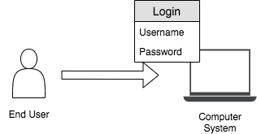

# Introduction to Authentication

### User Identity
The way in which a user can be uniquely identified is called ‘User
Identity’. A user’s identity can differ based on the platform and the use
case. Considering the digital world a single user can have different identifying attributes
such as user name, user ID, biometric information, etc.

### Authentication
Simply, **Authentication** is validating the user’s identity. During the user
on-boarding process, the user’s identity is shared and stored
with the system. When a user needs to access the system later, the
system checks and verifies whether it is really the particular user who
is trying to access the system by using that shared identity. Several
factors for authentication can be applied based on the security level
of the server or based on what the system needs to achieve.

There are two types of authentication. 

- Single Factor Authentication 
- Two Factor Authentication
- Multi-Factor Authentication

    
#### Single Factor Authentication
This is a process for securing access to a given system to identify the party requesting access through only one 
category of credentials. Any type of credential can be used for this even though the most typical and popular example of
this is a password (credential) to a username. As this approach requires a single credential, if that credential is 
exposed to the public, anybody can access the system. Therefore, considering the other two authentication mechanisms, this method is less secure.

#### Two Factor Authentication
This authentication requires a two-step verification process. Therefore, the party requesting the access should use two 
credentials. These credentials can be something the user knows (answer to a challenge question), something the user owns (SMS OTP), 
etc. This method is stronger than single-factor authentication but weaker than multi-factor authentication.

#### Multi-Factor Authentication
This method utilizes factors that are independent of each other such as something you know, something you have, and 
something you are, in order to eliminate any data exposure. For example, a system that is secured using multi-factor 
authentication (MFA) can use three verification steps such as username-password credentials, SMS OTP, and fingerprint to authenticate
a user to the system.

