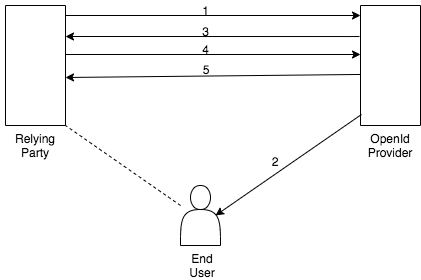

# Introduction to OpenID Connect

### What is OpenID Connect?
OpenID Connect (OIDC) is an authentication protocol that builds on top of the OAuth 2.0 protocol. It is not a replacement to OAuth2.0, 
but an extension that clients can request by including the 'openid' scope value in the Authorization Request. 
This protocol verifies user identity by authenticating the end user against the Authorization Server.

!!! info "WSO2 Identity Server is Open ID Certified !!!"
    The Open ID foundation holds a certification program and grants an Open ID Connect certificate for Open ID Providers who 
    conform to OIDC Profiles. WSO2 Identity Server is Open ID certified for the following profiles. 
    
      - Basic OP
      - Impicit OP
      - Hybrid OP
      - Form Post OP

----

### Why OpenID Connect?
When logging in to an online system, the user should be able to prove his identity to the system. 
A single user can have multiple identities (e.g., passport number, NIC number, fingerprint) and proving their identity to a system
can be done using credentials, biometric information, or any other mechanism. OpenID Connect provides a 
trustworthy, simple, and effective mechanism for individuals to identify themselves to many application and service 
providers using one or more of their identities stored at a trusted identity provider (IdP).

OIDC provides a single login to multiple sites through an Identity Provider. It provides secure access to a client or an
application without the user sharing the credentials of the application by exchanging tokens. Apart from that, the clients
receive user identity related details in the format of jwt, which is very easy to process and maintain. Although this 
protocol is faily simple, it has more features that match the enterprise demand supporting a wider variety of client types such as 
web, mobile, desktop, and JavaScript clients.
 
In simple terms, OIDC is a solution and a single platform that performs both authentication and authorization.

----

### When to choose OIDC for which application?
OIDC represents three flows of authentication:

  - Authorization code flow
  - Impicit flow
  - Hybrid flow

The different flows target different types of application clients.

| Flow                 | Usage         | 
| --------------------- | ------------- | 
| Authorization code flow | Mostly used by web and mobile applications when the clients can use typical ways to authenticate. (e.g., providing user credentials)  |                            
| Implicit Flow           | Specially consumed by mobile applications or the client side JavaScript applications that run in the browser where embedded credentials could be compromised. In this case, the client should not be authenticated and tokens should be retrieved via the front channel.  |                              
| Hybrid Flow             | Front-end and back-end applications use this flow to receive tokens independently (when a client application wants an immediate use of user details which can be obtained through an ID token), while the exchange of the authorization code and the access token happens.  | 

----

### How does it work?

The exact flow differs based on the authentication flow or the grant type.  However, OIDC in general allows web applications to authenticate users with an external server (i.e., OpenID Connect Provider - OP). Usually, the user information is picked from an external Identity Provider or sometimes the Identity Provider (IDP) may act as the OP as well. In this OIDC flow, all communication takes place via tokens.

The following steps explain how this protocol works in a simple manner.

  
  
Once a user attempts to access an application and initiates the flow: 
  
1. The client sends a request to the OP.
2. The OP authenticates the user and obtains the authorization.
3. The OP responds with an ID token and an access token.
4. The client application (Relying Party - RP) sends a request using the access token to obtain user information.
5. The user information returns claims.

