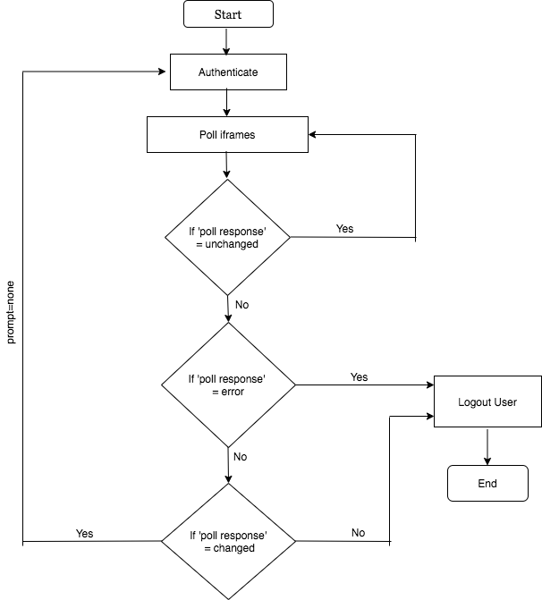

# OpenID Connect Session Management - staging

[The OpenID Connect Session Management specification](https://openid.net/specs/openid-connect-session-1_0.html)
defines methodologies to manage user sessions and log-out end-users at the authorization server using front-channel communication.
In this approach the login/logout requests from the RP (Relying Party or the client application) to OP (OpenID Provider)
and OP to RP is done via the User Agent (browser based).

###Obtaining user’s logging state.
To obtain the user’s logging state, the specification recommends the approach of polling a hidden [OP iframe](OP-iframe)
from an [RP iframe](RP-iframe) with an origin restricted postMessage. The main advantage of this approach is that, it will not 
cause any network traffic.

####OP iframe
The OP iframe loads in RP side based on the OP’s **check_session_iframe** endpoint.
The OP iframe must enforce that the caller has the same origin as its parent frame.
It must reject postMessage requests from any other source origin.

####RP iframe
This iframe loads in RP side and it should know the ID of the OP iframe.
This iframe can postMessage to the OP iframe. RP iframe should continuously post messages (poll)
to the OP iframe at an interval as per the application requirements.

###Session State
Session state is a JSON string that represents the End-User's login state at the OP.
The **session_state** value contains "a salted cryptographic hash of Client ID, origin URL, and OP browser state".
The OP passes this value to the RP in the authentication response and the RP uses this value 
to monitor end user session at the OP.

###Session Management Endpoints
OpenID Connect uses the following two endpoints for the session management. 

1. **check_session_iframe**
This endpoint supports cross-origin communications for session state information with the client, using the HTML5 postMessage API.
It accepts postMessage requests from the relevant [RP iframe](insertlink) and uses postMessage to post back the login
status of the End-User at the OpendID Provider.

2. **end_session_endpoint**
This endpoint responsibles to logging out an end-user once the client performs a redirect request.

###How does OpenID Connect Session Management Works?
Following diagram represents the flow.

- Once the end-user needs to login to the RP, the RP sends an authentication request to the OP.
- The OP responds back with the **session_state**.
- The RP iframe continuously polls the OP iframe to detect any state changes.
- The OP iframe responds back with one of the following status.

The status can be either;

    - changed
    - unchanged
    - error
    
- If the state is `unchanged`, this indicates that user-session is still valid at the OP. RP will continue to poll
  OP iframe to detect any session changes. 
- If the state is `changed`, this indicates that the session has changed at the OP.
  This can happen due to user logout, session timeout or user logging in from a different client application.
  Upon receipt of `changed` state, the RP performs re-authentication with prompt=none 
  to obtain the current session state at the OP.
- If the state is `error`, this indicates the message sent was determined by the OP to be malformed.
  Upon receipt of error, the RP must not perform re-authentication with `prompt=none`,
  so as to not cause potential infinite loops that generate network traffic to the OP, so it directly logged the user out.
  
###RP-Initiated Logout
In RP-initiated logout, once an end-user is logged out from the RP, it can notify the OP regarding that.
In this case, the RP, after having logged the End-User out of the RP,
redirects the End-User’s User Agent to the OP’s logout endpoint URL.
This URL is obtained via the end_session_endpoint described above.

Following parameters are optional and recommended to be passed as query parameters in the logout request.

- **id_token_hint**

This is previously issued ID Token. This should be passed to the logout endpoint as a hint about the End-User’s current
authenticated session with the Client. This is used as an indication of the identity of the End-User that the RP is 
requesting be logged out by the OP. The OP need not be listed as an audience of the ID Token 
when it is used as an id_token_hint value.

- **post_logout_redirect_uri**

This is the URL to which the RP is requesting that the End-User’s User Agent be redirected after a logout has been performed.
The value should have been previously registered with the OP. 

- **state**

Opaque value used by the RP to maintain state between the logout request and the callback to the endpoint
specified by the post_logout_redirect_uri query parameter. If included in the logout request, the OP passes this value
back to the RP using the state query parameter when redirecting the User Agent back to the RP.

