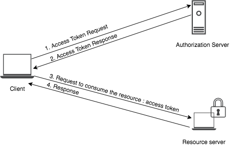

# Introduction to Access Token

### Access Token
Access tokens are credentials used to access protected resources on behalf of a resource owner. These tokens can be 
either an opaque string or a JSON Web Token (JWT). The [**Resource Server**](insertlink) can decide whether a client is authorized to 
consume a resource or not, by verifying the access token. The way the token endpoint of the [**Authorization Server**](insertlink) is 
invoked and the access token is generated differs based on the [grant type](insertlink). The ultimate audience of the access 
token is the **Resource Server**,  so the client can not interpret the value of the access token.

1. The client sends a request for an access token to the authorization server by passing the required parameters of the 
   relevant grant type
2. The authorization server validates the parameters and grants an access token to the client.
3. The client passes the access token to the authorization server.
4. Based on the validity of the access token the resource server allows the client to consume the protected resource.

The OAuth2.0 specification does not mandate any particular implementation for access tokens but it mentions two possible
strategies.

- The access token is an identifier that is hard to guess. For example, a randomly generated string of sufficient length,
  that the server handling the protected resource can use to look up the associated authorization information.
- The access token self-contains the authorization information in a manner that can be verified. For example, by 
  encoding authorization information along with a signature into the token.
  
 As the access tokens are used to make security decisions, the tokens should be transmitted and stored securely and 
 they should be short-lived. 
  
  There are two types of access tokens :
  
- [Opaque Access Tokens](#opaque-access-tokens)
- [Self Contain Access Token](#self-contain-access-token)
    
### Opaque Access Tokens
  A random unique string that does not contain user information which is issued from the authorization Server to access 
  a restricted resource in the Resource Server.
  
### Self Contain Access Token
  When short string identifiers are used as access tokens, a network request to the authorization server is required to 
  retrieve the authorization information associated with each access token. However, with self-contained access tokens, there
  is no need for a network call to retrieve the authorization information, as it’s self-contained. Thus, access token 
  processing may be significantly quicker and more efficient. However, when it comes to token revocation, self-contained 
  access tokens lag, whereas access tokens with string identifiers can be revoked with almost immediate effect. The 
  common practice is to have a short expiration time with self-contained access tokens, but that may result in more 
  refresh token requests at the authorization server.

