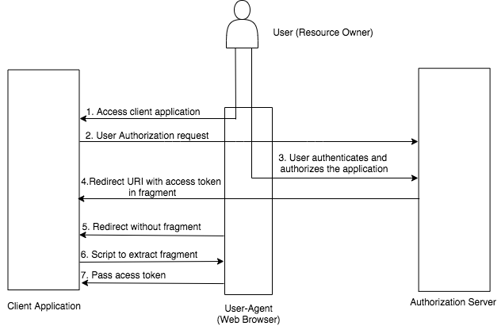

# Implicit Grant Type

### Recommended Use

The **implicit grant type** is optimized for [public clients](client-types.md) known to operate a particular redirection URI.
It is mainly used for clients that are not capable of keeping the client’s own credentials secret; for example a 'JavaScript only' application.
Since the access token is encoded into the redirect URI, it may be exposed to other parties other than the client, including the resource owner.
Therefore, access tokens issued via this grant type should be treated as public knowledge and must have very limited permissions
when interacting with the API server. For example, an access token that was granted using the authorization code grant
could have the required permission that allows it to be used to delete resources owned by the user.

However, an access token granted through the implicit flow should only be able to read resources and never perform 
any destructive operations.

### How does it work ?

The **implicit grant type** is similar to **authorization code grant type** as it will be redirected to an authorization server.
However, unlike the **authorization code grant type**, it will be redirected along with an access token
instead of an authorization code. The **implicit grant type** does not authenticate the client and instead relies
on the presence of the resource owner and the registration of the redirection URI.

The diagram below illustrates the implicit grant flow.





The URL below can be used to try this grant type.

``` powershell
https://localhost:9443/oauth2/authorize?response_type=token&client_id=<client id>&redirect_uri=<redirect uri>
```

**Response**
``` java
http://localhost:8080/playground2/oauth2client#access_token=131d4094-b94c-3714-9e73-672aa433248d&token_type=Bearer&expires_in=3410
```


!!! info "Support for refresh token grant - No"
	This grant type does not issue a refresh token which can be used to obtain new access tokens using the refresh token grant.
	[refresh token grant](refresh-token-grant.md).

