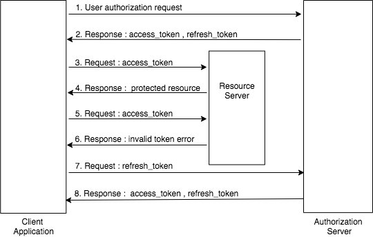

# Refresh Token Grant Type

### Recommended Use

The **refresh token grant** can be used when the current access token is expired or when a new access token is needed.
With this grant type, the refresh token acts as a credential and is issued to the client by the authorization server.

Issuing a refresh token is optional. If the authorization server issues a refresh token, it should be retrieved along 
with the access token. WSO2 Identity Server issues refresh tokens for all other grant types other than the **implicit and 
client credentials grant types**, as recommended by the OAuth 2.0 specification.

### How does it work ?

In the initial steps a refresh token has to be obtained before using it. This can be done using a grant type such as the
authorization code or password grant type. Using the obtained refresh token, a new access token can be obtained along 
with a renewed refresh token without having to go through any other additional steps.

The diagram below illustrates the refresh token grant flow.



Following cURL commands can be used to try this grant type.

``` java
curl -k -d "grant_type=refresh_token&refresh_token=<refresh_token>" -H "Authorization: Basic <Base64Encoded(Client_Id:Client_Secret)>" -H "Content-Type: application/x-www-form-urlencoded" <token_endpoint>
```
