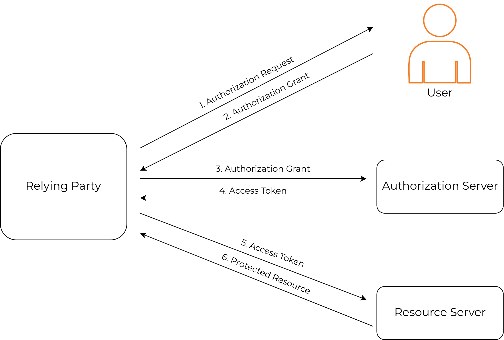

# Introduction to OAuth2.0

### What is OAuth2.0 ?
OAuth2 is a simple authorization (access delegation) protocol that allows a third-party application to obtain limited 
access to a secured resource, on behalf of the resource owner without sharing the password.

### Why OAuth2.0 ?
One of the key reasons for an enterprise to use OAuth2.0 is for the access delegation, where a resource owner can give
required permissions to a third-party application to access a resource located in a resource server.

It decouples authentication from authorization and supports multiple use cases addressing different client types such as
server-to-server apps, browser-based apps, mobile/native apps, and consoles/TVs.

This protocol which replaces the password-sharing anti-pattern and encourages ‘Federated Identity’, is more secure and 
usable. When working with the tokens it guarantees API security by relying on Secure Sockets Layer (SSL) that ensures 
data between the web server and browsers remain private. If a user can log in to a single OAuth 2.0 provider then he can
log in to other web services without login to those web services differently.

### Which OAuth2.0 grant type to choose?
OAuth 2.0 supports different grant types.

    - Authorization code
    - Client credential
    - Implicit 
    
These different grant types target different application types.

| Flow                 | Usage         | 
| --------------------- | ------------- | 
| Authorization code grant | Mostly recommended for web applications and single-page applications(SPA). This method is very safe in web applications, as tokens are passed directly to the web server and stored there without exposing the tokens to the resource owners. For Single page applications (JavaScript clients) it is recommended to use this grant type with PKCE.  |                            
| Client credential grant  | Recommended for **machine to machine** communications (CLIs), if a machine needs to access a resource without human interaction, this grant type is recommended.  |                              
| Implicit grant            | Used for single-page applications (SPA) to retrieve the access tokens directly without spending several round trips. However, there is a security consideration, as the access token is exposed to the client-side.  | 

### How does it work?
The exact flow differs based on the OAuth 2.0 the grant type. However, the abstract protocol flow is as below.

1. The application requests the authorization from the end-user (Resource Owner)
2. The Resource Owner grants the authorization to the application
3. The application grants the authorization to the Authorization Server
   (OAuth 2.0 Provider)
4. The server generates the access tokens and passes it back to the client (Relying Party)
5. The client passes the access token to the Resource Server.
6. The resource server provides access to the protected resource.
