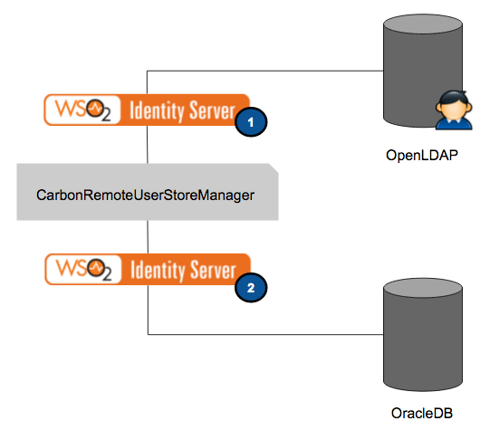

# Carbon Remote User Store Manager

Carbon Remote Userstore Manager enables using a userstore that is already configured in WSO2 Identity Server (WSO2 IS).

Consider a scenario where two instances of WSO2 Identity Server are configured. The first instance (IS1) has a `ReadOnlyLDAPUserStoreManager` configured on OpenLDAP and the second instance (IS2) has `JDBCUserStoreManager` configured on OracleDB. To expose the users in IS2 to IS1 through the `UserStoreManager` API, you can call the `UserStoreManager` admin service operations. WSO2 IS has a standard implementation which uses the admin services. The diagram below illustrates this scenario.

---

## Configure a carbon remote user store manager 

To configure a carbon remote userstore manager, you can follow the following steps.

1.  Log in to the management console of the the local server (IS1) and click **Main** > **Userstores > Add**.

2.  Fill in the following values in the form as given below. The image below shows a sample configuration.
    -   **User Store Manager Class:** `org.wso2.carbon.identity.user.store.remote.CarbonRemoteUserstoreManger`
    -   **Domain Name:** `<desired_secondary_userstore_name>`
    -   **Remote Server Username:** `<remote_admin_login>`
    -   **Remote Server Password:** `<remote_admin_password>`
    -   **Remote Server URL(s):** `https://<remote_sever_url>:<remote_server_port>/services`   

    !!! note        
        Make sure that you enter the same credentials used to invoke the admin services in the remote server and the same remote services URL.
        

     

3.  Update the other fields as required and click **Add**.

4.  Import the public certificate of the remote WSO2 Identity Server (IS2) to the primary WSO2 Identity Server's (IS1) truststore (`client-truststore.jks`) that is in the `<IS_HOME>/repository/resources/security` directory and restart WSO2 Identity Server.