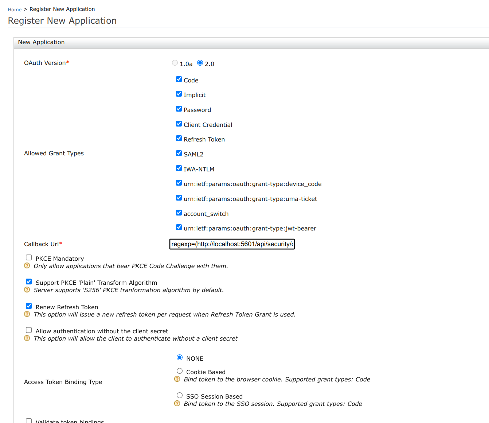

# ELK-based Analytics Installation Guide

The following steps required to configure the ELK-based Analytics for WSO2 Identity Server.  ELK-based Analytics solution supports ELK version 8.X.X.

## Enable Analytics in WSO2 Identity Server

Follow the steps below to enable ELK-based analytics in WSO2 Identity Server.

1. Download and install WSO2 Identity Server. For detailed information
   on how to install WSO2 IS, see [Installing the
   Product](../../setup/installing-the-product).

2. Navigate to the `<IS_HOME>/repository/conf/` directory and open the `deployment.toml` file.

3. Add the following configuration to the `deployment.toml` file.

    ```
    [analytics.elk]
    enable=true
    ```

## Enable Logs in WSO2 Identity Server

1. Navigate to the `<IS_HOME>/repository/conf` directory and open the `log4j2.properties` file.

2. Add the following configurations to the `log4j2.properties` file.
    
    - Add `ANALYTICS_EVENT_LOGFILE` to the list of all appenders as follows: <br />
        `appenders = {other appenders} , ANALYTICS_EVENT_LOGFILE`

    - Add the following appender configs:

        ```
        appender.ANALYTICS_EVENT_LOGFILE.type = RollingFile
        appender.ANALYTICS_EVENT_LOGFILE.name = ANALYTICS_EVENT_LOGFILE
        appender.ANALYTICS_EVENT_LOGFILE.fileName =${sys:carbon.home}/repository/logs/analytics_events.log
        appender.ANALYTICS_EVENT_LOGFILE.filePattern = ${sys:carbon.home}/repository/logs/analytics_events-%d{MM-dd-yyyy}.%i.log
        appender.ANALYTICS_EVENT_LOGFILE.layout.type = PatternLayout
        appender.ANALYTICS_EVENT_LOGFILE.layout.pattern=TID: [%tenantId] [%appName] [%d] [%X{Correlation-ID}] %5p {%c} — %mm%ex%n
        appender.ANALYTICS_EVENT_LOGFILE.policies.type = Policies
        appender.ANALYTICS_EVENT_LOGFILE.policies.time.type = TimeBasedTriggeringPolicy
        appender.ANALYTICS_EVENT_LOGFILE.policies.time.interval = 1
        appender.ANALYTICS_EVENT_LOGFILE.policies.time.modulate = true
        appender.ANALYTICS_EVENT_LOGFILE.policies.size.type = SizeBasedTriggeringPolicy
        appender.ANALYTICS_EVENT_LOGFILE.policies.size.size=10MB
        appender.ANALYTICS_EVENT_LOGFILE.strategy.type = DefaultRolloverStrategy
        appender.ANALYTICS_EVENT_LOGFILE.strategy.max = 20
        appender.ANALYTICS_EVENT_LOGFILE.filter.threshold.type = ThresholdFilter
        appender.ANALYTICS_EVENT_LOGFILE.filter.threshold.level = INFO
        ```

        !!! note
            To change the name of the log file and its location, change the **fileName** and **filePattern** parameters accordingly.

    - Add `org.wso2.carbon.event.output.adapter.logger.LoggerEventAdapter` to the list of all loggers as follows:
        ```
        loggers = {existing loggers}, org-wso2-carbon-event.output-adapter-logger-LoggerEventAdapter
        ```
    - Add the following logger configs
        ```
        logger.org-wso2-carbon-event.output-adapter-logger-LoggerEventAdapter.name=org.wso2.carbon.event.output.adapter.logger.LoggerEventAdapter
        logger.org-wso2-carbon-event.output-adapter-logger-LoggerEventAdapter.level=INFO
        logger.org-wso2-carbon-event.output-adapter-logger-LoggerEventAdapter.appenderRef.CUSTOM_LOGFILE.ref=ANALYTICS_EVENT_LOGFILE
        ```

        !!! note
            The `analytics_events.log` file will be rolled each day or when the log size reaches the limit of 1000 MB by default. Furthermore, only 10 revisions will be kept and older revisions will be deleted automatically. You can change these configurations by updating the configurations provided in step 2 given above in this. section.
 
## Configure ELK

### Install Elasticsearch
 
1. [Install Elasticsearch](https://www.elastic.co/guide/en/elastic-stack-get-started/current/get-started-elastic-stack.html#install-elasticsearch) according to your operating system.

2. Make sure Elasticsearch is [up and running](https://www.elastic.co/guide/en/elastic-stack-get-started/current/get-started-elastic-stack.html#_make_sure_that_elasticsearch_is_up_and_running).

### Install Filebeat
1. [Install Filebeat](https://www.elastic.co/guide/en/beats/filebeat/current/filebeat-installation-configuration.html#installation) according to your operating system.

2. Open the filebeat.yml file in the root directory and enter the following configurations.
    ```
    filebeat.inputs:
    - type: filestream  
      enabled: true
      parsers:
        - multiline:
          type: pattern
          pattern: '^[[:space:]]Event:'
          negate: false
          match: after
      include_lines: ['Event:']
      paths:
      - <IS_HOME>/repository/logs/wso2carbon*.log
    filebeat.registry.path: /var/lib/filebeat/registry
    output.logstash:
      hosts: ["localhost:5044"]
    ```

    !!! info
        Replace **IS_HOME** with the location of your WSO2 Identity Server.

### Install Logstash
 
1. [Install Logstash](https://www.elastic.co/guide/en/logstash/current/installing-logstash.html) according to your operating system.
2. In the Logstash directory, create a file with the '.conf' extension and add the following configurations.

    <details>
      <summary>Configrations</summary>

      ```
      
      input {
      	beats {
          		port => "5044"
        	}
      }
      
      filter {
      	if " Event:" not in [message] {
      	  drop {}
      	}
      
      	mutate {
              gsub => [
                "message", "LOCAL", "Resident"
              ]
      	}
      
      	# Date format parse
      	grok {
      		ecs_compatibility => disabled
      		match => {
      			'message' => '\[%{TIMESTAMP_ISO8601:logtime}\].*Unique ID: %{GREEDYDATA:eventType},\n Event: %      {GREEDYDATA:eventdata}'
      		}
      	}
      
      	json {
      		ecs_compatibility => disabled
      		source => "eventdata"
      		remove_field => ["eventdata","message"]
      	}
      
      	#ruby code to convert the comma seperated roles into an array
      	ruby{
      		code =>"
      
      		# method to split the supplied string by comma, trim whitespace and return an array
      		def mapStringToArray(strFieldValue)
      
      		#if string is not null, return array
      		if (strFieldValue != nil)
      			fieldArr =  strFieldValue.split(',').map(&:strip).reject(&:empty?).uniq 
      			return fieldArr                             
      		end     
      
      		return [] #return empty array if string is nil
      		end
      
      		vrtArr = mapStringToArray(event.get('[event][payloadData][rolesCommaSeparated]'))
      		if vrtArr.length > 0                           
      			event.set('[event][payloadData][rolesCommaSeparated]', vrtArr)
      		end
      
      		event_array = []
      		event_type = event.get('[event][payloadData][eventType]')
      		idp_type = event.get('[event][payloadData][identityProviderType]')
      		auth_step_success = event.get('[event][payloadData][authStepSuccess]')
              if (event_type == 'overall' || auth_step_success == false)
      			event_array.push('Overall')
      		end
      		if (event_type == 'step')
      			if (idp_type == 'Resident')
      				event_array.push('Resident')
      			end
      			if (idp_type == 'FEDERATED')
      				event_array.push('Federated')
      			end
      		end
      		event.set('[event][payloadData][event_type_filter]', event_array)
      	"
      	}
      
      	# take log time as the timestamp
      	date {
      		match => [ "logtime" , "yyyy-MM-dd HH:mm:ss,SSS" ]
      		target => "@timestamp"
      	}
      
      	# session specific
      	if [eventType] == "session" {
      
      		# user agent filter to transform the userAgent string into seperated fields
      		useragent {
      			ecs_compatibility => disabled
      			source => "[event][payloadData][userAgent]"
      			target => "userAgentDetails"
      		}
      
      		date {
      			match => [ "[event][payloadData][startTimestamp]" , "UNIX_MS" ]
      			target => "startTime"
      		}
      
      		date {
      			match => [ "[event][payloadData][terminationTimestamp]" , "UNIX_MS" ]
      			target => "endTime"
      		}
      
      	} else if [eventType] == "auth" {
      
      		#geo ip filter to transform the IP address to location
      		geoip {
      			ecs_compatibility => disabled
      			source => "[event][payloadData][remoteIp]"
      		}
      
      		# geo IP failure to lookup or local address 
      		if "_geoip_lookup_failure" in [tags] {
      			mutate {
      				add_field => { "[geoip][country_name]" => "N/A" }
      			}
      		}
      		
      	}
      
      }
      
      output {
      
      	#seperating event type as auth and session via the eventtype
      
      	if [eventType] == "auth"{
      		elasticsearch {
      			hosts => ["https://localhost:9200"]
      			cacert => "<ELASTICSEARCH_HOME>/config/certs/http_ca.crt"
      			user => "<ELASTICSEARCH_USERNAME>"
      			password => "<ELASTICSEARCH_USER_PASSWORD>"
      			index => "wso2-iam-auth-raw"
      			document_id => "%{[event][payloadData][eventId]}"
      		}
      	} else if [eventType] == "session"{
      		elasticsearch {
      			hosts => ["https://localhost:9200"]
      			cacert => "<ELASTICSEARCH_HOME>/config/certs/http_ca.crt"
      			user => "<ELASTICSEARCH_USERNAME>"
      			password => "<ELASTICSEARCH_USER_PASSWORD>"
      			index => "wso2-iam-session-raw"
      			document_id => "%{[event][payloadData][sessionId]}"
      		}
      		elasticsearch {
      			hosts => ["https://localhost:9200"]
      			cacert => "<ELASTICSEARCH_HOME>/config/certs/http_ca.crt"
      			user => "<ELASTICSEARCH_USERNAME>"
      			password => "<ELASTICSEARCH_USER_PASSWORD>"
      			index => "wso2-iam-session-time-series"
      		}
      	}
      } 
      ```
    </details>


    !!! info
        - Replace **ELASTICSEARCH_HOME**, **ELASTICSEARCH_USERNAME**, **ELASTICSEARCH_USER_PASSWORD** with your Elasticsearch settings.
        - Find the github repo of the configuration file [here](https://github.com/wso2-extensions/identity-elk-integration/blob/main/logstash/logstash-filebeat.conf)

3.  [Start the logstash server](https://www.elastic.co/guide/en/logstash/8.1/running-logstash-command-line.html#running-logstash-command-line) with the `-f` flag set to the configuration file you created.

 
### Installing Kibana
1. [Install Kibana](https://www.elastic.co/guide/en/elastic-stack-get-started/current/get-started-elastic-stack.html#install-kibana) according to your operating system and do this [one time configuration](https://www.elastic.co/guide/en/elasticsearch/reference/8.2/configuring-stack-security.html#stack-start-with-security).
  .
2. Once Kibana is running, enter its web interface using the following address:
    ```
    http://127.0.0.1:5601
    ```
 
## Configure ELK Analytics Dashboards
 
1. Log in to Kibana.
2. Navigate to **Stack Management** > **Index Management** and select the **Index Templates** tab.
3. Under the **Index patterns** column, if you have any index patterns created under the following names, delete them before moving to the next step.
 
     - wso2-iam-alert-auth*
     - wso2-iam-alert-session*
     - wso2-iam-auth-raw*
     - wso2-iam-session-raw*
     - wso2-iam-session-time-series*
 
4. Download the artifact file [here](../assets/img/elk-analytics/kibana-8-x-auth-and-session.ndjson).
5. Navigate to **Stack Management** > **Saved Objects**.
6. Click **Import**, add the downloaded artifact file as an import object, and import. 
7. Login to [MyAccount](https://localhost:9443/myaccount) of Identity Server using default admin credentials.
8. Navigate to the **Dashboard** section of Kibana to view the created **Auth** and **Session** dashboards.


## Configure Security in ELK
 
Elasticsearch supports several authentication modes ranging from basic authentication to Single sign-on with several identity providers.
 
In Elasticsearch version 8.x, security features are enabled by default. Basic authentication is enabled and cluster connections are encrypted.
 
## Configure Single-Sign-On with WSO2 Identity Server via OpenID Connect
 
 You can enable Single-sign-on for an ElasticSearch/Kibana deployment with WSO2 Identity Server via OpenID Connect. To set this up, follow the steps given below.
 
!!! note "Prerequisite"
          An Elasticsearch platinum subscription is required to enable SSO in ELK.

### Configure a service provider at WSO2 Identity Server
 
To enable SSO with WSO2 Identity Server, a service provider needs to be created. Follow the steps given below to create a service provider.
 
1. Login to the WSO2 Identity Server management console via https://{IS_HOST}:{PORT}/carbon
 
2. In the **Main** tab, click **Add** under **Service Providers**.

    
 
3. Provide a name for the service provider (eg. kibana) and click **Regsiter**.
 
    
 
4. Once the service provider is created, expand its  **Claim Configuration** section. Configure the claims as shown in the image below and click **Update**.
 
    
 
5.  Expand the **Inbound Authentication Configuration** and under **OAuth/OpenID Connect Configuration** select **Configure**. Enter the following as the **Callback Url**.
    ```
    regexp=(https://localhost:5601/api/security/oidc/callback|https://localhost:5601/security/logged_out)
    ```
 
    
 
6. Click Update to save your changes.
 
7. Return to the **Main** tab of the WSO2 IS console and lick **OIDC Scopes** -> **List** under the **Manage** section.

8. Click **Add claims** in the **Openid** row. Add the claims you’ve used in step 4 and click **Finish**.


### Configure OIDC Realm in Elasticsearch
 
To configure single sign-on in the Elastic Stack using OpenID connect, follow the steps given [here](https://www.elastic.co/guide/en/elasticsearch/reference/7.16/oidc-guide.html).
 
A sample OpenID connect realm is as follows.
 
  ```
  xpack.security.authc.token.enabled: true
  xpack.security.authc.realms.oidc.oidc1:
    order: 1
    rp.client_id: "<<CLIENT ID>>"
    rp.response_type: code
    rp.redirect_uri: "http:///<KIBANA_HOST>:5601/api/security/oidc/callback"
    op.issuer: "https://<IS_HOST>:<PORT>/oauth2/token"
    op.authorization_endpoint: "https://<IS_HOST>:<PORT>/oauth2/authorize"
    op.token_endpoint: "https://<IS_HOST>:<PORT>/oauth2/token"
    op.jwkset_path: "https://<IS_HOST>:<PORT>/oauth2/jwks"
    op.endsession_endpoint: "https://<IS_HOST>:<PORT>/oidc/logout"
    op.userinfo_endpoint: "https://<IS_HOST>:<PORT>/oauth2/userinfo"
    rp.post_logout_redirect_uri: "http://<KIBANA_HOST>:5601/security/logged_out"
    claims.principal: sub
    ssl.verification_mode: none
    claims.groups: groups
    claims.name: name
    claims.mail: email
  ```
 
### Configure role mapping for Kibana Dashboard
 
Once the above steps are completed, role mapping needs to be configured in Kibana to allow WSO2 Identity Server users to access the dashboards in Kibana. For that follow the steps below.
 
#### Create Users and Roles in WSO2 Identity Server
 
1. Login to the WSO2 Identity Server management console via https://{IS_HOST}:{PORT}/carbon
2. From the **Main** menu in the left panel, click **Add** under the **Users and Roles** section.

      

3. In **Add Users and Roles**, click **Add New Role**

      


4. Create a role (eg. `AnalyticsViewer`) and click **Finish**.

      

5. In **Add Users and Roles**, click **Add New User**.

6. Create a new user and click **Next**.

      

7. Assign the role that you created in step 4 to the user and click **Finish**.

      


#### Configure role mapping in Kibana

1. In your Kibana installation, navigate to the **config** directory and open **kibana.yml** file

2. Add the following configuration to the **kibana.yml** file.
   ```
   xpack.security.authc.providers:
     basic.basic1:
       order: 0
     oidc.oidc1:
       order: 1
       realm: "oidc1"
       description: "Log in with WSO2 via OIDC"
   ```
   
3. Login to Kibana using basic authentication.

4. Click **Stack Management** on the left panel and then click **Role Mappings** under the **Security** section.
 
5. Click **Create Role Mapping** and add a new role mapping by giving a **Mapping name**.
 
6. Select a role that has access to the particular dashboard from  **Roles**.
 
    
 
7. Click **Add Rules** under **Mapping rules**.

8. Select **groups** as the user field and enter the name of the role that you created in the WSO2 Identity Server.
 
    

9. Logout from Kibana and re-login by selecting the **Log in with WSO2 option**.
 
    
 
10. This will navigate to the WSO2 Identity Server login page. Try logging in with the credentials of the user that you created.
 
     
 
