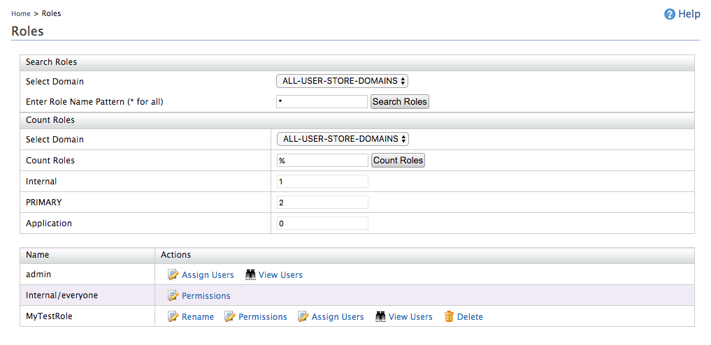

# Count Users and User Roles

WSO2 Identity Server enables easily counting the users and user roles using the **Management Console** and **Admin Services**. 

!!! tip "Before you begin"
    1.  Open the `deployment.toml` file in the `<IS_HOME>/repository/conf` directory and add the following configuration.

        ``` toml
        [user_store]
        count_retriever_class = "org.wso2.carbon.identity.user.store.count.jdbc.JDBCUserStoreCountRetriever"
        ```

    2.  Restart the server.
      
Let's get started! 

---

## Count via management console 

Follow the steps below to count users via the Management Console: 

1.  On the **Main** menu of the Management Console, click **Identity > Users and Roles > List**.
2.  To count users:
    1.  Click **Users**.
    2.  Click **Count Users**. Note that you can count the number of users in each domain for different claims, user name patterns, etc. 

        !!! example  
            In this example, `%admin` is given as search pattern.
             

3.  Similarly, to count user roles:
    1.  Click **Roles**.
    2.  Click **Count Roles**. Note that you can count the number of user roles in different userstore domains.

        !!! example
             


!!! note     
    By default, only JDBC userstore implementations supports this service but the functionality can be extended to LDAP userstores or any other type of userstore as well.
    
