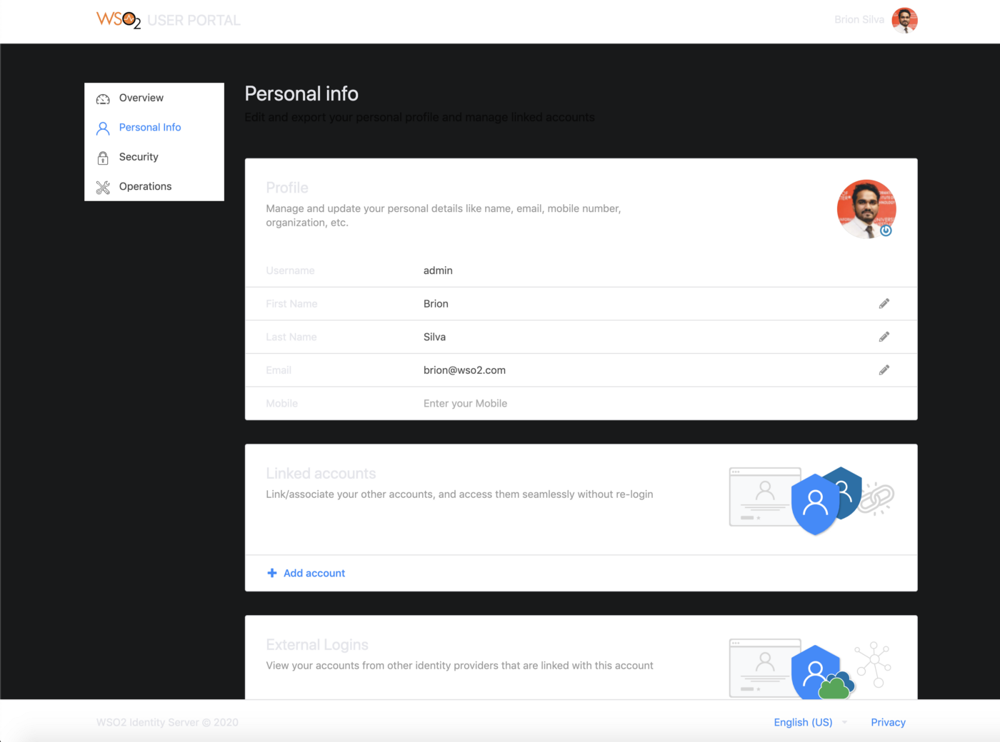
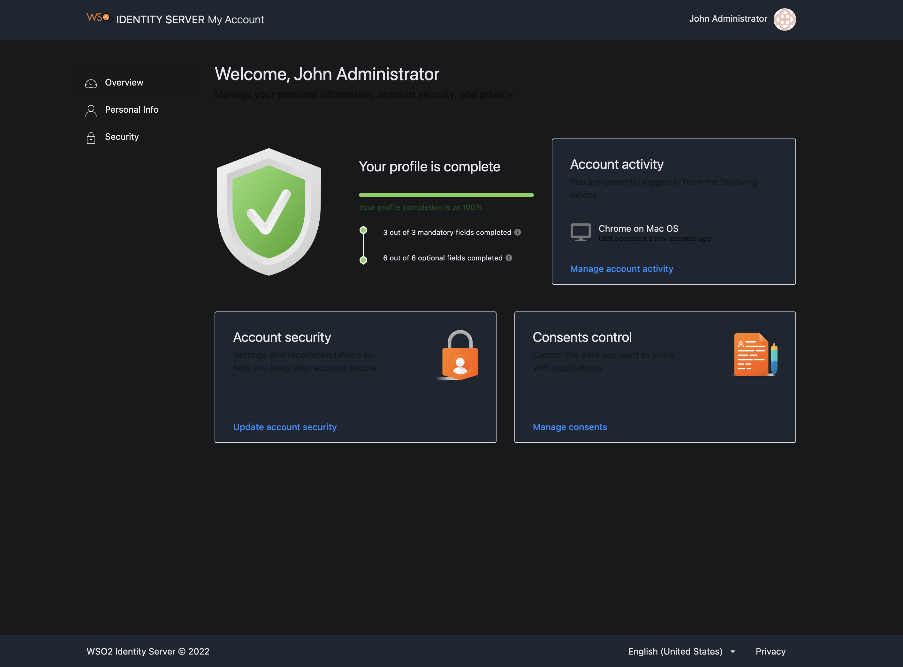
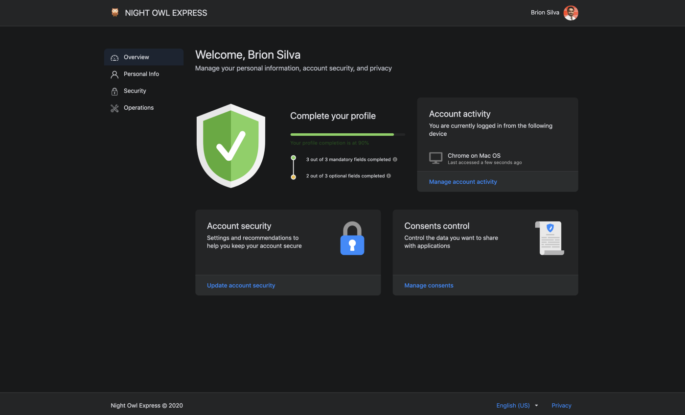
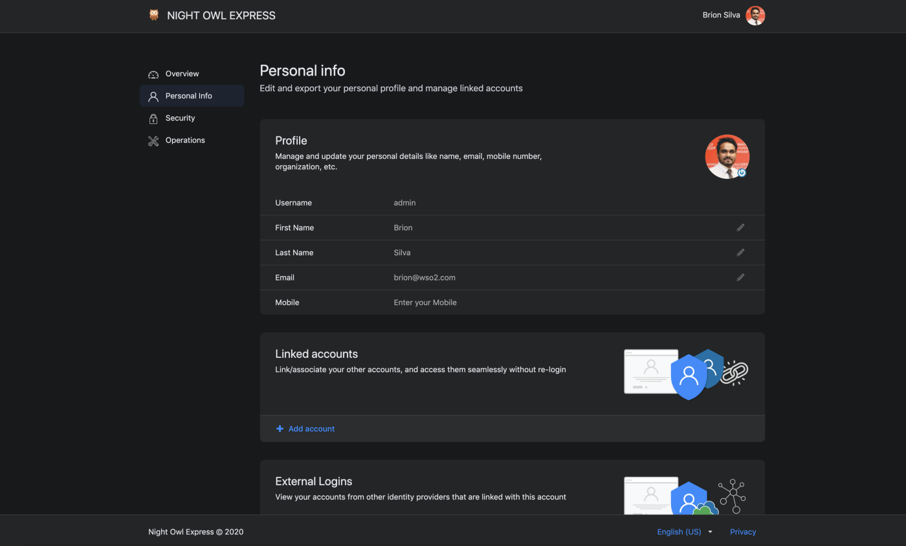

# Customizing the User Portal UI

From [WSO2 Identity Server 5.10.0](https://wso2.com/identity-and-access-management/) onwards, a new **user portal** has
been introduced which is the successor to the dashboard. It also adheres to the UI extensions scheme
 introduced with WSO2 Identity Server 5.9.0 to use a centralized theming for all the front-end portals.

Let's see how we can customize the theming of the **user portal**.

## Changing the default theme to dark mode


!!! info
    A customized version of the [default theme](https://github
    .com/Semantic-Org/Semantic-UI-LESS/tree/master/themes/default) in the Semantic UI LESS package has been used to
    achieve the look and feel of the **user portal**.

    

    Check the [Semantic UI documentation](https://semantic-ui.com/usage/theming.html) if you wish to learn more about
     Semantic UI theming.

!!! note "Before you begin"

    1. Check out the corresponding identity apps source code from the [repo](https://github.com/wso2/identity-apps)
    and set it up in the [development environment](../../develop/setting-up-user-portal-in-a-dev-environment). You
    can check out the `v1.0.72` tag since `v1.0.72` of identity-apps was used in IS 5.10.0
    ```java
        $ git fetch --all --tags --prune
        $ git checkout tags/v1.0.72 -b feature-dark-theme-demo
    ```

    2. Navigate to the `modules/theme/src/themes` folder inside identity-apps. All the theme global variable overrides
    can be found in `modules/theme/src/themes/default/globals/site.variables` file. For the full set of variables,
     see the [original theme variables file](https://github
     .com/Semantic-Org/Semantic-UI-LESS/blob/master/themes/default/globals/site.variables).

### Step 1: Changing the primary color of the portal

In order to change the primary color of the portal, you need to override the variables in `site.variables`.

1.  Add a new color under the site colors and let’s call it `facebookBlue`.
```java
    /*-------------------
        Site Colors
    --------------------*/

    @facebookBlue     : #2d88ff;
```
2. Now change the primary color variable.
```java
    /*-------------------
        Brand Colors
    --------------------*/

    @primaryColor        : @facebookBlue;
```
3. Next, change the page background color from white to dark gray and change the default text color to a
lighter shade. Add a new variable under the brand colors and let’s call it `globalBackgroundColor`.
```java
    /*-------------------
        Brand Colors
    --------------------*/

    @globalBackgroundColor: #18191a;
```
4. Override the `@pageBackground` variable.
```java
    /*-------------------
            Page
    --------------------*/

    @pageBackground      : @globalBackgroundColor;
    @textColor           : #e4e6eb;
```
5. Build the theme module by running the following command and check the results reflected on the dev server.
    ```java
        # from inside `modules/theme`
        $ npm run build
    ```
    You will see something like the following.
    
    As seen in the image above, the background color of the header, footer, side navigation, and content cards need
    to be changed.

6.  In order to change the header and footer background colors, add a new variable to the
`modules/theme/src/themes/default/collections/menu.variables` file under the brand "colors". Let's call the variable
`globalForegroundColor`.
    ```java
        @background: @globalForegroundColor;
    ```


7.  Change The side panel background in the `modules/theme/src/themes/default/collections/menu.overrides` file.
```java
    .ui.vertical.menu {
        &.side-panel {
            background: @globalBackgroundColor;

            // Other styles
        }
    }
```

8.  Modify the content card background color in the `modules/theme/src/themes/default/views/card.variables` file.
```java
   @background: @globalForegroundColor;
```
You can check the status by rebuilding the theme module. The changes should be reflected on the running dev server in
 no time. A sample screen of the new theme is shown below.


### Step 2: Changing the branding

Now that the styling is complete, let’s change the product branding.

1.  Change the product logo.

Use one of the following methods to change the product logo.

    ### Method 1 (Recommended)

    If you wish to change the logo without touching the compiled javascript bundle, you can do the following to
    override the existing WSO2 logo using CSS.

    1.  Download an icon from [Flaticon.com](https://www.flaticon.com/) such as `owl.svg` and add it to the
    `modules/theme/src/themes/default/assets/images` folder.

    2.  Open `modules/theme/src/definitions/globals/product.less` file and replace the existing styles in .product-logo
    class with the following.
        ```java
            .product-title {
                .product-logo {
                    width: 25px;
                    height: 25px;
                    vertical-align: text-top;
                    margin-right: 5px;
                    background: url(assets/images/owl.svg) no-repeat;
                    background-size: auto;

                    svg {
                        display: none;
                    }
                }

                // Other styles
            }
        ```

    ### Method 2

    1. Download an icon from [Flaticon.com](https://www.flaticon.com/) such as `owl.svg` and add it to the
    `modules/theme/src/themes/default/assets/images` folder.
    2. Open the `modules/theme/src/index.js` file and replace `Logo` with the path to the new icon.
            ```java
                export const Logo = require("../lib/assets/images/owl.svg");
            ```
    3.  Build user-portal artifacts.
            ```java
                npx lerna run build — scope @wso2is/user-portal
            ```
    4. Copy the `main.js` and `main.js.map` files from the `apps/user-portal/build/user-portal` folder and paste it
    inside the **user-portal** web app found in the `<IS_HOME>/repository/deployment/server/webapps/user-portal` folder.

2.  Change the product title & copyright.

    Add the following entries to the `runConfig` window object in the
    `<IS_HOME>/repository/deployment/server/webapps/user-portal/index.jsp` file.
    ```java
        window["runConfig"] = {
            ...
            applicationName: "NIGHT OWL EXPRESS",
            copyrightText: "Night Owl Express © 2020"
        };
    ```

3.  Change the Favicon.

    Replace `favicon.ico` in the `<IS_HOME>/repository/deployment/server/webapps/user-portal` folder with the
    desired icon.

    !!! tip
    If you do not have a favicon already, you can use an online generator like favicon.oi to generate a favicon for free

4.  Change the title.

    Change the `<title>` tag in the `<IS_HOME>/repository/deployment/server/webapps/user-portal/index.jsp` file.
    ```html
        <title>Night Owl Express</title>
    ```

### Step 3: Deploying the changes in the web app

The final step of the process is the deployment. Follow the sequence of steps listed below to deploy
the changes performed in the previous steps.

1.  Build the theme module.
```java
    # from inside modules/theme
    $npm run build
```
2.  Copy the artifacts to the web app.

    The built artifacts will be available inside the `modules/theme/lib` folder. Copy everything to the clipboard and
    navigate to the **user-portal** web app in the IS pack.

    Copy everything to the clipboard and paste it inside the
    `<IS_HOME>/repository/deployment/server/webapps/user-portal/libs/styles/css` folder.
    !!! warning
        Make sure that you keep a backup of the original CSS folder.

The final theme should look similar to following.





