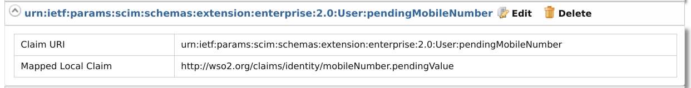

# Enable Mobile Number Verification for an Updated Mobile Number 

This feature enables mobile number verification when the user updates the user profile with a new mobile number, so that the new mobile number can be taken into consideration for all further activities performed by the user.

When a user updates their mobile number in the user profile, an SMS OTP is sent to the new mobile number. Until the new mobile number is successfully verified, the existing mobile number of the user will not be overridden.

!!! note 
    -   This feature can be invoked via a PUT/PATCH request to the SCIM 2.0 /Users endpoint or /Me endpoint.
    -   The verification on update capability is **only** supported for the http://wso2.org/claims/mobile claim.
    -   An SMS OTP verification is not triggered if the mobile number to be updated is the same as the previously verified mobile number of the user.
    -   This feature only manages the verification flow internally. External verification capability is not offered.

## Step 01 - Configuring mobile claim verification on update

1. Add the following properties to the `deployment.toml` file in the `IS_HOME/repository/conf` folder to subscribe the `userMobileVerification` handler to `PRE_SET_USER_CLAIMS` and `POST_SET_USER_CLAIMS` events.

    ```toml 
    [[event_handler]]
    name= "userMobileVerification"
    subscriptions =["PRE_SET_USER_CLAIMS","POST_SET_USER_CLAIMS"]
    ```

2. Define an attribute for a new claim `pendingMobileNumber` using **Enterprise User Extension** for SCIM2 by adding the following configuration to the `IS_HOME/repository/conf/scim2-schema-extension.config` file.
(Add this before the last element of the JSON array.)

    ```
    { 
    "attributeURI":"urn:ietf:params:scim:schemas:extension:enterprise:2.0:User:pendingMobileNumber",
    "attributeName":"pendingMobileNumber",
    "dataType":"string",
    "multiValued":"false",
    "description":"Store user's mobile number to be updated as a temporary claim until mobile number verification happens.",
    "required":"false",
    "caseExact":"false",
    "mutability":"readWrite",
    "returned":"default",
    "uniqueness":"none",
    "subAttributes":"null",
    "canonicalValues":[],
    "referenceTypes":[]
    }
    ```
 
    Add `pendingMobileNumber` to the `subAttributes` list of `urn:ietf:params:scim:schemas:extension:enterprise:2.0:User` attribute (the last element of the JSON array).

       ```
       {
       "attributeURI":"urn:ietf:params:scim:schemas:extension:enterprise:2.0:User",
       "attributeName":"urn:ietf:params:scim:schemas:extension:enterprise:2.0:User",
       "dataType":"complex",
       "multiValued":"false",
       "description":"Enterprise User",
       "required":"false",
       "caseExact":"false",
       "mutability":"readWrite",
       "returned":"default",
       "uniqueness":"none",
       "subAttributes":"verifyEmail askPassword employeeNumber costCenter organization division department manager pendingEmails pendingMobileNumber",
       "canonicalValues":[],
       "referenceTypes":["external"]
       }
       ```

3. Add a new SMS template for mobile number verification OTP by adding the below configuration to `sms-templates-admin-config.xml` file in `IS_HOME/repository/conf/sms` directory.
    
    ```
    <configuration type="verifyMobileOnUpdate" display="verifyMobileOnUpdate" locale="en_US">
        <body>Your Mobile Number Verification Code : {{confirmation-code}}</body>
    </configuration>
    ```

4. Add an event publisher to `IS_HOME/repository/deployment/server/eventpublishers`. For this sample, `HTTPOutputEventAdapter.xml` is used. The following sample publisher calls a REST Service to send confirmation codes.

    ??? info "Sample Event Publisher"
        ```
        <?xml version="1.0" encoding="UTF-8"?>
        <eventPublisher name="HTTPOutputEventAdapter" processing="enable"
            statistics="disable" trace="disable" xmlns="http://wso2.org/carbon/eventpublisher">
            <from streamName="id_gov_sms_notify_stream" version="1.0.0"/>
            <mapping customMapping="enable" type="json">
                <inline>{"api_key"="4c9374",
                    "api_secret"="FtqyPggE93",
                    "from"="NEXMO",
                    "to"={{mobile}},
                    "text"={{body}}
                    }</inline>
            </mapping>
            <to eventAdapterType="http">
                <property name="http.client.method">httpPost</property>
                <property name="http.url">https://rest.nexmo.com/sms/json</property>
            </to>
        </eventPublisher>
        ``` 
        
        !!! note
            This publisher uses [NEXMO](https://www.nexmo.com/) as the SMS REST service provider. For more information 
            on writing a custom http event publisher, see [HTTP Event Publisher](https://docs.wso2.com
            /display/DAS300/HTTP+Event+Publisher). 
            
5. Restart the server to apply the configurations.

## Step 02 - Adding the pending mobile number claim to store verification

1.  On the management console, navigate to **Main > Claims > Add > Add Local Claim**. Provide the following details and click **Add**.
    -   **Claim URI:** http://wso2.org/claims/identity/mobileNumber.pendingValue
    -   **Display Name:** Verification Pending Mobile
    -   **Description:** To store the updated mobile number until it is verified.
    -   **Mapped Attribute (s):** pendingMobileNumber
    -   **Read only:** Ticked


2.  To map the claim created above to the attribute that was created in **Enterprise User Extension**, navigate to **Main > Claims > Add > Add External Claim**.
Add the external claim configurations as shown below and click **Add**.
    -   **Dialect URI:** urn:ietf:params:scim:schemas:extension:enterprise:2.0:User
    -   **External Claim URI:** urn:ietf:params:scim:schemas:extension:enterprise:2.0:User:pendingMobileNumber
    -   **Mapped Local Claim:** http://wso2.org/claims/identity/mobileNumber.pendingValue



## Step 03 - Enable the feature via the management console

1.  On the management console, navigate to **Main > Identity Providers > Resident > Account Management Policies > User Claim Update**.
   
2.  Enable **Enable user mobile number verification on update**. Additionally, you can define the expiry time (in minutes) for the verification SMS OTP to match your requirement. 
    
    

3.  Click **Update** to save the changes. 

!!! note 
    To enable this feature server-wide, follow the instructions given below. 
    
    1.  Shut down the server if it is running.
    2.  Add the following properties to the `deployment.toml` file in `IS_HOME/repository/conf` to enable the feature and to configure the verification OTP expiry time.

        ```toml 
        [identity_mgt.user_claim_update.mobile]
        enable_verification = true
        verification_sms_otp_validity = “5”
        ```

## Try it out 

### Updating the mobile number
 
Given below is a sample request and the relevant response for updating the mobile number via a PATCH operation to SCIM 2.0 Users endpoint.

**Request**

```curl
curl -v -k --user [username]:[password] -X PATCH -d '{"schemas":[],"Operations":[{"op":[operation],
"value":{[attributeName]:[attribute value]}}]}' --header "Content-Type:application/json" https://localhost:9443/scim2/Users/[user ID]
```

**Sample Request**

```curl
curl -v -k --user admin:admin -X PATCH -d '{"schemas":["urn:ietf:params:scim:api:messages:2.0:PatchOp"],
"Operations":[{"op":"replace","value":{"phoneNumbers":[{"type":"mobile","value":"0123456789"}]}}]}' 
--header "Content-Type:application/json" https://localhost:9443/scim2/Users/1e624046-520c-4628-a245-091e04b03f21
```

**Sample Response**

```
{
    "emails": [
        "bobsmith@abc.com"
    ],
    "meta": {
        "location": "https://localhost:9443/scim2/Users/6d433ee7-7cd4-47a3-810b-bc09023bc2ce",
        "lastModified": "2020-10-12T13:35:24.579Z",
        "resourceType": "User"
    },
    "schemas": [
        "urn:ietf:params:scim:schemas:core:2.0:User",
        "urn:ietf:params:scim:schemas:extension:enterprise:2.0:User"
    ],
    "roles": [
        {
            "type": "default",
            "value": "Internal/everyone"
        }
    ],
    "name": {
        "givenName": "Bob",
        "familyName": "Smith"
    },
    "id": "6d433ee7-7cd4-47a3-810b-bc09023bc2ce",
    "userName": "bob123",
    "phoneNumbers": [
        {
            "type": "mobile",
            "value": "0111111111"
        }
    ],
    "urn:ietf:params:scim:schemas:extension:enterprise:2.0:User": {
        "pendingMobileNumber": "0123456789"
    }
}
```

Upon receiving the response given above, the user will receive an SMS notification with a verification code to the new mobile number. 

To validate the verification code sent to the user, use the existing `validate-code` and `resend-code` APIS of the
 [Self Registration REST APIs](https://docs.wso2.com/display/IS510/apidocs/self-registration/). 
 
### Validating the verification code

The user can submit the SMS OTP code using the validate-code API.
Given below is a sample request and the relevant response to submit the received verification code.

**Request**

```curl
curl -k -v -X POST -H "Authorization: <Base64Encoded_username:password>" -H "Content-Type: application/json" -d 
'{ "code": "<validation_code>","properties": []}' "https://localhost:9443/api/identity/user/v1.0/me/validate-code"
```

**Sample Request**

```curl
curl -k -v -X POST -H "Authorization: Basic YWRtaW46YWRtaW4=" -H "Content-Type: application/json" -d '{ "code": "123ABC","properties": []}'
 "https://localhost:9443/api/identity/user/v1.0/me/validate-code"
```

**Response**

```
"HTTP/1.1 202 Accepted"
```

### Resending the verification code

The user can request to resend a new SMS OTP code using the resend-code API.
Given below is a sample request and the relevant response to request a new verification code.

**Request**

```curl
curl -X POST -H "Authorization: Basic <Base64Encoded_username:password>" -H "Content-Type: application/json" -d '{"properties": []}' 
"https://localhost:9443/api/identity/user/v1.0/me/resend-code"
```

The verification scenario should be specified in the properties parameter of the request body as follows :

```
"properties": [{"key":"RecoveryScenario","value": "MOBILE_VERIFICATION_ON_UPDATE"}]
```

**Sample Request**

```curl
curl -X POST -H "Authorization: Basic YWRtaW46YWRtaW4=" -H "Content-Type: application/json" -d '{"properties": [{"key":"RecoveryScenario","value": "MOBILE_VERIFICATION_ON_UPDATE"}]}' 
"https://localhost:9443/api/identity/user/v1.0/me/resend-code"
```

**Response**

```
"HTTP/1.1 201 Created"
```


!!! info "Related Topics"
    See [Using the SCIM 2.0 Rest APIs](../../develop/using-the-scim-2.0-rest-apis) for instructions on using SCIM 2.0 REST APIs.
    
    For information on validate-code, and resend-code REST APIs, see the [swagger docs on Self Registration REST APIs](https://docs.wso2.com/display/IS510/apidocs/self-registration/).
