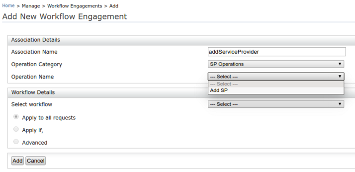

# Extend the Workflow Event Handler

By default, WSO2 Identity Server only supports user store operations to be engaged with workflows. However, this is an extensible feature where you can implement workflow support for any other operation such as SP/IDP operations, XACML policy creation, tenant operations, etc., which has an implemented interceptor that gets executed before method execution.

This page guides you through implementing workflow support for SP operations.

---

## Add a new handler

You can add a new handler by adding a new .jar file to the `<IS_HOME>/repository/components/dropins` folder. You can create a .jar file as described below.

Structure the new handler according to the following hierarchy.


Add a separate handler for each operation for which you wish to add workflow support. 

In this example, to implement workflow support for SP create functionality, add `SPCreateHandler` by extending `AbstractWorkflowRequestHandler`. The following methods should be overridden:

-   `retryNeedAtCallback()` - Return whether the same request is initiated at the callback. If set to 'true', this will
    take actions to skip the request initiated at the callback.
-   `getEventID()` - Return the event that this handler is subscribed, used when handling the callback.
-   `getParamDefinitions()` - Returns the parameter names and their types. Will be used in input validation and in UIs.
-   `getFriendlyName()` - Return the human friendly name for the event associated with this handler.
-   `getDescription()` - Return the human friendly description for the event associated with this handler
-   `getCategory()` - Return the category of the event associated with this handler.
-   `isValidOperation()` - Check if the operation is operation execute. For example, if there is already a SP added is pending in a workflow with same name, this method should return false.
-   `onWorkflowCompletion()` - This is the callback method from executor. This will be called when IS receives the callback. This method should contains details of how to handle the call back such as retrieving parameters of operation from map received, call the operation again, etc.

Other than these implemented methods, write a function such as `‘startSPCreateWorkflow’` which will be the function
that will get called from operation listener. In this method, add operation parameters to the `wfParams` and `nonWfParams` maps. Also check if the operation is valid using implemented `isOperatonValid()` method and should throw an exception if this is not valid.

---

## Define a map

Next, define a map called `PARAM_DEFINITIONS` which contains the types of each parameters used for the operation.

??? example "Click to view a sample class written for an SP create workflow handler"
    ``` java
    public class SPCreateHandler extends AbstractWorkflowRequestHandler {

      private static final Map<String, String> PARAM_DEFINITION;
      private static final Log log = LogFactory.getLog(SPCreateHandler.class);

      static {
          PARAM_DEFINITION = new LinkedHashMap<>();
          PARAM_DEFINITION.put("Application ID", WorkflowDataType.INTEGER_TYPE);
          PARAM_DEFINITION.put("Application Name", WorkflowDataType.STRING_TYPE);
          PARAM_DEFINITION.put("Application Description", WorkflowDataType.STRING_TYPE);
          PARAM_DEFINITION.put("Tenant Domain", WorkflowDataType.STRING_TYPE);
          PARAM_DEFINITION.put("Username", WorkflowDataType.STRING_TYPE);
      }

      @Override
      public void onWorkflowCompletion(String status, Map<String, Object> requestParams, Map<String, Object>
              responseAdditionalParams, int tenantId) throws WorkflowException {

          String applicationName = (String)requestParams.get("Application Name");
          String applicationDescription = (String)requestParams.get("Application Description");
          String tenantDoamin = (String)requestParams.get("Tenant Domain");
          String username = (String)requestParams.get("Username");

          if (WorkflowRequestStatus.APPROVED.toString().equals(status) ||
                  WorkflowRequestStatus.SKIPPED.toString().equals(status)) {
              try {

                  ApplicationManagementService applicationMgtService = ApplicationManagementService.getInstance();
                  ServiceProvider serviceProvider = new ServiceProvider();               serviceProvider.setApplicationName(applicationName);
                  serviceProvider.setDescription(applicationDescription);
                  applicationMgtService.createApplication(serviceProvider, tenantDoamin, username);
              } catch (Exception e) {
                  throw new WorkflowException(e.getMessage(), e);
              }
          } else {
              if (retryNeedAtCallback()) {
                  unsetWorkFlowCompleted();
              }
              if (log.isDebugEnabled()) {
                  log.debug("Adding user is aborted for SP '" + applicationName + "', Reason: Workflow response was " +
                                  status);
              }
          }
      }

      @Override
      public boolean retryNeedAtCallback() {
          return true;
      }

     @Override
     public String getEventId() {
          return "ADD_SP";
      }
     
     @Override
     public Map<String, String> getParamDefinitions() {
          return PARAM_DEFINITION;
      }

      @Override
     public String getFriendlyName() {
          return "Add SP";
      }

      @Override
     public String getDescription() {
          return "";
      }

      @Override
     public String getCategory() {
          return "SP Operations";
      }

      public boolean startSPCreateWorkflow (ServiceProvider serviceProvider, String tenantDomain, String userName)
              throws WorkflowException{
          Map<String, Object> wfParams = new HashMap<>();
          Map<String, Object> nonWfParams = new HashMap<>();
          wfParams.put("Application ID",serviceProvider.getApplicationID());
          wfParams.put("Application Name",serviceProvider.getApplicationName());
          wfParams.put("Application Description",serviceProvider.getDescription());
          wfParams.put("Tenant Domain",tenantDomain);
          wfParams.put("Username",userName);
          String uuid = UUID.randomUUID().toString();
          Entity[] entities = new Entity[1];
          entities[0] = new Entity(serviceProvider.getApplicationName(), "SP", -1234);
          if (!Boolean.TRUE.equals(getWorkFlowCompleted()) && !isValidOperation(entities)) {
              throw new WorkflowException("Operation is not valid.");
          }
          boolean state = startWorkFlow(wfParams, nonWfParams, uuid).getExecutorResultState().state();
          return state;
      }

      @Override
      public boolean isValidOperation(Entity[] entities) throws WorkflowException {
          //Check if the operation is valid, eg:- Is there a SP already added and not approved with the same name as
          // this SP.
          return true;
      }
    }
    ```

---

## Call the handler

Now, call `‘startSPCreateWorkflow’` before the operation get executed. You can do this easily by implementing the ‘doPre’ method of the operation through an interface. Following is a sample listener implementation created for this purpose.  Define `orderID` of this listener so that this will execute as the first listener before all other listeners.

??? example "Click to view the sample listener implementation"
    ``` java
    public class SPWorkflowListener extends AbstractApplicationMgtListener {

          @Override
          public int getDefaultOrderId() {
                  return 1;
          }

          @Override
          public boolean doPreCreateApplication(ServiceProvider serviceProvider, String tenantDomain, String userName)
                  throws IdentityApplicationManagementException {
                  if (!isEnable()) {
                          return true;
                  }
                  try {
                          SPCreateHandler spCreateHandler = new SPCreateHandler();
                          return spCreateHandler.startSPCreateWorkflow(serviceProvider, tenantDomain, userName);
                  } catch (Exception e) {
                          // Sending e.getMessage() since it is required to give error message to end user.
                          throw new IdentityApplicationManagementException(e.getMessage(), e);
                  } finally {
                  }
          }

    }
    ```

----

## Register the handler and listener

Finally in the service component, register the handler and the listener that you implemented using the following code block. 

``` java
**
* @scr.component name="tenant.mgt.workflow" immediate="true"
*/
public class SPWorkflowServiceComponent {

  protected void activate(ComponentContext context) {

      BundleContext bundleContext = context.getBundleContext();
      bundleContext.registerService(ApplicationMgtListener.class.getName(), new SPWorkflowListener(), null);
      bundleContext.registerService(WorkflowRequestHandler.class.getName(), new SPCreateHandler(), null);
  }
}
```

---

## Verify handler

After adding the .jar file of this handler to the `<IS_HOME>/repository/components/dropins` folder, you will see the new operation category, and the operation is available to select when adding a new workflow engagement.




A sample handler implementation is available [here](https://github.com/wso2/samples-is/tree/master/workflow).
