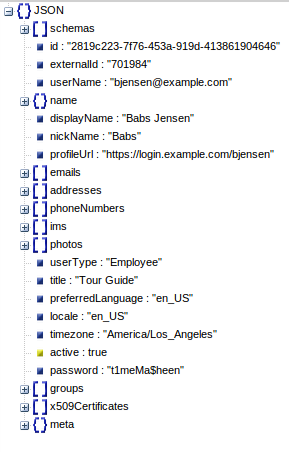
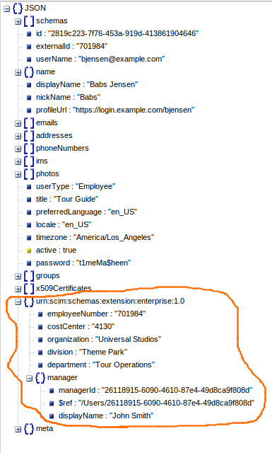
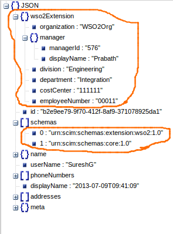
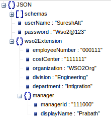
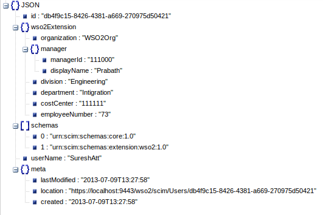

# Extensible SCIM User Schemas With WSO2 Identity Server

The System for Cross-Domain Identity Management (SCIM)) specification
defines a [fixed set of default
attributes](http://tools.ietf.org/html/draft-ietf-scim-core-schema-01#section-11.2)
for the user object. This set is defined to ensure the interoperability
and it can cater to most of the industry's identity management
requirements. Given below is a sample user object with the default
attributes set.



However the SCIM specification itself introduces the [Enterprise User
Extension](http://tools.ietf.org/html/draft-ietf-scim-core-schema-01#section-11.3)
to support extra attributes for the SCIM user object.



However the reality in the industry is that organizations have their own
attributes defined for the users. These attributes are already there in
their LDAP schemas. Therefore SCIM should be extensible enough to cope
with these custom attributes of the users.

WSO2 Identity Server allows users to define their own user schema in a
configuration file (
`         [IS-HOME]/repository/conf/scim-schema-extension.config        `
). Then these configured schema are used while creating, validating user
objects. With this the users can pass their custom attributes of users
over SCIM for Identity Management requirements. The implementation is
adhering to the [Schema Extension
Model](http://tools.ietf.org/html/draft-ietf-scim-core-schema-01#section-4). Given below is a sample extended user object with the default schema
configuration.



### Enable Extension

1.  Locate the `provisioning-config.xml` file in the path
    `          [IS-HOME]/repository/conf/identity/provisioning-config.xml         `
    .
2.  Open the file and locate the `user-schema-extension-enabled`
    property and set it to true.
3.  Save the file and restart the server.

### Claims Mapping

Log into the Identity Server and do the claim mapping for the following
claim URIs (see
[here](../../learn/configuring-active-directory-user-stores-for-inbound-provisioning)
for more information on how to do claim mappings).

-   `          urn:scim:schemas:extension:wso2:1.0:wso2Extension.costCenter                   `
-   `          urn:scim:schemas:extension:wso2:1.0:wso2Extension.department         `
-   `          urn:scim:schemas:extension:wso2:1.0:wso2Extension.division         `
-   `          urn:scim:schemas:extension:wso2:1.0:wso2Extension.employeeNumber         `
-   `          urn:scim:schemas:extension:wso2:1.0:wso2Extension.organization         `
-   `          urn:scim:schemas:extension:wso2:1.0:wso2Extension.manager.displayName         `
-   `          urn:scim:schemas:extension:wso2:1.0:wso2Extension.manager.managerId         `

Now the server is up and running with the new extended user schema. The
claim mappings can map the SCIM user attributes to the LDAP user
attributes.

Create a new user with the new schema. The following screen depicts the
user to be added with the **wso2Extension** attributes.



### CURL Commands

The following is the cURL command to add a user:

``` java tab="Primary Userstore Command"
curl -v -k --user admin:admin --data '{"schemas":[],"userName":"SureshAtt","password":"Wso2@123","wso2Extension":{"employeeNumber":"000111","costCenter":"111111","organization":"WSO2Org","division":"Engineering","department":"Intigration","manager":{"managerId":"111000","displayName":"Prabath"}}}' --header "Content-Type:application/json" https://localhost:9443/wso2/scim/Users
```

``` java tab="Secondary Userstore Command"
curl -v -k --user admin:admin --data '{"schemas":[],"userName":'mysql/uresh67',"password":"Wso2@123"}' --header "Content-Type:application/json" https://localhost:9443/wso2/scim/Users 
```

Note that in the Secondary Userstore Command, user name is preceded by the domain and is within single
quotes 'mysql/uresh67'. Also note that 'mysql' here is a reference to a
domain name.

The above command provides the following result:

``` java tab="Primary Userstore Output"
{"id":"db4f9c15-8426-4381-a669-270975d50421","wso2Extension":{"organization":"WSO2Org","manager":{"managerId":"111000","displayName":"Prabath"},"division":"Engineering","department":"Intigration","costCenter":"111111","employeeNumber":"73"},"schemas":["urn:scim:schemas:core:1.0","urn:scim:schemas:extension:wso2:1.0"],"userName":"SureshAtt","meta":{"lastModified":"2013-07-09T13:27:58","location":"https://localhost:9443/wso2/scim/Users/db4f9c15-8426-4381-a669-270975d50421","created":"2013-07-09T13:27:58"}}
```

``` java tab="Secondary Userstore Output"
{"id":"2e89cac0-17f3-40e7-8a07-ff1047a70cf1","schemas":["urn:scim:schemas:core:1.0"],"userName":"mysql/uresh67","meta":{"lastModified":"2013-12-17T14:31:30","location":"https://localhost:9443/wso2/scim/Users/2e89cac0-17f3-40e7-8a07-ff1047a70cf1","created":"2013-12-17T14:31:30"}}* Closing connection #0
```

The created SCIM user object can be viewed in the following screen:


