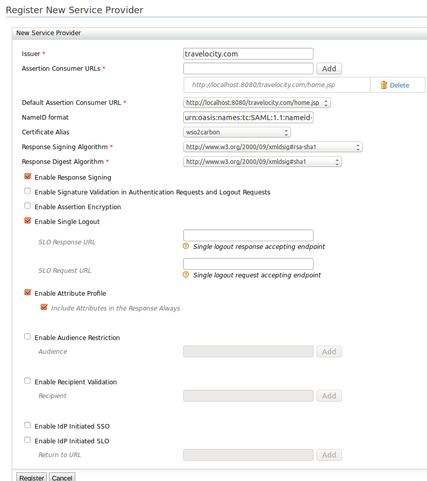

# Configuring Facebook Authenticator

The Facebook authenticator is configured as a federated authenticator in
WSO2 Identity Server to authenticate Facebook users to log in to your
organization’s applications.

 

Current trends require usage of services from hundreds of websites in a
connected world. Most of these websites need the user to create an
account with them by providing a valid email address and password.
Remembering all the different user IDs and passwords that you use can be
difficult and cumbersome. To make the life easier most websites now
provide the user with an option to log in using their Facebook account,
Twitter account or Google account. Since most of the internet users have
one of these accounts, it makes creating a new account an instant
action.

WSO2 Identity Server enables users to log in to the Identity Server
using their Facebook account. To do that, first you have to create a
Facebook app after registering as a Facebook developer.

!!! info 
    To download the authenticator and other artifacts, go to
    <https://store.wso2.com/store/assets/isconnector/details/9edb106b-05ee-4810-8d47-81d0639f8c2b>
    .

!!! note
    This is relevant for WSO2 Identity Server versions 5.2.0 and
    5.3.0. For older product versions, you have to configure this
    differently. Refer to [WSO2 IS 5.1.0
    documentation](https://docs.wso2.com/display/IS510/How+To%253A+Login+to+the+Identity+Server+using+Facebook+Credentials)
    on doing this.
    
This topic provides instructions on how to configure the Facebook app
and the Identity Server to integrate using a sample app. See the
following sections for more information.

### Deploying the required artifacts

1.  Download the .jar file associated with this authenticator from [the
    connector
    store](https://store.wso2.com/store/assets/isconnector/details/9edb106b-05ee-4810-8d47-81d0639f8c2b)
    .
2.  Copy the .jar file you downloaded into the
    `           <IS_HOME>/repository/components/dropins          `
    folder.

    !!! note
        If you want to upgrade the Facebook Authenticator in your existing
        IS pack, please refer [upgrade
        instructions.](../../develop/upgrading-an-authenticator)
    

3.  Restart the WSO2 Identity Server if it is already running.

### Configuring the Facebook app

1.  Go to <https://developers.facebook.com/> and log in using your
    Facebook credentials.
2.  Click on **My Apps** and then click **Create a New App**.  
     
3.  Choose the platform you wish to use. Select **Website** here when
    working with this sample.  
     
4.  Enter the name of your new app in the window that appears and click
    **Create New Facebook App ID**.  
    
5.  Enter a Display Name, Contact Email and select an appropriate
    category from the dropdown. Click **Create App ID**.  
    
6.  This will lead you to the quick start guide. You can view the
    configuration there and skip the quick start guide to access the
    developer dashboard.  
     
7.  This will take you to the app **Dashboard** where you can find the
    **App ID** and **App Secret** as shown in the image below. Click
    **Show** to view the **App Secret**.

    **App ID** is the Client ID and the **App Secret** is the Client
    Secret in OAuth terminology. The API Version is Facebook’s API that
    is used to create the application.

     

8.  Click **Settings** on the left menu and navigate to the **Basic**
    tab. Add the **App Domains** (since WSO2 IS is running on localhost,
    you can add localhost as the App Domain) and click **Add Platform**
    .  
     

9.  Select **Website** as the platform for the application and enter the
    following as the site URL:
    [https://localhost:9443](https://localhost:9443/). Click **Save
    Changes**.  
     
     
10. On the left panel, click **Add Product** and click **Get Started**
    for a **Facebook Login** product.  
    

11. You can configure the **Client OAuth Settings** on the window that
    appears.  
     

    1.  **Client OAuth Login** should be set to **Yes**.
    2.  **Web OAuth Login** should be set to **Yes**.
    3.  **Valid OAuth redirect URIs** should be set to
        <https://localhost:9443/commonauth>.

12. Scroll down and click the **Save Changes** button to save the
    changes.

Now you have finished configuring Facebook as an Identity Provider.

!!! info "About accessing the app"

    The app is not available to general public yet. To make to app available
    to every Facebook user, you have to submit the app for review. After a
    review, Facebook makes the app available to every Facebook user. You can
    find more information on the review process by clicking on **App
    Review** in the left navigation menu of your app's dashboard.

    The review process may take some time, so for the purposes of this
    sample, you can specify some Facebook users as Developers or Testers.
    Only the users specified here can use this app to log in with Facebook
    until the app goes public. To do this, click on **Roles** in the left
    navigation menu of the dashboard and specify the required Facebook users
    as Developers or Testers.

     

### Deploying travelocity.com sample app

The next step is to deploy the travelocity.com sample app in order to
use it in this scenario.

1.  You can download the travelocity.com.war file from
    [here](https://drive.google.com/file/d/0B6TqW_IScmilVzdsSUNVWEQ0UWs/edit?usp=sharing)
    .
2.  Deploy this sample web app on a web container.
    1.  Use the Apache Tomcat server to do this.
    2.  Since this sample is written based on Servlet 3.0, it needs to
        be deployed on Tomcat 7.x.
    3.  Copy the .war file into the webapps folder. For example,
        `             <APACHE_HOME>/apache-tomcat-7.0.50/webapps            `
        .

Once this is done, the next step is to configure the WSO2 Identity
Server by adding a service provider and identity provider.

### Configuring the identity provider

Now you have to configure WSO2 Identity Server by [adding a new identity
provider](../../learn/adding-and-configuring-an-identity-provider)
.

1.  Download the WSO2 Identity Server from
    [here](http://wso2.com/products/identity-server/) and [run
    it](../../setup/running-the-product).
2.  Log in to the [Management
    Console](../../setup/getting-started-with-the-management-console)
    as an administrator.
3.  In the **Identity** section under the **Main** tab of the Management
    Console, click **Add** under **Identity Providers**.
4.  Give a suitable name as the **Identity Provider Name**.  
     
5.  Go to **Facebook Configuration** under **Federated Authenticators**
    .

6.  Enter the following values in the form that appears:
    <table>
    <thead>
    <tr class="header">
    <th>Field</th>
    <th>Description</th>
    <th>Sample Value</th>
    </tr>
    </thead>
    <tbody>
    <tr class="odd">
    <td>App ID</td>
    <td>This refers to the Client Id you received from the Facebook app you created.</td>
    <td>&lt;Application ID of the Facebook App&gt;</td>
    </tr>
    <tr class="even">
    <td>App Secret</td>
    <td>This refers to the Client Secret you received from the Facebook app you created.</td>
    <td>&lt;App Secret of the Facebook App&gt;</td>
    </tr>
    <tr class="odd">
    <td>Scope</td>
    <td>Defines the permission to access particular information from a Facebook profile. See the <a href="https://developers.facebook.com/docs/facebook-login/permissions">Permissions Reference</a> for a list of the different permission groups in Facebook APIs.</td>
    <td>email 
     
    </td>
    </tr>
    <tr class="even">
    <td>User Information Fields</td>
    <td>These are the claims related to the user account on Facebook. WSO2 Identity Server requests these fields from Facebook when a user is authenticated with Facebook through the IS. See <a href="https://developers.facebook.com/docs/facebook-login/permissions#reference-public_profile">public_profile permission</a> for more information about these fields.</td>
    <td>id,name,gender,email,first_name,last_name,age_range,link</td>
    </tr>
    </tbody>
    </table>

     

7.  Select both checkboxes to **Enable Facebook Authenticator** and make
    it the **Default**.

8.  Click **Register**.

You have now added the identity provider.

### Configuring the service provider

The next step is to configure the service provider.

1.  Return to the Management Console.
2.  In the **Identity** section under the **Main** tab, click **Add**
    under **Service Providers**.
3.  Enter [travelocity.com](http://travelocity.com/) in the **Service
    Provider Name** text box and click **Register**.
4.  In the **Inbound Authentication Configuration** section, click
    **Configure** under the **SAML2 Web SSO Configuration** section.
       
      
    Now set the configuration as follows:
    1.  Enter the following values:

        **Issuer** : [travelocity.com](http://travelocity.com/)

        **Assertion Consumer URL** :
        <http://localhost:8080/travelocity.com/home.jsp>

    2.  Select the following check-boxes:

        Enable Response Signing

        Enable Single Logout

        Enable Attribute Profile

        Include Attributes in the Response Always

5.  Click **Register**. Now you will be sent back to the **Service
    Providers** page.

6.  Go to the **Local and Outbound Authentication Configuration**
    section.

7.  Select the **Federated Authentication** radio button and select the
    Identity Provider you created from the dropdown list under
    **Federated Authentication**.  
    

8.  Click **Update** to save the changes.

You have now added and configured the service provider.

!!! note
    The default client-truststore.jks found in the
    `         <IS_HOME>/repository/resources/security/        ` directory
    contains the Facebook certificate by default.
    

### Configuring claim mappings for Facebook

The next step is to configure claims in the Identity Server and map them
with Facebook.

1.  In the **Identity** section under the **Main** tab, click **List**
    under **Identity Providers**.
2.  Click **Edit** to edit the facebook identity provider you created.
3.  Under **Claim Configuration**, go to **Basic Claim Configuration**
    .
4.  Select the **Define Custom Claim Dialect** option under **Select
    Claim mapping Dialect**.
5.  Click **Add Claim Mapping** to add custom claim mappings as
    follows.  
     
6.  You can retrieve all the public information of the user and the
    email address. The following are some common attribute names.

    id  
    email  
    name  
    first\_name  
    last\_name  
    link  
    gender  
    locale  
    age\_range

    More information is available from the following link:
    <https://developers.facebook.com/docs/facebook-login/permissions/v2.0>

    You can map these attributes to any **Local Claim URI** that is
    suitable.

7.  Select a suitable **User ID Claim URI** (e.g., email).
8.  Click **Update** to save changes.

### Configuring requested claims for [travelocity.com](http://travelocity.com/)

1.  In the **Identity** section under the **Main** tab, click **List**
    under **Service Providers**.
2.  Click **Edit** to edit the
    [travelocity.com](http://travelocity.com/) service provider.
3.  Go to **Claim Configuration**.
4.  Click on **Add Claim URI** under **Requested Claims** to add the
    requested claims as follows. Here you should add the claims you
    mapped in the Identity Provider claim configuration.  
     
5.  Select a suitable claim for the **Subject Claim URI**.

    !!! note
        To use email address as the **Subject Claim URI**, you
        have to allow the usage of email addresses as usernames in the
        `            <IS_HOME>/repository/conf/carbon.xml           ` file.
        To allow using email address as usernames, uncomment the following
        in the **carbon.xml** file.
        `            <!--EnableEmailUserName>true</EnableEmailUserName-->           `
    

Now you have configured the Identity Server.

### Testing the sample

1.  To test the sample, go to the following URL:
    <http://localhost:8080/travelocity.com> .  
     
2.  Click the link to log in with SAML from WSO2 Identity Server.
3.  You are redirected to the Facebook Login page. Enter your Facebook
    credentials and you will be taken to the home page of the
    [travelocity.com](http://travelocity.com/) app.
