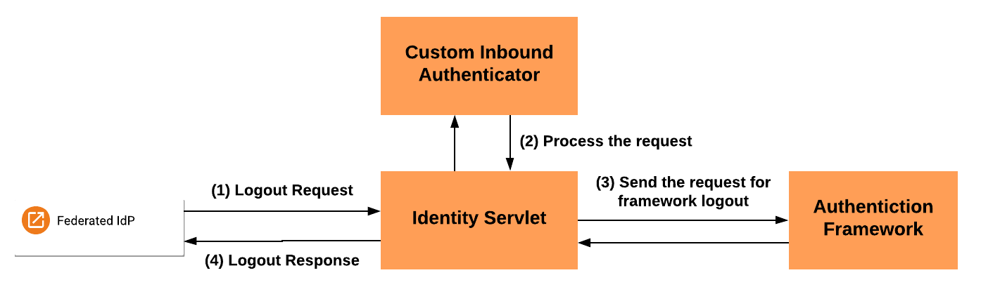
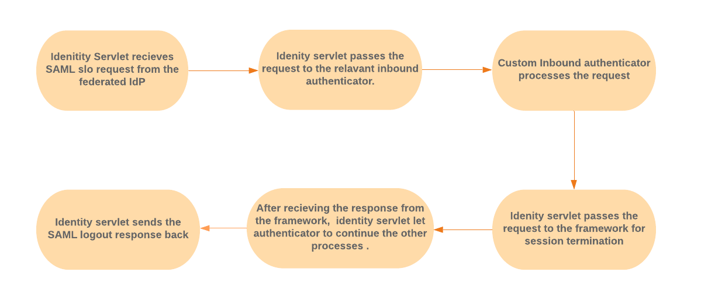
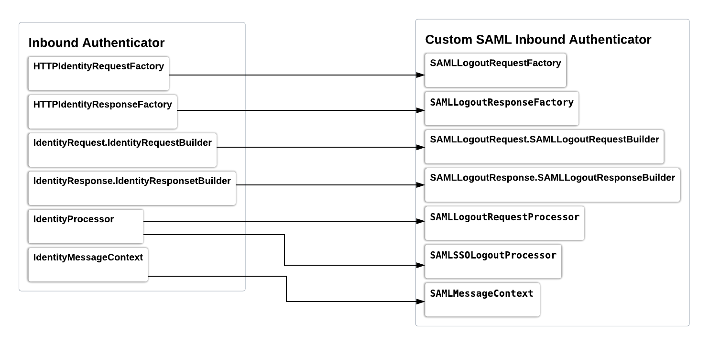
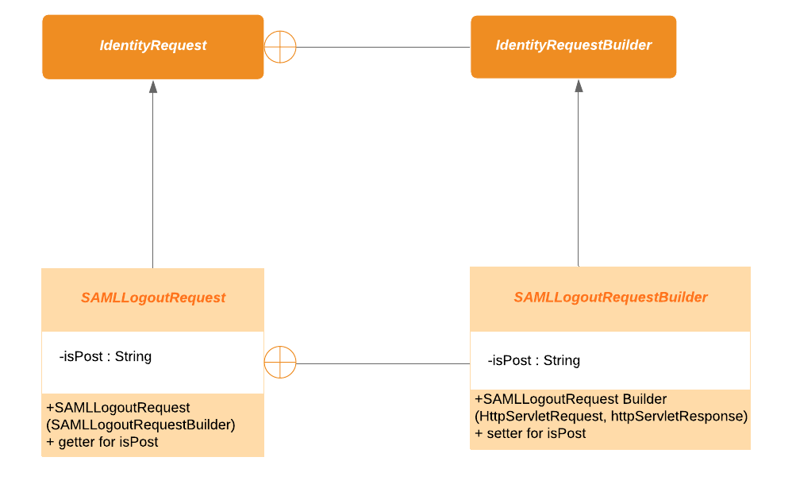
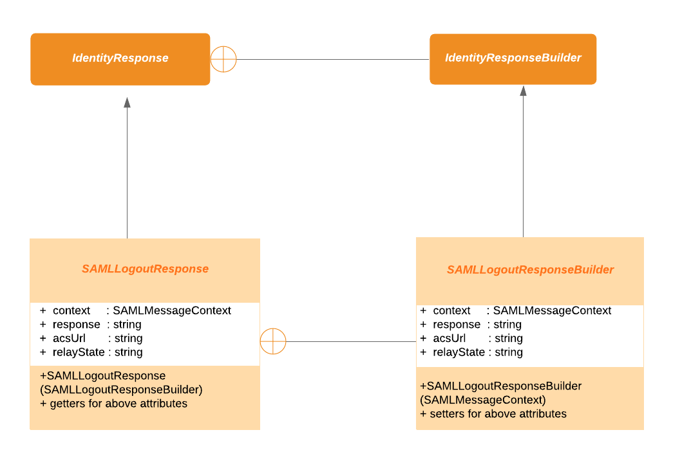
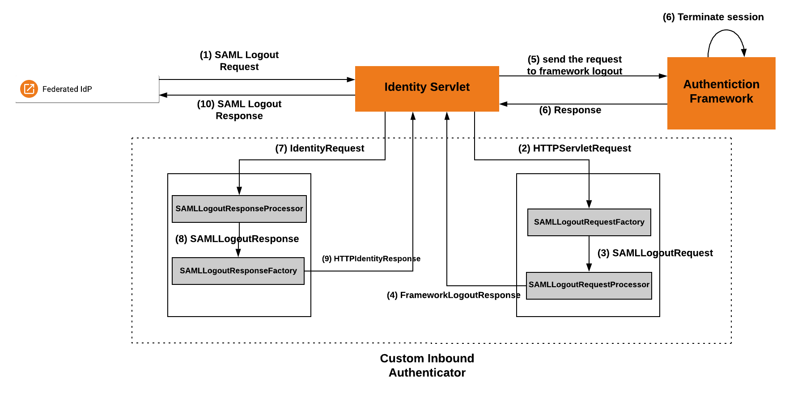

# Handling SAML Single Logout Requests from Federated Identity Providers

WSO2 Identity Server (WSO2 IS) supports handling SAML single logout requests from federated identity providers.
After the SAML single logout request is received from the federated identity provider, Identity Server processes 
the request and responds back to the identity provider after the session termination. 

## Scenario

Consider the following diagram where, WSO2 identity server, App 01 and App 02 are service providers of the federated 
identity provider. App03 and App04 are service providers of wso2 identity server. When a user tries to logout
from the App01, it will send a logout request to the federated IdP. Federated IdP will determine the session 
participants using the session index available in the logout request. As the Identity server is a session participant,
the Identity Server will receive a logout request from the federated IdP. Therefor the Identity Server needs to handle this
request,terminate the session and response back with a valid logout response.

## Approach

A custom inbound authenticator is implemented to handle SAML single logout requests from federated identity 
providers. This implementation architecture is mainly based on identity servlet driven inbound authentication. 

### Identity Servlet Driven Custom Inbound Authenticator

Primarily the purpose of the inbound authenticator is about processing the logout requests. The following diagram
featured upon the high level architecture of the flow of handling single logout request. As the process continues,
initially a SAML logout request from the federated IdP reaches the identity servlet through the “/identity/saml/slo”
URL,thus it will engage with this inbound authenticator. This inbound authenticator will be responsible for handling
all the protocol-specific tasks. 

The following flow chart describes the entire process in the above diagram with more explanation. 

According to the architecture, there are major classes should be extended in the authenticator and will give an 
explanation of all the classes and methods that I have implemented. 

The SAMLLogoutRequestFactory, SAMLLogoutResponseFactory,SAMLLogoutProcessor and SAMLLogoutRequestprocessor should 
be registered in the OSGI context. All these three entities have a method "canhandle()", which will decide whether t
he respective entity can handle the given scenario. In Identity Framework, all of these will be stored in a respective 
list and this list will be iterated in the order of priority and the method "canhandle()" will be called.

### SAMLLogoutRequestFactory

Takes in a HTTPServletRequest from the identity servlet and returns a builder to an SAMLLogoutRequest instance 
(instance of SAMLLogoutRequestBuilder). Main functionalities carried by the canHandle() and create() methods.

**Methods implemented in SAMLIdentityRequestFactory**

canHandle (HttpServletRequest request, HttpServletResponse response):
           
    Checks whether the URI of the HttpServletRequest matches with “/identity/saml/slo” which is also a SAML request.  
    Returns the boolean value after checking these conditions.

create (HttpServletRequest request, HttpServletResponse response):

    Converts the HTTPServletRequest to a common framework-understood format by building a builder (SAMLLogoutRequestBuilder) 
    to an SAMLLogoutRequest instance which includes the necessary parameters in the HTTPServletRequest.

### SAMLLogoutRequest and SAMLLogoutRequestBuilder

SAMLLogoutRequestBuilder is an inner class of SAMLLogoutRequest. Both are extended respectively from 
IdentityRequestBuilder and IdentityRequest.

Both have the same properties while SAMLLogoutRequest has getters and SAMLLogoutRequestBuilder has setters. 
So all the properties should be initialized in the time of creating IdentityRequestBuilder.

As the SAML request is a complex object with a large number of optional parameters, converting the request 
to another object model is a complex construction. Therefore Builder design pattern is used to construct the 
Identity Request object step by step and the final step will return the object. It also does separate the 
construction of the complex object from its representation so that the same construction process can create 
different representations.

### SAMLLogoutRequestProcessor

Now we have built the SAMLLogoutRequest. Now we should process the SAMLLogoutRequest. For that we need a 
processor (SAMLLogoutRequestProcessor) extended from IdentityProcessor. Now, this processor will validate 
the SAML logout request and if successfully validated, will return the FrameworkLogoutResponse.
FrameworkLogoutResponseBuilder instance. This  FrameworkLogoutResponse will be handled by identity servlet 
and redirected to the commanauth endpoint.

**Methods implemented in SAMLLogoutRequestProcessor**

_canHandle(IdentityRequest identityRequest):_

`Just as in the RequestFactory, here we should decide whether the given IdentityReuest can be processed 
in this processor. As we have a custom IdentityRequest we can just check whether the IdentityRequest is 
an "instanceof" SAMLLogoutRequest.`

_process(IdentityRequest identityRequest):_

`The processing functionality. In this processor basically, we have validated the SAML request.  
All the process methods should return an IdentityResponse.IdenstityResponse builder. Here we will 
return a default FarameworkLogoutResponseBuilder which is returned from the "buildResponseForFrameworkLogout". 
For calling this method, we need an IdentityMessageContext. This object includes the IdentityRequest we built. T
his context will be cached in the framework. Here we have created a custom SAMLMessageContext. In this object, 
you can include other fields that you need access to later. The only thing is they should be serializable, 
as this is going to be cached.`

_buildResponseForFrameworkLogout(SAMLMessageContext<String, String> samlMessageContext):`_

`This method is used to create an authentication request for the framework logout. The session index is a
dded as a query parameter to the authentication request. A new session data key is created to cache the
authentication request and SAMLMessageContext object is also cached using the same session data key.  
`

### SAMLLogoutProcessor

After framework logout, the response comes back to the identity servlet and IdentityRequest will be built 
in the identity servlet. It will iterate through the identity processors and will be handled by the relevant 
processor. This processor is implemented to handle the response sent from the framework after the framework logout. 
Methods implemented in SAMLLogoutProcessor

_canHandle(IdentityRequest identityRequest) :_

`Get the context from the cache using the value of the “sessionDataKey” parameter in the request. After that, 
check whether the context is not null and context.getRequest() instance of SAMLLogoutRequest. `

_process(IdentityRequest identityRequest) :_

`SAMLMessageContext object is retrieved from the cache using the sessionDataKey and build the SAMLLogoutResponse.
SAMLLogoutResponseBuilder instance passing the context. The saml response and the assertion consumer service URL 
are set to the builder and return the builder. `

### SAMLLogoutResponse and SAMLLogoutResponseBuilder

SAMLLogoutResponse class same as the SAMLLogoutRequest class. SAMLLogoutResponseBuilder is an inner class 
of the SAMLLogoutResponse class.

### SAMLLogoutResponseFactory

This class does the opposite of the SAMLLogoutRequestFactory; it builds a HttpIdentityResponse instance 
based on the common IdentityResponse format. 

**Methods implemented in SAMLLogoutProcessor**

_canHandle(IdentityRequest identityRequest):_

`check whether the IdentityResponse is an "instanceof" SAMLLogoutResponse.`

_process(IdentityResponse identityResponse):_

`Create HttpIdentityResponse.HttpIdentityResponseBuilder instance and set the body (saml response), 
status code, redirect url  using the attributes of the  identityResponse object. Return the HttpIdentityResponse.
HttpIdentityResponseBuilder instance to identity servlet.`

Identity servlet adds all values in the HttpIdentityResponse object to the HttpServletResponse and sends it 
to the relevant party. The diagram below illustrates the overall flow, starting from the single logout request 
issued from the federated IdP:

