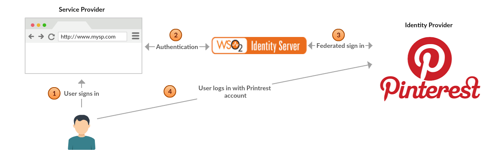
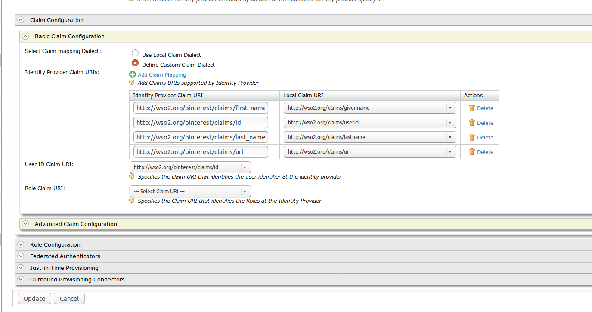
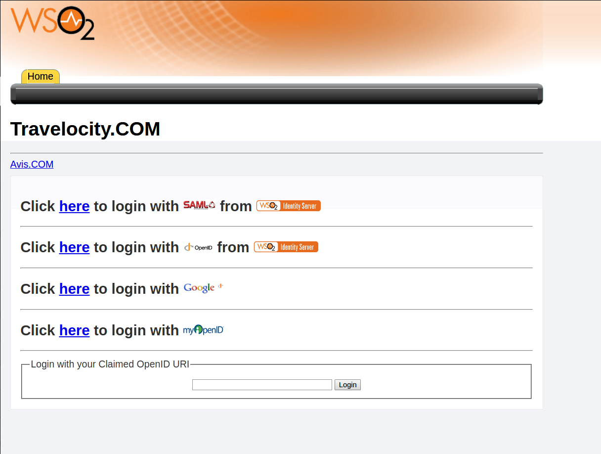

# Configuring Pinterest Authenticator

The Pinterest authenticator is configured as a federated authenticator
in WSO2 Identity Server to authenticate Pinterest users to log in to
your organization’s applications. Pinterest is a social network that
allows users to visually share, and discover new interests by posting
images or videos to their own or others' boards and browsing what other
users have pinned. The diagram below illustrates the flow of the
Printrest federated authenticator.

This page provides instructions on how to configure the Pinterest
authenticator and the WSO2 Identity Server using a sample app to
demonstrate authentication. You can find more information in the
following sections.

!!! info 
	This is tested for the Pinterest API version 1.0. Pinterest
	Authenticator is supported by Identity Server version 5.3.0 upwards.

### Configuring the Pinterest App

1.  Place the authenticator .jar file into the
    `           <IS_HOME>/repository/components/dropins          `
    directory. You can download the .jar file (
    `           org.wso2.carbon.extension.identity.authenticator.Pinterest.connector          `
    ) from [the WSO2
    Store](https://store.wso2.com/store/assets/isconnector/list?q=%2522_default%2522%253A%2522Pinterest%2522)
    .  

    !!! note
        If you want to upgrade the Pinterest Authenticator (.jar) in your
        existing IS pack, please refer [upgrade
        instructions.](../../develop/upgrading-an-authenticator)

2.  Navigate to <https://developers.pinterest.com/apps/> and create a
    new app as described in the [Pinterest Getting Started
    documentation](https://developers.pinterest.com/docs/api/overview/)
    .
3.  Enter the **Name** and **Description** of your new app and then
    click the **Create** button.  
    
4.  Enter the redirect URL as <https://localhost:9443/commonauth> in the
    page that appears.  
    This is the WSO2 IS endpoint to which Pintrest, who is the federated
    authenticator, needs to send the authentication response.  
     
5.  You have now finished configuring Pinterest. Copy the **App ID** and
    **App secret** from the resulting page.  
     

### Deploying travelocity.com sample app

The next step is to deploy the travelocity.com sample app in order to
use it in this scenario.

For more information on how to do this, see [Deploying travelocity.com
sample app](../../develop/deploying-the-sample-app).

### Configuring the identity provider

Now you must configure WSO2 Identity Server by [adding a new identity
provider](../../learn/adding-and-configuring-an-identity-provider)
.

1.  Download the WSO2 Identity Server from
    [here](http://wso2.com/products/identity-server/) and [run
    it](../../setup/running-the-product).
2.  Log in to the [Management
    Console](../../setup/getting-started-with-the-management-console)
    as an administrator.
3.  In the **Identity Providers** section under the **Main** tab of the
    management console, click **Add**.
4.  Give a suitable name for **Identity Provider Name** and configure
    Pinterest as the identity provider. Refer
    [this](../../learn/adding-and-configuring-an-identity-provider#adding-an-identity-provider)
    document for more information regarding the identity provider
    configurations.  
       
    Do the following configurations.

    | Field         | Description                                                                                                                                                                                            | Sample Value                                                     |
    |---------------|--------------------------------------------------------------------------------------------------------------------------------------------------------------------------------------------------------|------------------------------------------------------------------|
    | Enable        | Selecting this option enables pinterest to be used as an authenticator for users provisioned to the Identity Server.                                                                                   | Selected                                                         |
    | Default       | Selecting the **Default** checkbox signifies that Pinterest is the main/default form of authentication. This removes the selection made for any other **Default** checkboxes for other authenticators. | Selected                                                         |
    | Client Id     | This is the username from the Pinterest application.                                                                                                                                                   | 4927778446347615595                                              |
    | Client Secret | This is the password from the Pinterest application. Click the **Show** button to view the value you enter.                                                                                            | 7514127b86f6a5b6a5f4625cb9ba967f10ba0cdb3fef5bf20a91b0cc7b261818 |
    | Callback URL  | This is the URL to which the browser should be redirected after the authentication is successful. It should have this format: https://(host-name):(port)/acs.                                          | https://localhost:9443/commonauth                                |

5.  Go to **Pinterest Authenticator Configuration** under **Federated
    Authenticators**.
6.  Enter the values as given in the above figure.  
    -   **Client Id** : App ID for your app.
    -   **Client Secret** : App secret for your app.
    -   **Callback URL** : Service Provider's URL where code needs to be
        sent .

You have now added the identity provider.

### Configuring the service provider

The next step is to configure the service provider.

1.  Return to the management console.
2.  In the **Service Providers** section under the **Main** tab, click
    **Add**.
3.  Since you are using travelocity as the sample, enter travelocity.com
    in the **Service Provider Name** text box and click **Register**.
4.  In the **Inbound Authentication Configuration** section, click
    **Configure** under the **SAML2 Web SSO Configuration** section.  
     
5.  Now set the configuration as follows:  
    -   **Issuer** : travelocity.com
    -   **Assertion Consumer URL** :
        <http://localhost:8080/travelocity.com/home.jsp>
6.  Select the following check-boxes:
    -   **Enable Response Signing**.
    -   **Enable Single Logout**.
    -   **Enable Attribute Profile**.
    -   **Include Attributes in the Response Always**.
7.  Click **Update** to save the changes. Now you will be sent back to
    the **Service Providers** page.
8.  Go to the **Local and Outbound Authentication Configuration**
    section.
9.  Select the identity provider you created from the dropdown list
    under **Federated Authentication**.  
     
10. Ensure that the **Federated Authentication** radio button is
    selected and click **Update** to save the changes.

### Configuring claim mappings for Pinterest

1.  Sign into the [Management
    Console](../../setup/getting-started-with-the-management-console)
    by entering your username and password.
2.  In the **Main** menu, click **Add** under **Claims**.
3.  Click **Add Claim Dialect** to create the Pinterest authenticator
    specific claim dialect.

4.  Specify the **Dialect URI** as http://wso2.org/pinterest/claims.  
     

5.  Click [Add external
    claim](../../learn/adding-claim-mapping#add-external-claim)
    . Use the Dialect Uri as http://wso2.org/pinterest/claims. You can
    create the external claims here.  
    
    Create the claim for Pinterest user id while creating the claim
    dialect.

    |                    |                                     |
    |--------------------|-------------------------------------|
    | Dialect URI        | http://wso2.org/pinterest/claims    |
    | External Claim URI | http://wso2.org/pinterest/claims/id |
    | Mapped Local Claim | http://wso2.org/claims/userid       |

    Create the claim for Pinterest first name while creating the claim
    dialect.

    |                    |                                              |
    |--------------------|----------------------------------------------|
    | Dialect URI        | http://wso2.org/pinterest/claims             |
    | External Claim URI | http://wso2.org/pinterest/claims/first\_name |
    | Mapped Local Claim | http://wso2.org/claims/givenname             |

    Create the claim for Pinterest last name while creating the claim
    dialect.

    |                    |                                             |
    |--------------------|---------------------------------------------|
    | Dialect URI        | http://wso2.org/pinterest/claims            |
    | External Claim URI | http://wso2.org/pinterest/claims/last\_name |
    | Mapped Local Claim | http://wso2.org/claims/lastname             |

    Create the claim for Pinterest URL while creating the claim dialect.

    |                    |                                       |
    |--------------------|---------------------------------------|
    | Dialect URI        | http://wso2.org/pinterest/claims      |
    | External Claim URI | http://wso2.org/pinterest/claims/ur l |
    | Mapped Local Claim | http://wso2.org/claims/url            |

    Likewise, you can create the claims for all the public information
    of the Pinterest user.

6.  The next step is to configure claims in the Identity Server and map
    them to Pinterest.

    !!! note
        For more details on configuring claims for a service provider,
        Please refer
        [this](../../learn/configuring-claims-for-a-service-provider)
        .

    1.  In the **Identity** section under the **Main** tab, click
        **List** under **Identity Providers**.
    2.  Click **Edit** to edit the pinterest identity provider you
        created.
    3.  Under **Claim Configuration**, go to **Basic Claim
        Configuration**.
    4.  Select the **Define Custom Claim Dialect** option under **Select
        Claim mapping Dialect**.
    5.  Click **Add Claim Mapping** to add custom claim mappings as
        follows.  
        
    6.  Select a suitable **User ID Claim URI** (e.g.,
        http://wso2.org/pinterest/claims/id ).
    7.  Click **Update** to save changes.

Here, we are mapping claims in the Identity Server and with the claims
of Pinterest. So that once the user is authenticated from the Printrest,
the identity server can obtain the necessary claim values of the
authenticated user from the Pinterest side. These claims can be used by
the service provider for different purposes.

### Configuring requested claims for travelocity.com

1.  In the **Identity** section under the **Main** tab, click **List**
    under **Service Providers**.
2.  Click **Edit** to edit the [travelocity.com](http://travelocity.com)
    service provider.
3.  Go to **Claim Configuration**.
4.  Click on **Add Claim URI** under **Requested Claims** to add the
    requested claims as follows. Here you should add the claims you
    mapped in the Identity Provider claim configuration.  
     

### Testing the sample

1.  To test the sample, go to the following URL:
    `            http://<TOMCAT_HOST>:<TOMCAT_PORT>/travelocity.com/index.jsp           `
    . E.g., <http://localhost:8080/travelocity.com>  
    
2.  Click the link to log in with SAML from the WSO2 Identity Server.
3.  You are redirected to the Pinterest sign in page. Enter your
    Pinterest credentials and click **Log in**.  
    
4.  Authenticate the user by clicking **Allow access**.
5.  You are taken to the home page of the travelocity.com app.  
    