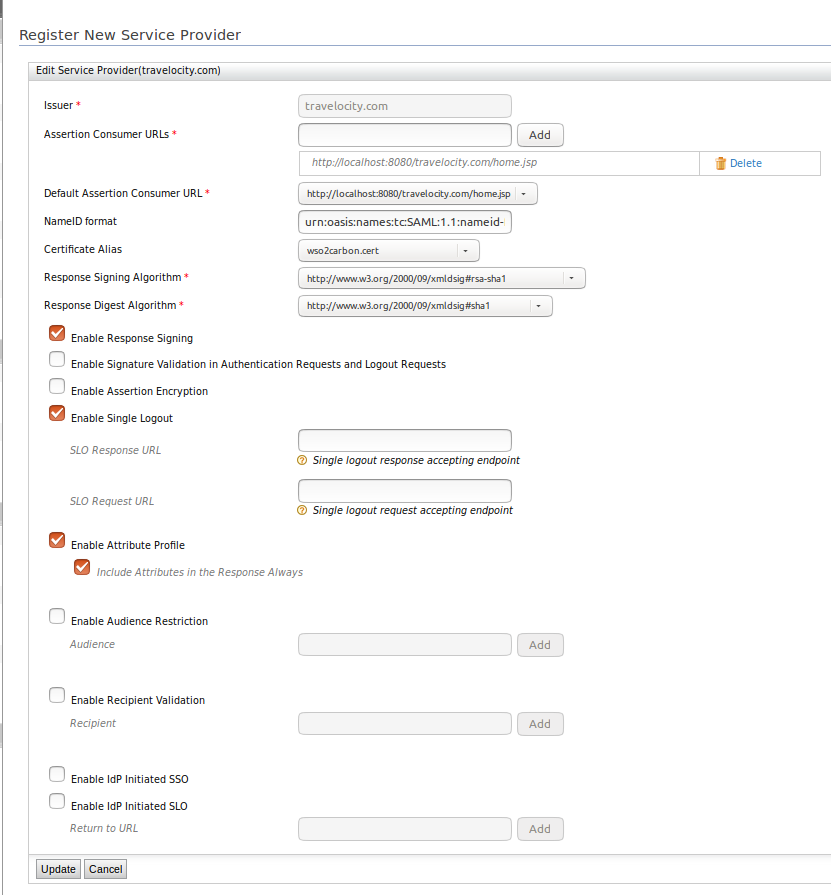

# Configuring Multi-factor Authentication using Token2

The Token2 authenticator is configured as a federated authenticator in
WSO2 Identity Server to provide multifactor authentication for your
organization’s applications. It can be used with a time-based hardware
token device that complies with OAuth specifications.

This section provides instructions on how to configure the Token2
authenticator and WSO2 Identity Server using a sample app. See the
following sections for more information.

!!! info 
	Token2 Authenticator is supported by WSO2 Identity Server versions 5.1.0
	and 5.2.0.

### Deploying Token2 artifacts

The artifacts can be obtained from [the store for this
authenticator](https://store.wso2.com/store/assets/isconnector/list?q=%22_default%22%3A%22token2%22)
.

1.  Place the `           token2authenticationendpoint.          ` war
    file into the
    `           <IS_HOME>/repository/deployment/server/webapps          `
    directory.
2.  Place the
    `            org.wso2.carbon.extension.identity.authenticator.token2.connector-1.0.0.jar           `
    file into the
    `            <IS_HOME>/repository/components/dropins           `
    directory.  

    !!! note
        If you want to upgrade the Token2 Authenticator in your existing IS
        pack, please refer [upgrade
        instructions.](../../develop/upgrading-an-authenticator)
    

### Configuring the Token2 hardware device

1.  Register a Token2 account using " <https://token2.com/register>".
    Ensure that you do the following.
    1.  Enter the **Mobile phone number** in e164 format (+ 94 77 \*\*
        \*\* \*\*\* )
    2.  Select **SMS Based** as the **User type**.
    3.  Click **Register**.  
        
2.  Once you have registered with Token2, log in using your email,
    password and the OTP that is sent to the registered mobile number
    through Token2.
3.  Add a new site using " <https://token2.com/manage> " and obtain the
    API Key and site\_id for the site.
4.  As mentioned in the [Token2 API
    page](https://token2.com/?content=api), create the user and you can
    find the userid in the response .
5.  You have to obtain the hardware token device and send the userid,
    site\_id and token serial number to Token2 support to enable it.
6.  Then logout and login again with your email, password and use the
    token generated in the hardware token device .

You have now enabled the token2 hardware device.

### Deploying [travelocity.com](http://travelocity.com) sample

The next step is to [deploy the sample app](../../develop/deploying-the-sample-app)
in order to use it in this scenario.

O nce this is done, the next step is to configure the WSO2 Identity
Server by adding an [identity
provider](../../learn/adding-and-configuring-an-identity-provider)
and a [service provider](../../learn/adding-and-configuring-a-service-provider).

### Configuring the identity provider

Now you have to configure WSO2 Identity Server by [adding a new identity
provider](../../learn/adding-and-configuring-an-identity-provider)
.

1.  Download the WSO2 Identity Server from
    [here](http://wso2.com/products/identity-server/).

2.  [Run the WSO2 Identity
    Server](../../setup/running-the-product).
3.  Log in to the [management
    console](../../setup/getting-started-with-the-management-console)
    as an administrator.
4.  In the **Identity Providers** section under the **Main** tab of the
    management console, click **Add**.
5.  Give a suitable name for **Identity Provider Name** (e.g., token2 ).
6.  Navigate to **Token2Authenticator Configuration** under **Federated
    Authenticators**.
7.  Select both check boxes to **Enable** the Token2 authenticator and
    make it the **Default**.  
     

8.  Enter the following values:

    | Field        | Description                                                                                                                              | Sample Value                                                                                                                           |
    |--------------|------------------------------------------------------------------------------------------------------------------------------------------|----------------------------------------------------------------------------------------------------------------------------------------|
    | ApiKey       | This is the API key you obtained when [configuring the Token2 hardware device](_Configuring_Multi-factor_Authentication_using_Token2_). | `                7cf6eof73be1c38952ca81dd68a               `                                                                           |
    | Callback URL | This is the service provider's URL to which the code is sent.                                                                            | `                                                   https://localhost:9443/commonauth                                                ` |

9.  Click **Register**.  
    You have now added the identity provider.

### Configuring user claims

1.  In the **Main** menu, click **Add** under **Claims**.
2.  Click [Add New
    Claim](../../learn/adding-claim-mapping).
3.  Click **Add Local Claim**. The **Dialect URI** will be
    automatically set to
    `                         http://wso2.org/claims                       `
   , which is the internal claim dialect .

    <table>
    <thead>
    <tr class="header">
    <th>Claim details</th>
    <th>Description</th>
    <th>Sample</th>
    </tr>
    </thead>
    <tbody>
    <tr class="odd">
    <td><strong>Claim URI</strong></td>
    <td>This is the URI defined under the dialect, specific to the claim. There are different URIs available in the Identity Server and these equate to user attributes displayed in the profile of users. These URIs are mapped to the attributes in the underlying user store.</td>
    <td><code>                                   http://wso2.org/claims/identity/userid                                 </code></td>
    </tr>
    <tr class="even">
    <td><strong>Display Name</strong></td>
    <td>This is the name of the claim displayed on the UI. This can be viewed in the user's profile by navigating to the <strong>Main</strong> tab in the management console and clicking <strong>List</strong> in <strong>Users and Roles</strong> . In the resulting page, click <strong>Users</strong> and in the list of users that is displayed, click <strong>User Profile</strong> next to the one you wish to check.</td>
    <td><code>                 User Id                </code></td>
    </tr>
    <tr class="odd">
    <td><strong>Description</strong></td>
    <td>This gives you the option to describe the functionality of the claim.</td>
    <td><code>                 Claim to User Id                </code></td>
    </tr>
    <tr class="even">
    <td><strong>Mapped Attribute</strong></td>
    <td>

    
This is the corresponding attribute name from the underlying user store that is mapped to the Claim URI value. 
     
    When you have multiple user stores connected to the Identity Server, this maps the equivalent attribute in all of them to the Claim URI you are configuring. 
    For example, if you specify the <code>                   cn                  </code> attribute, this is mapped to the <code>                   cn                  </code> attribute in all the connected user stores. If you want to specify the attribute in a specific user store, you must add the domain name in addition to the mapped claim. For example, in a scenario where you have a primary user store configured called PRIMARY and secondary user stores called AD (representing Active Directory), you can map an attribute from each of these user stores to the Claim URI value by clicking <strong>Add Attribute Mapping</strong>, selecting the respective user store from the drop-down list, and mentioning the attribute of the userstore the attribute needs to be mapped to. 
    Example: 
    

    
</td>
    <td><code>                 stateOrProvinceName                </code></td>
    </tr>
    <tr class="odd">
    <td><strong>Regular Expression</strong></td>
    <td>This is the regular expression used to validate inputs. Example : For a claim URI like <code>                                                      http://wso2.org/claims/email                                                   </code> the regex should be something like <strong>^([a-zA-Z0-9_\-\.]+)@([a-zA-Z0-9_\-\.]+)\.([a-zA-Z]{2,5})$ .</strong> This will validate the claim value and will not let other values except an email.</td>
    <td> 
    </td>
    </tr>
    <tr class="even">
    <td><strong>Display Order</strong></td>
    <td>This enables you to specify the order in which the claim is displayed, among the other claims defined under the same dialect.</td>
    <td> 
    </td>
    </tr>
    <tr class="odd">
    <td><strong>Supported by Default</strong></td>
    <td>If unchecked, this claim will not be prompted during user registration.</td>
    <td> 
    </td>
    </tr>
    <tr class="even">
    <td><strong>Required</strong></td>
    <td>This specifies whether this claim is required for user registration.</td>
    <td> 
    </td>
    </tr>
    <tr class="odd">
    <td><strong>Read-only</strong></td>
    <td>This specifies whether the claim is read-only or not. If the claim is read-only, it can't be updated by the user.</td>
    <td> 
    </td>
    </tr>
    <tr class="even">
    <td><strong>Additional Properties</strong></td>
    <td>These properties are not currently used in current WSO2 Identity server. If we need to write an extension using current claims, we can use these property values.</td>
    <td> 
    </td>
    </tr>
    </tbody>
    </table>

       

4.  Next click **List** under **Main \> Identity \> Users and Roles**.
5.  Click **User Profile** under **Admin** and update the
    `           User Id          ` .  
     

Now you have configured the claim.  

### Configuring the service provider

The next step is to configure the service provider.

1.  Return to the management console.

2.  In the **Identity** section under the **Main** tab, click **Add**
    under **Service Providers**.

3.  Enter **[travelocity.com](http://travelocity.com)** in the **Service
    Provider Name** text box and click **Register**.

4.  In the **Inbound Authentication Configuration** section, click
    **Configure** under the **SAML2 Web SSO Configuration** section.  
    

	??? note "Click here to view the field definitions"
		<table>
		<thead>
		<tr class="header">
		<th>Field</th>
		<th>Description</th>
		<th>Sample value</th>
		</tr>
		</thead>
		<tbody>
		<tr class="odd">
		<td>Issuer</td>
		<td>Specify the <strong>Issuer</strong> . This is the <code>                   &lt;saml:Issuer&gt;                  </code> element that contains the unique identifier of the service provider. This is also the issuer value specified in the SAML Authentication Request issued by the service provider. When configuring single-sign-on across Carbon servers, ensure that this value is equal to the <strong>ServiceProviderID</strong> value mentioned in the <code>                   &lt;IS_HOME&gt;/repository/conf/security/authenticators.xml                  </code> file of the relying party Carbon server.</td>
		<td>travelocity.com</td>
		</tr>
		<tr class="even">
		<td>Assertion Consumer URLs</td>
		<td>Specify the <strong>Assertion Consumer URLs</strong> . This is the URL to which the browser should be redirected to after the authentication is successful. This is the Assertion Consumer Service (ACS) URL of the service provider. The identity provider redirects the SAML2 response to this ACS URL. However, if the SAML2 request is signed and SAML2 request contains the ACS URL, the Identity Server will honor the ACS URL of the SAML2 request. It should have this format: https://(host-name):(port)/acs . You can add multiple assertion consumer URLs for the service provider by entering the URL and clicking the <strong>Add</strong> button.</td>
		<td>http://wso2is.local:8080/travelocity.com/home.jsp</td>
		</tr>
		<tr class="odd">
		<td>Default Assertion Consumer URL</td>
		<td>

		
Since there can be multiple assertion consumer URLs, you must define a <strong>Default Assertion Consumer URL</strong> in case you are unable to retrieve it from the authentication request.

		

		
Tips

		
In a service provider initiated single sign-on setup, the following needs to be considered.

		<ul>
		<li>If no ACS URL is given in the &lt; <code>                      AuthnRequest                     </code> &gt;, the Identity Server sends the response to the default ACS URL of the service provider (whether the request is signed or not).</li>
		<li>If the ACS URL in &lt; <code>                      AuthnRequest                     </code> &gt; matches with one of the registered URLs, the Identity Server sends the response to the matched one.</li>
		<li>If the ACS URL in &lt; <code>                      AuthnRequest                     </code> &gt; does not match any of the registered ACS URLs and if the request is signed, the Identity Server sends the response to the ACS URL in the request only if the signature is valid. Alternatively, the &lt; <code>                      AuthnRequest                     </code> &gt; is rejected.</li>
		</ul>
		
In an identity provider initiated single sign-on setup, the following needs to be considered.

		<ul>
		<li>If the “acs” query parameter is not present in the request, the Identity Server sends the response to default ACS URL of the service provider.</li>
		<li>If the "acs” parameter is present and the value of that parameter matches with any of the registered ACS URLs of the service provider, then the Identity Server sends the response to the matched one.</li>
		</ul>
		

</td>
		<td>http://wso2is.local:8080/travelocity.com/home.jsp</td>
		</tr>
		<tr class="even">
		<td>NameID format</td>
		<td>

		
Specify the <strong>NameID format</strong> . This defines the name identifier formats supported by the identity provider. The service provider and identity provider usually communicate with each other regarding a specific subject. That subject should be identified through a Name-Identifier (NameID), which should be in some format so that It is easy for the other party to identify it based on the format. Name identifiers are used to provide information regarding a user.

		

		

		
About NameID formats

		
For SSO interactions, you can use the following types of NameID formats.

		<ul>
		<li><code>                       urn:oasis:names:tc:SAML:2.0:nameid-format:persistent                      </code></li>
		<li><code>                       urn:oasis:names:                      </code> tc <code>                       :SAML:2.0:                      </code> nameid <code>                       -format:transient                      </code></li>
		<li><code>                       urn:oasis:names:                      </code> tc <code>                       :SAML:1.1:                      </code> nameid <code>                       -format:                      </code></li>
		<li><code>                       emailAddressurn:oasis:names:tc:SAML:1.1:nameid-format:unspecified                      </code></li>
		<li><code>                       urn:oasis:names:tc:SAML:1.1:nameid-format:X509SubjectName                      </code></li>
		<li><code>                       urn:oasis:names:tc:SAML:1.1:nameid-format:WindowsDomainQualifiedName                      </code></li>
		<li><code>                       urn:oasis:names:tc:SAML:2.0:nameid-format:kerberos                      </code></li>
		<li><code>                       urn:oasis:names:tc:SAML:2.0:nameid-format:entity                      </code></li>
		</ul>
		
This specifies the name identifier format that the Identity Server wants to receive in the subject of an assertion from a particular identity provider. The following is the default format used by the identity provider.

		<ul>
		<li><code>                       urn:oasis:names:tc:SAML:1.1:nameid-format:emailAddress                      </code></li>
		</ul>
		

		

</td>
		<td>
urn:oasis:names:tc:SAML:1.1:nameid-format:emailAddress
</td>
		</tr>
		<tr class="odd">
		<td>Certificate Alias</td>
		<td>
Select the <strong>Certificate Alias</strong> from thedropdown. This is used to validate the signature of SAML2 requests and is used to generate encryption.Basically the service provider’s certificate must be selected here. Note that this can also be the Identity Server tenant's public certificate in a scenario where you are doing atenant specific configuration.
</td>
		<td>wso2carbon</td>
		</tr>
		<tr class="even">
		<td>Response Signing Algorithm</td>
		<td>
Specifies the ‘SignatureMethod’ algorithm to be used in the ‘Signature’ element in POST binding. The default value can be configured in the <code>                    &lt;IS_HOME&gt;/repository/conf/identity.xml                   </code> file, in the <code>                    SSOService                   </code> element with <code>                    SAMLDefaultSigningAlgorithmURI                   </code> tag. If it is not provided the default algorithm is RSA­SHA 1, at URI http:// www.w3.org/2000/09/xmldsig#rsa­sha1 ‘ ’ .
</td>
		<td><a href="http://www.w3.org/2000/09/xmldsig#rsa%C2%ADsha1">http://www.w3.org/2000/09/xmldsig#rsa­sha1</a></td>
		</tr>
		<tr class="odd">
		<td>Response Digest Algorithm</td>
		<td>
Specifies the ‘DigestMethod’ algorithm to be used in the ‘Signature’ element in POST binding. The default value can be configured in the <code>                    &lt;IS_HOME&gt;/repository/conf/identity.xml                   </code> file, in the <code>                    SSOService                   </code> element with <code>                    SAMLDefaultDigestAlgorithmURI                   </code> tag. If it is not provided the default algorithm is SHA 1, at URI ‘ http://www.w3.org/2000/09/xmldsig#sha1 ’ .
</td>
		<td><a href="http://www.w3.org/2000/09/xmldsig#sha1">http://www.w3.org/2000/09/xmldsig#sha1</a></td>
		</tr>
		<tr class="even">
		<td>Enable Response Signing</td>
		<td>Select <strong>Enable Response Signing</strong> to sign the SAML2 Responses returned after the authentication process.</td>
		<td>Selected</td>
		</tr>
		<tr class="odd">
		<td>Enable SignatureValidation inAuthentication Requests and Logout Requests</td>
		<td>Select <strong>Enable Signature Validation in Authentication Requests and Logout Requests</strong> if you need this functionality configured. This specifies whether the identity provider must validate the signature of the SAML2 authentication request and the SAML2 logout request thatare sent by the service provider.</td>
		<td>Unselected</td>
		</tr>
		<tr class="even">
		<td>Enable Assertion Encryption</td>
		<td>Enable <strong>Assertion Encryption</strong>, if you wish to encrypt the assertion.</td>
		<td>Unselected</td>
		</tr>
		<tr class="odd">
		<td>Enable Single Logout</td>
		<td>Select <strong>Enable Single Logout</strong> so that all sessions are terminated once the user signs out from one server. If single logout is enabled, the identity provider sends logout requests to all service providers. Basically, the identity provider acts according to the single logout profile. If the service provider supports a different URL for logout, you can enter a <strong>SLO Response URL</strong> and <strong>SLO Request URL</strong> for logging out. These URLs indicate where the request and response should go to. If you do not specify this URL, the identity provider uses the Assertion Consumer Service (ACS) URL.</td>
		<td>Selected</td>
		</tr>
		<tr class="even">
		<td>Enable Attribute Profile</td>
		<td>Select <strong>Enable Attribute Profile</strong> to enable this and add a claim by entering the claim link and clicking the <strong>Add Claim</strong> button. The Identity Server provides support for a basic attribute profile where the identity provider can include the user’s attributes in the SAML Assertions as part of the attribute statement. Once you select the checkbox to <strong>Include Attributes in the Response Always</strong>, the identity provider always includes the attribute values related to the selected claims in the SAML attribute statement.</td>
		<td>Unselected</td>
		</tr>
		<tr class="odd">
		<td>Enable Audience Restriction</td>
		<td>Select <strong>Enable Audience Restriction</strong> to restrict the audience. You may add audience members using the <strong>Audience</strong> text box and clicking the <strong>Add</strong> button.</td>
		<td>Unselected</td>
		</tr>
		<tr class="even">
		<td>Enable Recipient Validation</td>
		<td>Select this if you require validation from the recipient of the response.</td>
		<td>Unselected</td>
		</tr>
		<tr class="odd">
		<td>Enable IdP Initiated SSO</td>
		<td>Select the <strong>Enable IdP Initiated SSO</strong> checkbox to enable this functionality. When this is enabled, the service provider is not required to send the SAML2 request.</td>
		<td>Unselected</td>
		</tr>
		<tr class="even">
		<td>Enable IdP Initiated SLO</td>
		<td>Select the <strong>Enable IdP Initiated SLO</strong> checkbox to enable this functionality. You must specify the URL.</td>
		<td>Unselected</td>
		</tr>
		<tr class="odd">
		<td>Enable Assertion Query Request Profile</td>
		<td>Select the Enable Assertion Query Request Profile checkboxto query assertions that are persisted to the database when you loginto the service provider application. For more information, see <a href="https://docs.wso2.com/display/IS530/Querying+SAML+Assertions">Querying SAML Assertions</a> .</td>
		<td>Unselected</td>
		</tr>
		</tbody>
		</table>

5.  Now set the configuration as follows:

    1.  **Issuer** : [travelocity.com](http://travelocity.com)

    2.  **Assertion Consumer URL** :
        <http://localhost:8080/travelocity.com/home.jsp>

6.  Select the following check-boxes:
    1.  **Enable Response Signing**

    2.  **Enable Single Logout**

    3.  **Enable Attribute Profile**

    4.  **Include Attributes in the Response Always**

7.  Click **Update** to save the changes. Now you will be sent back to
    the Service Providers page.

8.  Go to **Claim configuration** and select the userId claim as Subject
    Claim URI.  
     

9.  Go to **Local and Outbound Authentication Configuration** section .

10. Select the **Advanced configuration** radio button option .

11. Add the **basic** authentication as a first step and **token2**
    authentication as a second step . This is done to configure
    multi-step authentication. What this means is that a user who logs
    in would first have to enter their credentials that are configured
    with the Identity Server and then get authenticated using Token2 as
    the second step. This is an added security measure and a common use
    of the Token2 authenticator.  
     

    ??? note "Click here to view the field definitions"
		<table>
		<thead>
		<tr class="header">
		<th>Authentication Type</th>
		<th>Details</th>
		</tr>
		</thead>
		<tbody>
		<tr class="odd">
		<td>Default</td>
		<td>

		
This is the default authenticator sequence for a configured service provider in the Identity Server. This sequence can be modified by updating following section in the <code>                     &lt;IS_HOME&gt;/repository/conf/identity/application-authentication.                    </code> xml file.

		

		

		
<pre class="sourceCode xml"><code class="sourceCode xml"><a class="sourceLine" id="cb1-1" title="1">&lt;Sequences&gt;</a>
		<a class="sourceLine" id="cb1-2" title="2">    &lt;!-- Default Sequence. This is mandatory --&gt;</a>
		<a class="sourceLine" id="cb1-3" title="3">    &lt;Sequence appId=&quot;default&quot;&gt;</a>
		<a class="sourceLine" id="cb1-4" title="4">        &lt;Step order=&quot;1&quot;&gt;</a>
		<a class="sourceLine" id="cb1-5" title="5">            &lt;Authenticator name=&quot;BasicAuthenticator&quot;/&gt;</a>
		<a class="sourceLine" id="cb1-6" title="6">        &lt;/Step&gt;</a>
		<a class="sourceLine" id="cb1-7" title="7">    &lt;/Sequence&gt;</a>
		<a class="sourceLine" id="cb1-8" title="8">&lt;/Sequences&gt;</a></code></pre>

		

		

		
</td>
		</tr>
		<tr class="even">
		<td>LocalAuthentication</td>
		<td>
In this case, Identity Server itself authenticate the user. There are three types of local authenticators OOTB in a fresh Identity Server pack.

		<ul>
		<li>The <strong>basic</strong> authenticator is used to authenticate the user using the credentials available in the Identity Server.</li>
		<li><strong>IWA</strong> stands for Integrated Windows Authentication and involves automatically authenticating users using their Windows credentials.</li>
		<li><strong>FIDO</strong> authenticator is a local authenticator that comes with the WSO2 Identity Server. This will handle FIDO authentication requests related key validation against stored keys, the public key,keyhandler, and the counter, attestation certificate of FIDO registered users.</li>
		</ul></td>
		</tr>
		<tr class="odd">
		<td>FederatedAuthentication</td>
		<td>In this case, Identity Server trust third-party Identity provider to perform the user authentication. These Identity providers use various protocols to transfer authentication/authorization related messages. Currently, the Identity Server only supports the following federated authenticators OOTB.
		<ul>
		<li>SAML2 Web SSO</li>
		<li>OAuth2/OpenID Connect</li>
		<li>WS-Federation (Passive)</li>
		<li>Facebook</li>
		<li>Microsoft (Hotmail, MSN, Live)</li>
		<li>Google</li>
		<li>SMS OTP</li>
		<li>Email OTP</li>
		<li>Twitter</li>
		<li>Yahoo</li>
		<li>IWA Kerberos</li>
		<li>Office365</li>
		</ul></td>
		</tr>
		<tr class="even">
		<td>Advanced Configuration</td>
		<td>Advanced configurations enable you to add multiple options or steps in authentication. When multiple authentication steps exist, the user is authenticated based on each and every one of these steps. If only one step is added then the user is only authenticated based on the local and/or federated authenticators added in a single step. However, in the case of local and/or federated authenticators, the authentication happens based on any one of the available authenticators.</td>
		</tr>
		</tbody>
		</table>

You have now added and configured the service provider.  

### Testing the sample

1.  To test the sample, go to the following URL:
    <http://localhost:8080/travelocity.com>  
    
	 

2.  Click the link to log in with SAML from WSO2 Identity Server.

3.  Basic authentication page will be visible, use your IS username and
    password.  
     

4.  Enter the code that is generated with token2 hardware device to
    authenticate. You are directed to the home page of the
    [travelocity.com](http://travelocity.com) app.

     

     
