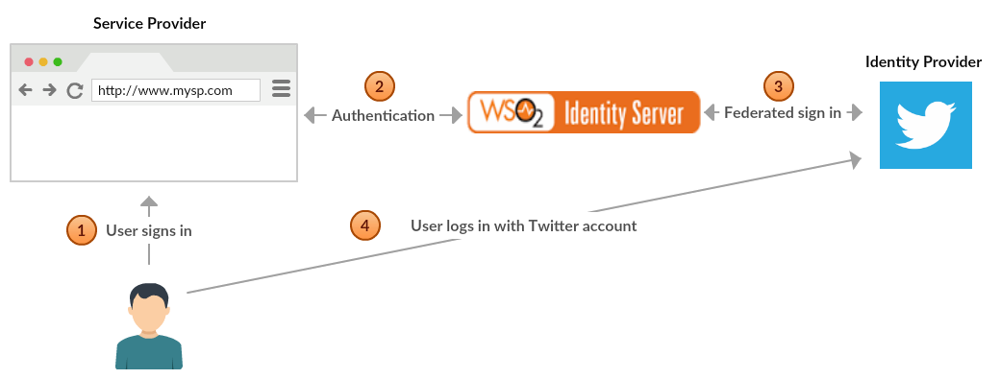
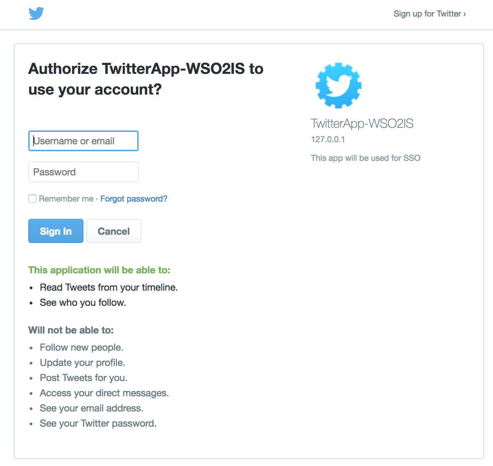
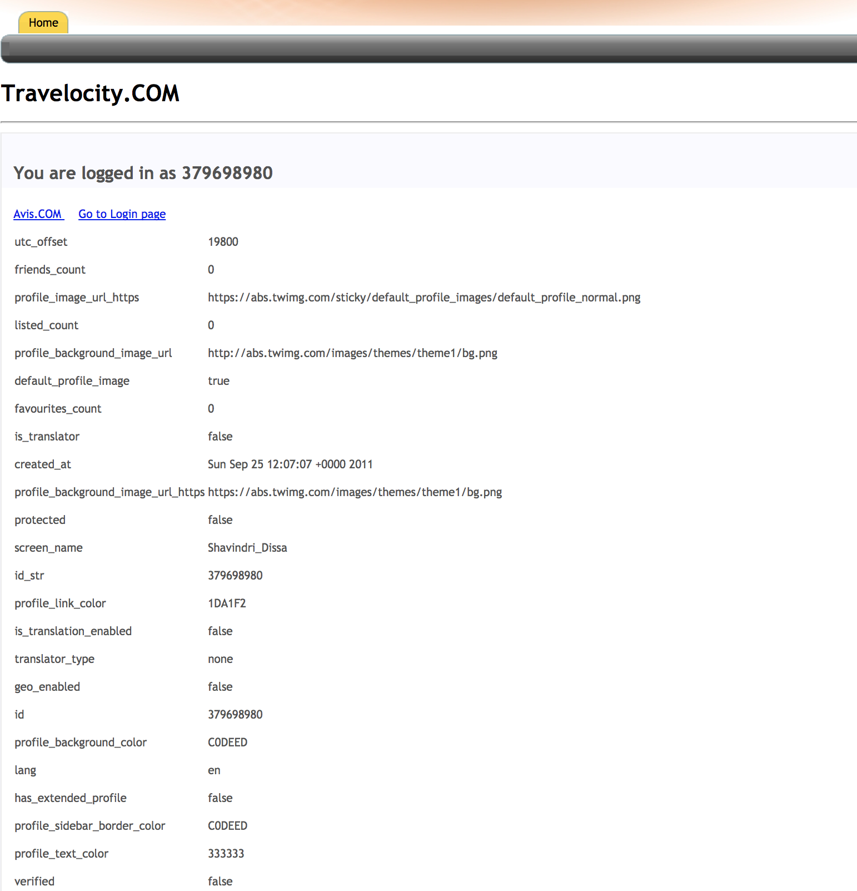

# Configuring Twitter Authenticator

The Twitter authenticator is configured as a federated authenticator in
WSO2 Identity Server to authenticate Twitter users to log in to your
organization’s applications. Twitter is a free social networking
microblogging service that allows registered members to broadcast short
posts called tweets.

The diagram below illustrates the flow of the Twitter federated
authenticator.

 

This page provides instructions on how to configure the Twitter
authenticator and Identity Server using a sample app. You can find more
information in the following sections.

!!! info 
    This is tested with the Twitter API version 1.1 which uses OAuth 1.0a.
    Twitter Authenticator is supported by Identity Server 5.1.0 upwards.

## Deploying Twitter artifacts

-   Download the WSO2 Identity Server from
    [here](http://wso2.com/products/identity-server/).

-   Place the Twitter authenticator .jar file (
    `           org.wso2.carbon.extension.identity.authenticator.twitter.connector-X.X.X.jar          `
    ) into the
    `           <IS_HOME>/repository/components/dropins          `
    directory. This can be downloaded from [the WSO2
    Store](https://store.wso2.com/store/assets/isconnector/details/51bc4245-9c97-4839-9e3c-c177b20145ee)
    .

    !!! note
        If you want to upgrade the Twitter Authenticator in your existing IS
        pack, please refer [upgrade
        instructions.](../../develop/upgrading-an-authenticator)
    

## Configuring the Twitter App

1.  Create an account at <https://twitter.com> and log in.
2.  Navigate to https://apps.twitter.com/ and click **Create New App**.

    -   Provide an application name and description.
    -   For this tutorial, enter `            https://           `
        `            127.0.0.1           ` as the website URL. It is
        used as a placeholder since application used for the tutorial is
        not publicly available.
    -   Give the **Callback URL** as
        `             https://<HOST_NAME_OF_IS>:9443/commonauth            `
        . For example:
        `                                          https://apps.customhost.com:9443/commonauth                                       `
        .

        !!! note
            If the Identity Server is running on your local machine, add an
            entry as mentioned below and use this host name (here
            `                             apps.customhost.com                           `
            ) in your twitter callback url.

            `              127.0.0.1       apps.customhost.com             `

    -   Click **Create your Twitter application**.

     

    !!! note
        **Callback URL** is the URL to which the browser should be
        redirected after the authentication is successful. It should have
        this format:
        `                       https://(host-name):(port)/acs                     `
        . Here ACS URL (Assertion Consumer URL) is the endpoint in WSO2
        Identity Server which accepts the response sent by Google.

3.  After creating the app, go to the **Keys and Access Tokens** tab to
    get the **API Key** and **API Secret**. These are the **Consumer Key** and **Consumer Secret** values shown.  
    Example:  
     

## Deploying travelocity sample application

The next step is to deploy and configure travelocity application. See 
[deploy the sample app](../../learn/deploying-the-sample-app/#deploying-the-travelocity-webapp) for more information 
on configuring travelocity application. 

Once this is done, the next step is to configure the WSO2 Identity
Server by adding an identity provider and service provider as shown below.

## Configuring the identity provider

Now you have to configure WSO2 Identity Server by adding a new identity
provider. For more information about the Identity Providers, see
[Configuring an Identity
Provider](../../learn/adding-and-configuring-an-identity-provider)
.

1.  [Run the WSO2 Identity
    Server](../../setup/running-the-product).

2.  Log in to the [management
    console](../../setup/getting-started-with-the-management-console)
    as an administrator.
3.  In the **Identity Providers** section under the **Main** tab of the
    management console, click **Add**.
4.  Give a suitable name for **Identity Provider Name**. Expand
    **Federated Authenticators** and expand **TwitterAuthenticator Configuration**.  
    
       
    
    Enter the values as given when you [created the twitter
    application](#configuring-the-twitter-app).
    -   Select both checkboxes to **Enable** the Twitter
        authenticator** and make it the Default.  
    -   **API Key** : Consumer Key for your app.
    -   **API Secret** : Consumer Secret for your app.
    -   **Callback URL** : Service Provider's URL where code needs to be
        sent (e.g., https://apps.customhost.com:9443/commonauth )

5.  Click **Register**.

You have now added the identity provider.

## Configuring the service provider

The next step is to configure the service provider.

1.  In the
    [previous section of this guide](#deploying-travelocity-sample-application)
    you have deployed and
    [registered the `travelocity.com` webapp](learn/deploying-the-sample-app/#configuring-the-service-provider).
    Let's edit the same service provider to configure `twitter` as the
    identity provider.

2.  Locate the "travelocity.com" service provider and navigate to the
    **Local and Outbound Authentication Configuration** section.

3.  Select the identity provider you created from the dropdown list
    under **Federated Authentication**.

     

4.   Ensure that the **Federated Authentication** radio button is
     selected and click **Update** to save the changes.

You have now added and configured the service provider.

## Testing the sample

1.  To test the sample, go to the following URL: `http://<TOMCAT_HOST>:<TOMCAT_PORT>/travelocity.com/index.jsp ` . ex:
    `http://wso2is.local:8080/travelocity.com`

2.  Click the option available to log in with SAML from the WSO2
    Identity Server.

     

    You are navigated to the Twitter application. Enter the username and
    password of your Twitter account to log in.  
    Example:  
     

3.  Once the authentication is complete, you will be taken to the home
    page of the travelocity.com app.  
    Example:  
     