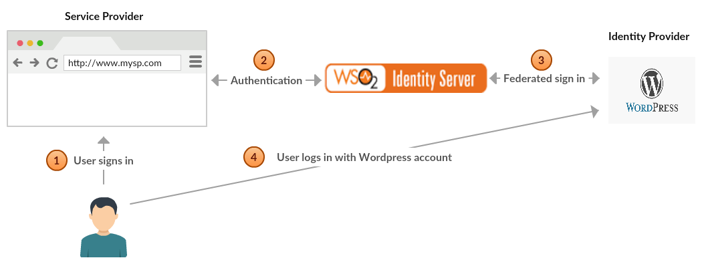
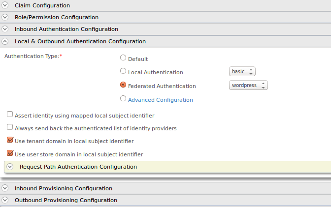

# Configuring Wordpress Authenticator
The Wordpress authenticator is configured as a federated authenticator
in WSO2 Identity Server to authenticate Wordpress users to log in to
your organization’s applications. The diagram below illustrates the flow
of the Wordpress federated authenticator.

The Wordpress authenticator allows you to authenticate users using
Wordpress through the WSO2 Identity Server. This page provides
instructions on how to configure the Wordpress authenticator and the
WSO2 Identity Server for logging into a sample app.

You can find more information in the following sections.

!!! info 
    This is tested for the Wordpress API version 1.0. Wordpress
    Authenticator is supported by Identity Server 5.1.0 upwards.

### Configuring the Wordpress App

1.  Place the authenticator .jar file into the
    `           <IS_HOME>/repository/components/dropins          `
    directory. You can download the
    .jar(org.wso2.carbon.identity.authenticator.wordpress) file from the
    [wso2
    store](https://store.wso2.com/store/assets/isconnector/list?q=%22_default%22%3A%22Wordpress%22)
    .  

    !!! note
        If you want to upgrade the Wordpress Authenticator in your existing
        IS pack, please refer [upgrade
        instructions.](../../develop/upgrading-an-authenticator)
    

2.  Navigate to <https://developer.wordpress.com/apps> and log in.

    !!! note
        You can either use your Wordpress developer account
        credentials or your own Google account credentials to log in.
    

3.  Click **Create New Application**.

     

4.  Enter the following details in the window that appears.
    -   **Name** - TestApp
    -   **Description** - Application for testing purposes
    -   **Website URL** - https://localhost:9443/commonauth
    -   **Redirect URLs** - https://localhost:9443/commonauth
    -   **Javascript Origins** - <https://localhost:9443>
    -   **Type** - web client

        !!! tip
            Make sure to answer the mathematical question that is asked
            (e.g., What is 5+2 ?).
        

5.  Click **Create**.  
    Now you have finished configuring Wordpress so copy the **Client ID** and **Client Secret** for use in the Identity Server.  
     

### Deploying travelocity sample application

The next step is to deploy the travelocity.com sample app in order to
use it in this scenario.

For deployment and configuration, see [Deploying the Sample App](../../develop/deploying-the-sample-app).

### Configuring the identity provider

Now you must configure the WSO2 Identity Server by [adding a new
identity
provider](../../learn/adding-and-configuring-an-identity-provider).

1.  Download the WSO2 Identity Server from
    [here](http://wso2.com/products/identity-server/) and [run
    it](../../setup/running-the-product).
2.  Log in to the [management
    console](../../setup/getting-started-with-the-management-console)
    as an administrator.
3.  In the **Identity Providers** section under the **Main** tab of the
    management console, click **Add**.  
     
4.  Enter the following details for the Identity Provider.

    -   **Identity Provider Name** - WordpressIdP
    -   **Alias** - <https://localhost:9443/oauth2/token>

     

5.  Go to **Wordpress Configuration** under **Federated Authenticators**
    and enter the required details.

    !!! tip
        Make sure to enter the client Id, client secret, and callback URL
        based on the [wordpress application that you
        created](#configure-wordpress).
    

    | Field         | Description                                                                                                                                                                                          | Sample value                                                     |
    |---------------|------------------------------------------------------------------------------------------------------------------------------------------------------------------------------------------------------|------------------------------------------------------------------|
    | Enable        | Selecting this option enables Wordpress to be used as an authenticator for users provisioned to the Identity Server.                                                                                 | Selected                                                         |
    | Default       | Selecting the Default checkbox signifies that Wordpress is the main/default form of authentication. This removes the selection made for any other default check-boxes for other authenticators.      | Selected                                                         |
    | Client Id     | This is the username from the Wordpress application.                                                                                                                                                 | 56002                                                            |
    | Client Secret | This is the password from the Wordpress application. Click the **Show** button to view the value you enter.                                                                                          | LxLvRoWplkvva4WMdOWAxrcghOVlxrH8RHJ96XWlXVaZi6pZDgXsvPhLHhzGqeCF |
    | Callback URL  | This is the URL to which the browser should be redirected after the authentication is successful. It should have the following format: `               https://(host-name):(port)/acs              ` | <https://localhost:9443/commonauth>                              |

6.  Click **Register**.

You have now added the identity provider.

### Configuring the service provider

The next step is to configure the service provider.

1.  Return to the management console.
2.  In the **Service Providers** section under the **Main** tab, click
    **Add**.
3.  Since you are using travelocity as the sample, enter travelocity.com
    in the **Service Provider Name** text box and click **Register**.
4.  In the **Inbound Authentication Configuration** section, click
    **Configure** under the **SAML2 Web SSO Configuration** section.  

5.  Now set the configuration as follows:  
    1.  **Issuer** : travelocity.com
    2.  **Assertion Consumer URL** :
        <http://localhost:8080/travelocity.com/home.jsp>
6.  Select the following check-boxes:
    1.  **Enable Response Signing**.
    2.  **Enable Single Logout**.
    3.  **Enable Attribute Profile**.
    4.  **Include Attributes in the Response Always**.
7.  Click **Update** to save the changes. Now you will be sent back to
    the **Service Providers** page.
8.  Go to the **Local and Outbound Authentication Configuration**
    section.
9.  Select the identity provider you created from the dropdown list
    under **Federated Authentication**.  
      
     
10. Ensure that the **Federated Authentication** radio button is
    selected and click **Update** to save the changes.

You have now added and configured the service provider.

### Testing the sample

1.  To test the sample, go to the following URL:
    `          http://<TOMCAT_HOST>:<TOMCAT_PORT>/travelocity.com/index.jsp         `
    . E.g., [http://localhost:8080/travelocity.com](http://localhost:8080/travelocity.com)
    
     
    
2.  Click the link to log in with SAML from WSO2 Identity Server.
3.  You are redirected to the Wordpress login page. Enter your Wordpress
    credentials.  
      
     
4.  Click **Log In** to authenticate the user.  
      
     
5.  You will be taken to the home page of the travelocity.com app.  
     
