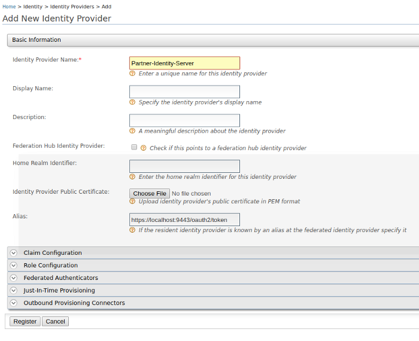

# Writing a Custom Federated Authenticator

A custom federated authenticator can be written to authenticate a user with an external system.
The external system can be any Identity provider including Facebook, Twitter, Google, Yahoo, etc.
You can use the extension points available in WSO2 Identity Server to create custom federated authenticators.


## Authenticator API

The following is the API used to implement a custom federated
authenticator.

??? example "Click to view the API of the Application Authenticators"
    ``` java
      /*
      *  Copyright (c) 2005-2013, WSO2 Inc. (http://www.wso2.org) All Rights Reserved.
      *
      *  WSO2 Inc. licenses this file to you under the Apache License,
      *  Version 2.0 (the "License"); you may not use this file except
      *  in compliance with the License.
      *  You may obtain a copy of the License at
      *
      *    http://www.apache.org/licenses/LICENSE-2.0
      *
      * Unless required by applicable law or agreed to in writing,
      * software distributed under the License is distributed on an
      * "AS IS" BASIS, WITHOUT WARRANTIES OR CONDITIONS OF ANY
      * KIND, either express or implied.  See the License for the
      * specific language governing permissions and limitations
      * under the License.
      */
      
      package org.wso2.carbon.identity.application.authentication.framework;
      
      import java.io.Serializable;
      import java.util.List;
      
      import javax.servlet.http.HttpServletRequest;
      import javax.servlet.http.HttpServletResponse;
      
      import org.wso2.carbon.identity.application.authentication.framework.context.AuthenticationContext;
      import org.wso2.carbon.identity.application.authentication.framework.exception.AuthenticationFailedException;
      import org.wso2.carbon.identity.application.authentication.framework.exception.LogoutFailedException;
      import org.wso2.carbon.identity.application.common.model.Property;
      
      /**
       * API of the Application Authenticators.
       *
       */
      public interface ApplicationAuthenticator extends Serializable {
      
          /**
           * Check whether the authentication or logout request can be handled by the
           * authenticator
           * 
           * @param request
           * @return boolean
           */
          public boolean canHandle(HttpServletRequest request);
          
          /**
           * Process the authentication or logout request.
           * 
           * @param request
           * @param response
           * @param context
           * @return the status of the flow
           * @throws AuthenticationFailedException
           * @throws LogoutFailedException
           */
          public AuthenticatorFlowStatus process(HttpServletRequest request,
                  HttpServletResponse response, AuthenticationContext context)
                  throws AuthenticationFailedException, LogoutFailedException;
          
          /**
           * Get the Context identifier sent with the request. This identifier is used
           * to retrieve the state of the authentication/logout flow
           * 
           * @param request
           * @return
           */
          public String getContextIdentifier(HttpServletRequest request);
          
          /**
           * Get the name of the Authenticator
           * @return name
           */
          public String getName();
          
          /**
           * @return
           */
          public String getFriendlyName();
          
          /**
           * Get the claim dialect URI if this authenticator receives claims in a standard dialect
           * and needs to be mapped to the Carbon dialect http://wso2.org/claims
           * @return boolean
           */
          public String getClaimDialectURI();
          
          /**
           * @return
           */
          public List<Property> getConfigurationProperties();
      }
    ```

This API can be used to configure a custom authenticator. 

## Writing a custom federated authenticator

1. First create a maven project for the custom federated authenticator. Refer the [pom.xml](https://github.com/wso2/samples-is/blob/master/authenticators/components/org.wso2.carbon.identity.sample.federated.authenticator/pom.xml) 
   file used for the sample custom federated authenticator.
2. Refer the [service component class](https://github.com/wso2/samples-is/blob/master/authenticators/components/org.wso2.carbon.identity.sample.federated.authenticator/src/main/java/org/wso2/carbon/identity/custom/federated/authenticator/internal/CustomFederatedAuthenticatorServiceComponent.java) 
   as well since the authenticator is written as an OSGI service to deploy in WSO2 Identity Server and register 
   it as a federated authenticator.
3. The [custom federated authenticator](https://github.com/wso2/samples-is/blob/master/authenticators/components/org.wso2.carbon.identity.sample.federated.authenticator/src/main/java/org/wso2/carbon/identity/custom/federated/authenticator/CustomFederatedAuthenticator.java) 
   should be written by extending the [AbstractApplicationAuthenticator](https://github.com/wso2/carbon-identity-framework/blob/v5.17.5/components/authentication-framework/org.wso2.carbon.identity.application.authentication.framework/src/main/java/org/wso2/carbon/identity/application/authentication/framework/AbstractApplicationAuthenticator.java) class 
   and implementing the [FederatedApplicationAuthenticator](https://github.com/wso2/carbon-identity-framework/blob/v5.17.5/components/authentication-framework/org.wso2.carbon.identity.application.authentication.framework/src/main/java/org/wso2/carbon/identity/application/authentication/framework/FederatedApplicationAuthenticator.java) class.

The important methods in the `AbstractApplicationAuthenticator` class, and the `FederatedApplicationAuthenticator` interface are listed as follows.

*   **[public String getName()](https://github.com/wso2/samples-is/blob/master/authenticators/components/org.wso2.carbon.identity.sample.federated.authenticator/src/main/java/org/wso2/carbon/identity/custom/federated/authenticator/CustomFederatedAuthenticator.java#L71-L75)** -

    Returns the name of the authenticator.

*   **[public String getFriendlyName()](https://github.com/wso2/samples-is/blob/master/authenticators/components/org.wso2.carbon.identity.sample.federated.authenticator/src/main/java/org/wso2/carbon/identity/custom/federated/authenticator/CustomFederatedAuthenticator.java#L65-L69)** -

    Returns the display name for the custom federated authenticator. In this sample we are using custom-federated-authenticator.

*   **[public String getContextIdentifier(HttpServletRequest request)](https://github.com/wso2/samples-is/blob/master/authenticators/components/org.wso2.carbon.identity.sample.federated.authenticator/src/main/java/org/wso2/carbon/identity/custom/federated/authenticator/CustomFederatedAuthenticator.java#L213-L222)** -

    Returns a unique identifier that will map the authentication request and the response. The value returned by the invocation of authentication request and the response should be the same.

*   **[public boolean canHandle(HttpServletRequest request)](https://github.com/wso2/samples-is/blob/master/authenticators/components/org.wso2.carbon.identity.sample.federated.authenticator/src/main/java/org/wso2/carbon/identity/custom/federated/authenticator/CustomFederatedAuthenticator.java#L58-L63)** -

    Specifies whether this authenticator can handle the authentication response.

*   **[protected void initiateAuthenticationRequest(HttpServletRequest request, HttpServletResponse response, AuthenticationContext context)](https://github.com/wso2/samples-is/blob/master/authenticators/components/org.wso2.carbon.identity.sample.federated.authenticator/src/main/java/org/wso2/carbon/identity/custom/federated/authenticator/CustomFederatedAuthenticator.java#L135-L137)** -

    Redirects the user to the login page in order to authenticate and in this sample, the user is redirected to the login page of the application which is configured in the partner identity server which acts as the external service.

*   **[protected void processAuthenticationResponse(HttpServletRequest request, HttpServletResponse response, AuthenticationContext context)](https://github.com/wso2/samples-is/blob/master/authenticators/components/org.wso2.carbon.identity.sample.federated.authenticator/src/main/java/org/wso2/carbon/identity/custom/federated/authenticator/CustomFederatedAuthenticator.java#L167-L169)** -

    Implements the logic of the custom federated authenticator.

!!! note
    You can find a custom federated authenticator [here](https://github.com/wso2/samples-is/tree/master/authenticators/components/org.wso2.carbon.identity.sample.federated.authenticator) for your reference.


## Deploy the custom federated authenticator in WSO2 IS

1. Once the implementation is done, navigate to the root of your project and run the following command to compile the service.
   ```
   mvn clean install
   ```
2. Copy `org.wso2.carbon.identity.custom.federated.authenticator-x.x.x.jar` inside the `/target` folder to the `<IS_HOME>/repository/components/dropins` folder.

## Configure the partner identity server

In this sample the partner identity server acts as the external system. 
Therefore, that partner identity server will be running on the same machine in a different port 
by adding the following config to the deployment.toml file.

```
[server]
offset=1
```

After starting that partner identity server, it will run on [localhost:9444](https://localhost:9444/carbon).

### Register a service provider

1. In the Management Console of the partner identity server, navigate to **Main** > **Identity** > **Service Providers** > **Add**.

3. Enter a **Service Provider Name**. Optionally, enter a **Description**.

4. Click **Register**.

5. Expand **Inbound Authentication Configuration** > **OAuth/OpenID Connect Configuration**. 

6. Add `https://localhost:9443/commonauth` as the **Callback Url**.

### Add a user

1. In the Management Console of the partner identity server, navigate to **Main** > **Identity** > **Users and Roles** > **Add**.

2. Click **Add New User** and create a new user by providing username and password.
                               
3. Click **Finish**.

## Configure Federated Authenticator

To configure the federated authenticator, click the **Add** button under **Identity Providers** and add the IDP name as 
**Partner-Identity-Server**. Register the new IDP.

1. In the Management Console of the identity server, navigate to **Main** > **Identity** > **Identity Providers** > **Add**.
    
2. Enter the **Identity Provider Name** as `Partner-Identity-Server`.

    

3. Click **Register**.

4. In the registered identity providers view, click **Edit** on the created identity provider.

5. Click **Federated Authenticators** and expand **Custom-federated-authenticator Configuration**.
 
6. Configure it as follows.

    *   Select **Enable**.
    *   **Client Id** - The Client Id generated by the external service provider of the partner IS.
    *   **Client Secret** - The Client Secret generated by the external service provider of the partner IS.
    *   **Callback URL** - `https://localhost:9443/commonauth`
    *   **Authorization Endpoint URL** - `https://localhost:9444/oauth2/authorize/`
    *   **Token Endpoint URL** - `https://localhost:9444/oauth2/token/`

    

## Configure an application with the custom federated authenticator

1. Let’s use the playground app. Refer
   [this](../../learn/deploying-the-sample-app/#deploying-the-playground2-webapp) 
   to configure playground app.

2. In the created service provider, expand **Local & Outbound Authentication Configuration**. For the **Authentication Type**,  
   select **Federated Authentication**. Select the configured federated authenticator from the dropdown.
    
3. Click **Update** to save the configurations.

    

## Try the scenario

1. Access the playground app by using `http://localhost:8080/playground2`. 
   
2. This will redirect to the login page of the application which is configured in the partner identity server which acts as the external service. 
   
3. Enter the username and password of the earlier created user in the partner identity server. 
   
Now the user is authenticated by the partner Identity Server.

Similarly, you can write a federated authenticator to authenticate the users using an external system.
