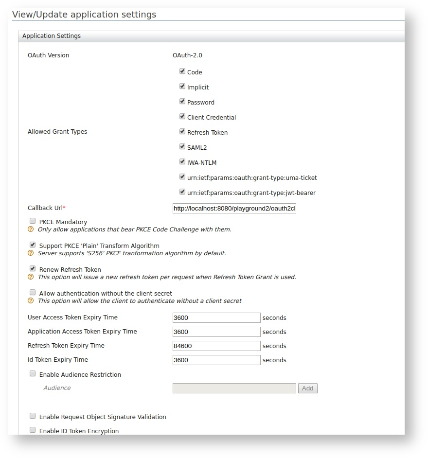
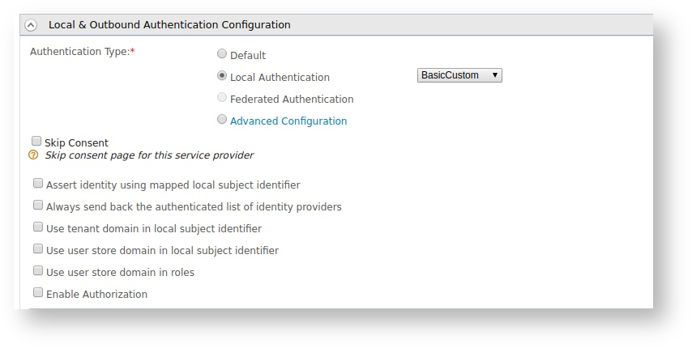
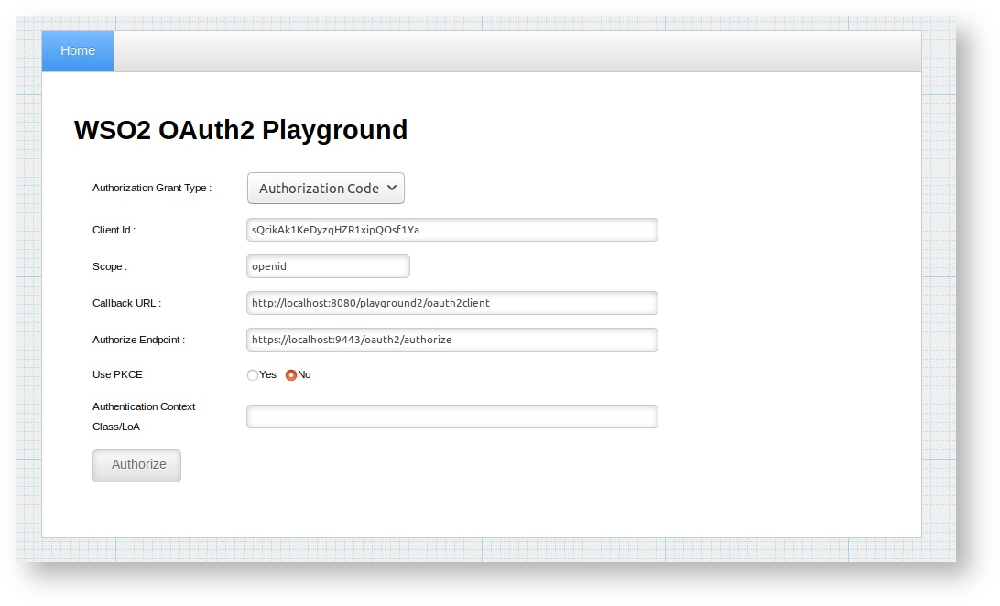

# Writing a Custom Local Authenticator

The default WSO2 Identity Server authenticator is the basic authenticator. It is a local authenticator that authenticates the end users using a connected user store and the provided user name and password. When a user needs to be authenticated with the user store and authorized based on the assigned user role, you can write a custom local authenticator. Let's try out a sample scenario on this.

### Sample scenario
You have an app called playground that is used for importing/exporting photos. The playground uses OpenID Connect to let the users log into it. The playground only allows the users who are assigned with the photoSharingRole user role to log in to it. (The users with other user roles are not allowed to log in to the playground application)

This requirement can be easily achieved through WSO2 Identity Server extension points that have the ability to plug custom local authenticators. 

### Configurations
The following steps explain how you can write a custom local authenticator by extending the **AbstractApplicationAuthenticator** class and implementing the **LocalApplicationAuthenticator** class and how this custom local authenticator can be plugged into these extension points.

Let's begin.    

1.  Create a maven project to write the custom authenticator.

    ??? example "Click to view the sample pom.xml"
        ``` xml
        <?xml version="1.0" encoding="utf-8"?>
        <!--
        ~ Copyright (c) 2017, WSO2 Inc. (http://www.wso2.org) All Rights Reserved.
        ~
        ~ Licensed under the Apache License, Version 2.0 (the "License");
        ~ you may not use this file except in compliance with the License.
        ~ You may obtain a copy of the License at
        ~
        ~      http://www.apache.org/licenses/LICENSE-2.0
        ~
        ~ Unless required by applicable law or agreed to in writing, software
        ~ distributed under the License is distributed on an "AS IS" BASIS,
        ~ WITHOUT WARRANTIES OR CONDITIONS OF ANY KIND, either express or implied.


        ~ See the License for the specific language governing permissions and
        ~ limitations under the License.
        -->
        <project xmlns="http://maven.apache.org/POM/4.0.0" xmlns:xsi="http://www.w3.org/2001/XMLSchema-instance" xsi:schemaLocation="http://maven.apache.org/POM/4.0.0 http://maven.apache.org/maven-v4_0_0.xsd">

        <modelVersion>4.0.0</modelVersion>
        <groupId>org.wso2.custom.authenticator</groupId>
        <artifactId>org.wso2.custom.authenticator.local</artifactId>
        <packaging>bundle</packaging>
        <version>1.0.0</version>
        <name>WSO2 Carbon - BasicAuth Custom Authenticator</name>
        <dependencies>
            <dependency>
                <groupId>org.wso2.carbon</groupId>
                <artifactId>org.wso2.carbon.utils</artifactId>
                <version>4.4.11</version>
            </dependency>
            <dependency>
                <groupId>org.wso2.carbon</groupId>
                <artifactId>org.wso2.carbon.logging</artifactId>
                <version>4.4.11</version>
            </dependency>
            <dependency>
                <groupId>org.wso2.carbon.identity.framework</groupId>
                <artifactId>org.wso2.carbon.identity.application.authentication.framework</artifactId>
                <version>5.7.5</version>
            </dependency>
        </dependencies>
        <build>
            <plugins>
                <plugin>
                    <artifactId>maven-compiler-plugin</artifactId>
                    <version>2.3.1</version>
                    <inherited>true</inherited>
                    <configuration>
                        <encoding>UTF-8</encoding>
                        <source>1.7</source>
                        <target>1.7</target>
                    </configuration>
                </plugin>
                <plugin>
                    <groupId>org.apache.felix</groupId>
                    <artifactId>maven-scr-plugin</artifactId>
                    <version>1.7.2</version>
                    <executions>
                        <execution>
                            <id>generate-scr-scrdescriptor</id>
                            <goals>
                                <goal>scr</goal>
                            </goals>
                        </execution>
                    </executions>
                </plugin>
                <plugin>
                    <groupId>org.apache.felix</groupId>
                    <artifactId>maven-bundle-plugin</artifactId>


            <version>2.3.5</version>
                    <extensions>true</extensions>
                    <configuration>
                        <instructions>
                            <Bundle-SymbolicName>${project.artifactId}</Bundle-SymbolicName>
                            <Bundle-Name>${project.artifactId}</Bundle-Name>
                            <Axis2Module>${project.artifactId}-${project.version}</Axis2Module>
                            <Import-Package>
                                javax.servlet,
                                javax.servlet.http,
                                *;resolution:=optional
                            </Import-Package>
                            <Private-Package>
                                org.wso2.custom.authenticator.local.internal,
                            </Private-Package>
                            <Export-Package>
                                !org.wso2.custom.authenticator.local.internal,
                                org.wso2.custom.authenticator.local.*;
                                version="1.0.0"
                            </Export-Package>
                        </instructions>
                    </configuration>
                </plugin>
            </plugins>
        </build>

        <repositories>
            <repository>
                <id>wso2-nexus</id>
                <name>WSO2 internal Repository</name>
                <url>http://maven.wso2.org/nexus/content/groups/wso2-public/</url>
                <releases>
                    <enabled>true</enabled>
                    <updatePolicy>daily</updatePolicy>
                    <checksumPolicy>ignore</checksumPolicy>
                </releases>
            </repository>
        </repositories>

        <pluginRepositories>
            <pluginRepository>
                <id>wso2-maven2-repository</id>
                <url>http://dist.wso2.org/maven2</url>
            </pluginRepository>
        </pluginRepositories>
        </project>
        ```

2.  Write a custom local authenticator.

    !!! note    
        The `            BasicCustomAuthenticatorConsta           `
        `            nts.java           ` file that is referred in the below
        example is available
        [here](../../assets/attachments/BasicCustomAuthenticatorConstants.java).
    
    ??? example "Click to view the sample custom authenticator class"
        ```
        /*
        * Copyright (c) 2017, WSO2 Inc. (http://www.wso2.org) All Rights Reserved.
        *
        * WSO2 Inc. licenses this file to you under the Apache License,
        * Version 2.0 (the "License"); you may not use this file except
        * in compliance with the License.
        * You may obtain a copy of the License at
        *
        *      http://www.apache.org/licenses/LICENSE-2.0
        *
        * Unless required by applicable law or agreed to in writing,
        * software distributed under the License is distributed on an
        * "AS IS" BASIS, WITHOUT WARRANTIES OR CONDITIONS OF ANY
        * KIND, either express or implied.  See the License for the
        * specific language governing permissions and limitations
        * under the License.
        */
        package org.wso2.custom.authenticator.local;
        
        import org.apache.commons.logging.Log;
        import org.apache.commons.logging.LogFactory;
        import org.wso2.carbon.identity.application.common.model.User;
        import org.wso2.carbon.identity.core.util.IdentityUtil;
        import org.wso2.custom.authenticator.local.internal.BasicCustomAuthenticatorServiceComponent;
        import org.wso2.carbon.identity.application.authentication.framework.AbstractApplicationAuthenticator;
        import org.wso2.carbon.identity.application.authentication.framework.LocalApplicationAuthenticator;
        import org.wso2.carbon.identity.application.authentication.framework.config.ConfigurationFacade;
        import org.wso2.carbon.identity.application.authentication.framework.context.AuthenticationContext;
        import org.wso2.carbon.identity.application.authentication.framework.exception.AuthenticationFailedException;
        import org.wso2.carbon.identity.application.authentication.framework.exception.InvalidCredentialsException;
        import org.wso2.carbon.identity.application.authentication.framework.model.AuthenticatedUser;
        import org.wso2.carbon.identity.application.authentication.framework.util.FrameworkUtils;
        import org.wso2.carbon.user.core.UserStoreException;
        import org.wso2.carbon.user.core.UserStoreManager;
        import org.wso2.carbon.user.core.common.AbstractUserStoreManager;
        import org.wso2.carbon.utils.multitenancy.MultitenantUtils;
        
        import javax.servlet.http.HttpServletRequest;
        import javax.servlet.http.HttpServletResponse;
        import java.io.IOException;
        
        /**
        * Username Password based custom Authenticator
        */
        public class BasicCustomAuthenticator extends AbstractApplicationAuthenticator implements LocalApplicationAuthenticator {
        
        private static final long serialVersionUID = 4345354156955223654L;
        private static final Log log = LogFactory.getLog(BasicCustomAuthenticator.class);
        
        
        @Override
        protected void initiateAuthenticationRequest(HttpServletRequest request,
                                                        HttpServletResponse response,
                                                        AuthenticationContext context)
                throws AuthenticationFailedException {
        
            String loginPage = ConfigurationFacade.getInstance().getAuthenticationEndpointURL();//This is the
            // default WSO2 IS login page. If you can create your custom login page you can use
            // that instead.
            String queryParams =
                    FrameworkUtils.getQueryStringWithFrameworkContextId(context.getQueryParams(),
                            context.getCallerSessionKey(),
                            context.getContextIdentifier());
        
            try {
                String retryParam = "";
        
                if (context.isRetrying()) {
                    retryParam = "&authFailure=true&authFailureMsg=login.fail.message";
                }
        
                response.sendRedirect(response.encodeRedirectURL(loginPage + ("?" + queryParams)) +
                        "&authenticators=BasicAuthenticator:" + "LOCAL" + retryParam);
            } catch (IOException e) {
                throw new AuthenticationFailedException(e.getMessage(), e);
            }
        }
        
        /**
            * This method is used to process the authentication response.
            * Inside here we check if this is a authentication request coming from oidc flow and then check if the user is
            * in the 'photoSharingRole'.
            */
        @Override
        protected void processAuthenticationResponse(HttpServletRequest request,
                                                        HttpServletResponse response, AuthenticationContext context)
                throws AuthenticationFailedException {
        
            String username = request.getParameter(BasicCustomAuthenticatorConstants.USER_NAME);
            boolean isAuthenticated = true;
            context.setSubject(AuthenticatedUser.createLocalAuthenticatedUserFromSubjectIdentifier(username));
            boolean authorization = false;
        
            if(isAuthenticated) {
                if ("oidc".equalsIgnoreCase(context.getRequestType())) {
                    // authorization only for openid connect requests
                    try {
                        int tenantId = BasicCustomAuthenticatorServiceComponent.getRealmService().getTenantManager().
                                getTenantId(MultitenantUtils.getTenantDomain(username));
                        UserStoreManager userStoreManager = (UserStoreManager) BasicCustomAuthenticatorServiceComponent.getRealmService().
                                getTenantUserRealm(tenantId).getUserStoreManager();
        
                        // verify user is assigned to role
                        authorization = ((AbstractUserStoreManager) userStoreManager).isUserInRole(username, "photoSharingRole");
                    } catch (UserStoreException e) {
                        log.error(e);
                    } catch (org.wso2.carbon.user.api.UserStoreException e) {
                        log.error(e);
                    }
                } else {
                    // others scenarios are not verified.
                    authorization = false;
                }
        
                if (!authorization) {
                    log.error("user authorization is failed.");
        
                    throw new InvalidCredentialsException("User authentication failed due to invalid credentials",
                            User.getUserFromUserName(username));
        
                }
            }
        }
        
        @Override
        protected boolean retryAuthenticationEnabled() {
            return true;
        }
        
        @Override
        public String getFriendlyName() {
            //Set the name to be displayed in local authenticator drop down lsit
            return BasicCustomAuthenticatorConstants.AUTHENTICATOR_FRIENDLY_NAME;
        }
        
        @Override
        public boolean canHandle(HttpServletRequest httpServletRequest) {
            String userName = httpServletRequest.getParameter(BasicCustomAuthenticatorConstants.USER_NAME);
            String password = httpServletRequest.getParameter(BasicCustomAuthenticatorConstants.PASSWORD);
            if (userName != null && password != null) {
                return true;
            }
            return false;
        }
        
        @Override
        public String getContextIdentifier(HttpServletRequest httpServletRequest) {
            return httpServletRequest.getParameter("sessionDataKey");
        }
        
        @Override
        public String getName() {
            return BasicCustomAuthenticatorConstants.AUTHENTICATOR_NAME;
        }
        }
        ```    

3.  Write an OSGi service component class to register the custom authenticator. 

    ??? example "Click to view" 
        ``` java
            /*
            * Copyright (c) 2017, WSO2 Inc. (http://www.wso2.org) All Rights Reserved.
            *
            * WSO2 Inc. licenses this file to you under the Apache License,
            * Version 2.0 (the "License"); you may not use this file except
            * in compliance with the License.
            * You may obtain a copy of the License at
            *
            *      http://www.apache.org/licenses/LICENSE-2.0
            *
            * Unless required by applicable law or agreed to in writing,
            * software distributed under the License is distributed on an
            * "AS IS" BASIS, WITHOUT WARRANTIES OR CONDITIONS OF ANY
            * KIND, either express or implied.  See the License for the
            * specific language governing permissions and limitations
            * under the License.
            */
            package org.wso2.custom.authenticator.local.internal;
        
            import org.apache.commons.logging.Log;
            import org.apache.commons.logging.LogFactory;
            import org.osgi.service.component.ComponentContext;
            import org.wso2.custom.authenticator.local.BasicCustomAuthenticator;
            import org.wso2.carbon.identity.application.authentication.framework.ApplicationAuthenticator;
            import org.wso2.carbon.user.core.service.RealmService;
        
        
            /**
            * @scr.component name="org.wso2.custom.authenticator.local.basic.component" immediate="true"
            * @scr.reference name="realm.service"
            * interface="org.wso2.carbon.user.core.service.RealmService"cardinality="1..1"
            * policy="dynamic" bind="setRealmService" unbind="unsetRealmService"
            */
            public class BasicCustomAuthenticatorServiceComponent {
        
            private static final Log log = LogFactory.getLog(BasicCustomAuthenticatorServiceComponent.class);
        
            private static RealmService realmService;
        
            public static RealmService getRealmService() {
                return realmService;
            }
        
            protected void activate(ComponentContext ctxt) {
                try {
                    BasicCustomAuthenticator basicCustomAuth = new BasicCustomAuthenticator();
                    ctxt.getBundleContext().registerService(ApplicationAuthenticator.class.getName(), basicCustomAuth, null);
                    if (log.isDebugEnabled()) {
                        log.info("BasicCustomAuthenticator bundle is activated");
                    }
                } catch (Throwable e) {
                    log.error("BasicCustomAuthenticator bundle activation Failed", e);
                }
            }
        
            protected void deactivate(ComponentContext ctxt) {
                if (log.isDebugEnabled()) {
                    log.info("BasicCustomAuthenticator bundle is deactivated");
                }
            }
        
            protected void unsetRealmService(RealmService realmService) {
                log.debug("UnSetting the Realm Service");
                BasicCustomAuthenticatorServiceComponent.realmService = null;
            }
        
            protected void setRealmService(RealmService realmService) {
                log.debug("Setting the Realm Service");
                BasicCustomAuthenticatorServiceComponent.realmService = realmService;
            }
            }
        ```

4.  Build the project using maven. (Click to see the sample project
    [here](../../assets/attachments/org.wso2.custom.authenticator.local.zip)).

5.  Copy the .jar file
    `           org.wso2.custom.authenticator.local-1.0.0.jar          `
    inside
    `           <IS_HOME>/repository/components/dropins          `
    folder.

6.  Start WSO2 Identity Server.

7.  Sign in to the Management Console.

8.  Create a new user with the name `Larry`.

9.  Create a new user role called  `photoSharingRole` and assign it to the newly created user.

10. Create a service provider for the application.  
    (You must have the app deployed on the tomcat server.)

11. In the service provider configuration, under **Inbound Authentication Configuration** section, click **OAuth/OpenID Connect Configuration > Configure**. 
     

12. Provide the `callback URL` and register it as an OAuth2 client app.

     

13. Under **Local & Outbound Authentication Configuration**, select **Local
    authentication** check box.
     

    !!! note
        On the corresponding drop-down list, you can see, `BasicCustom` which is the display name of the custom authenticator that was written. From the above step, you can make sure your custom authenticator is there and ready for use.    

14. Visit the playground app and provide **Client ID** of the registered
    playground app and give the **Scope** as `openid` to make sure it is
    in the OpenID Connect flow. Click **Authorize**.  
    
    Note that you will be directed to WSO2 Identity Server login page.

15. Provide the username and password of the user `Larry` who is in the
    `photoSharingRole`. You are prompted to approve the app and logged
    in.

The following is a set of methods related to writing a custom local
authenticator.

<table style="width:100%;">
<colgroup>
<col style="width: 17%" />
<col style="width: 82%" />
</colgroup>
<thead>
<tr class="header">
<th>Method</th>
<th>Description</th>
</tr>
</thead>
<tbody>
<tr class="odd">
<td>canHandle()</td>
<td><p>This method checks whether the authentication request is valid, according to the custom authenticator’s requirements. The user will be authenticated if the method returns 'true'. This method also c hecks whether the authentication or logout request can be handled by the authenticator.</p>
<p>For example, you can check if the username and password is 'not null' in the <strong>canHandle</strong> method. if that succeeds, the authentication flow will continue (to have the user authenticated).</p></td>
</tr>
<tr class="even">
<td>process()</td>
<td><p>This method is used to process or carry out the user authentication process. It calls the <strong>super.process()</strong>, so that the super class will handle the authentication process, and it calls <strong>processAuthenticationResponse()</strong> method in the custom authenticator class to execute the custom authentication logic.</p></td>
</tr>
<tr class="odd">
<td>processAuthenticationResponse()</td>
<td><p>Implementation of custom authentication logic happens inside this method. For example, you can call any API that can do authentication and authenticate the user or you can authenticate the user against the underlying user store. Then you can also do any other custom logic after authenticating the user.</p>
<p>For example, you can check if a user belongs to a particular role and allow authentication accordingly.</p></td>
</tr>
<tr class="even">
<td>initiateAuthenticationrequest()</td>
<td><p>This method is used to redirect the user to the login page in order to authenticate. You can redirect the user to a custom login URL using this method or you can use default WSO2 Identity Server login page.</p></td>
</tr>
<tr class="odd">
<td>retryAuthenticationEnabled()</td>
<td><p>This method returns a boolean value. If the authentication fails due to some issue like invalid credentials, this method will be called to know whether to retry the authentication flow. If this method returns 'true', the authentication flow will be retried. If returns 'false', the flow is stopped with an exception thrown.</p>
<p>You need to override this method if you are calling the <strong>super.process()</strong> method. But if you are writing your own <strong>process()</strong> method, you can handle all the retrying logic accordingly within the method.</p></td>
</tr>
<tr class="even">
<td>getContextIdentifier()</td>
<td><p>This method gets the Context identifier sent with the request. This identifier is used to retrieve the state of the authentication/logout flow.</p></td>
</tr>
<tr class="odd">
<td>getFriendlyName()</td>
<td><p>This method returns the name you want to display for your custom authenticator. This name will be displayed in the local authenticators drop down.</p></td>
</tr>
<tr class="even">
<td>getname()</td>
<td><p>This method is used to get the name of the authenticator.</p></td>
</tr>
</tbody>
</table>
