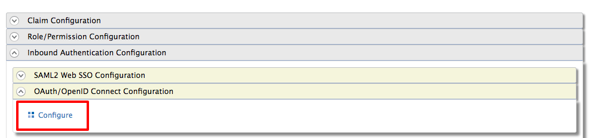
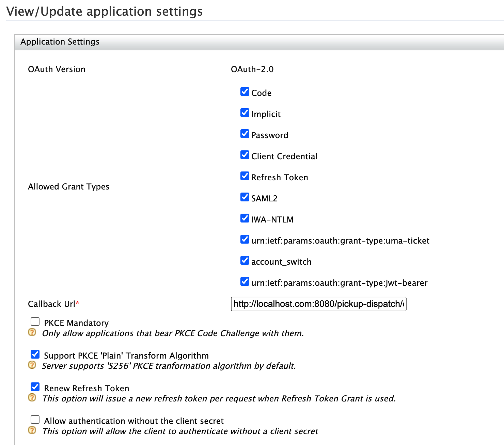
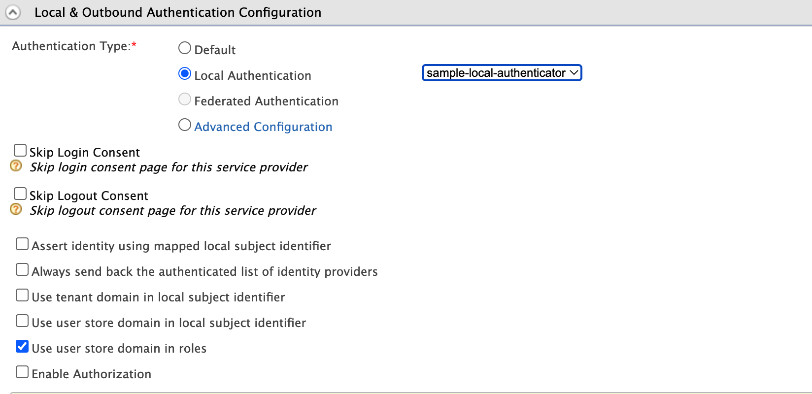
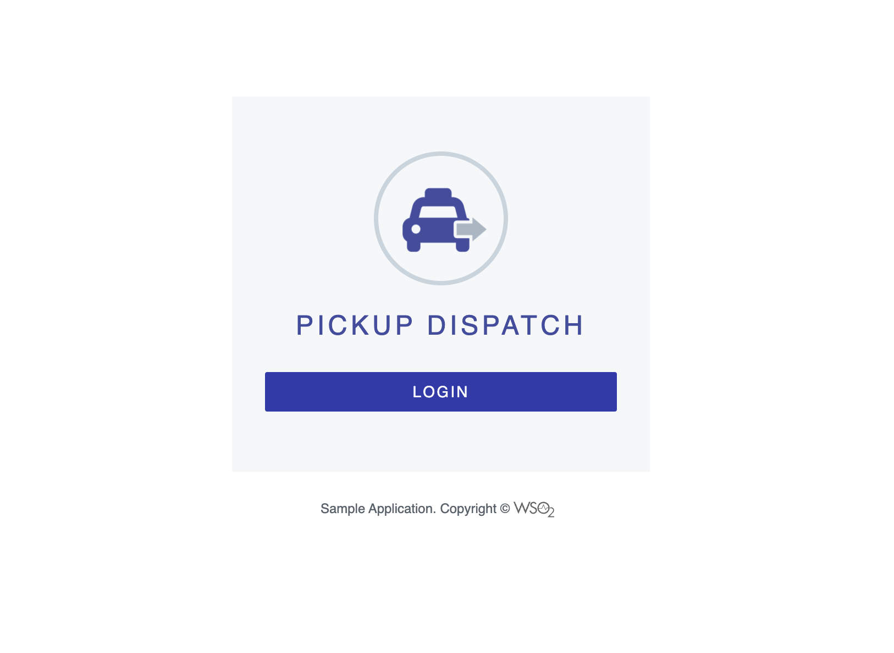

# Writing a Custom Local Authenticator

The default authenticator available in the WSO2 Identity Server is the basic authenticator. It authenticates end users using a connected user store and the provided username and password.

With the WSO2 Identity Server, you can write your own local authenticator to define various authentication logic.

## Sample scenario
You have the **pickup-dispatch** app to which you want users to log in with their telephone numbers instead of usernames. Once a user enters a telephone number, your authentication logic should identify the user and validate the user's credentials. 

The following guide shows you how to write a custom local authenticator to implement this authentication logic.

## Implement the custom local authenticator

You can write a custom local authenticator by extending the **AbstractApplicationAuthenticator** class and implementing the **LocalApplicationAuthenticator** class.

Let's begin.    

1.  Create a maven project to write the custom authenticator.

    ??? example "Click to view the sample pom.xml"
        ``` xml
        
        <?xml version="1.0" encoding="UTF-8"?>
        <!--
        ~ Copyright (c)  2022, WSO2 Inc. (http://www.wso2.org) All Rights Reserved.
        ~
        ~ WSO2 Inc. licenses this file to you under the Apache License,
        ~ Version 2.0 (the "License"); you may not use this file except
        ~ in compliance with the License.
        ~ You may obtain a copy of the License at
        ~
        ~ http://www.apache.org/licenses/LICENSE-2.0
        ~
        ~ Unless required by applicable law or agreed to in writing,
        ~ software distributed under the License is distributed on an
        ~ "AS IS" BASIS, WITHOUT WARRANTIES OR CONDITIONS OF ANY
        ~ KIND, either express or implied.  See the License for the
        ~ specific language governing permissions and limitations
        ~ under the License.
        -->

        <project xmlns="http://maven.apache.org/POM/4.0.0"
                xmlns:xsi="http://www.w3.org/2001/XMLSchema-instance"
                xsi:schemaLocation="http://maven.apache.org/POM/4.0.0 http://maven.apache.org/xsd/maven-4.0.0.xsd">
            <modelVersion>4.0.0</modelVersion>

            <groupId>sample-local-authenticator</groupId>
            <artifactId>org.wso2.carbon.auth.local.sample</artifactId>
            <version>1.0.0</version>
            <name>WSO2 Carbon - Sample Local Authenticator</name>
            <packaging>bundle</packaging>
            <dependencies>
                <dependency>
                    <groupId>org.wso2.carbon</groupId>
                    <artifactId>org.wso2.carbon.utils</artifactId>
                    <version>4.6.1</version>
                </dependency>
                <dependency>
                    <groupId>commons-logging</groupId>
                    <artifactId>commons-logging</artifactId>
                    <version>1.2</version>
                </dependency>
                <dependency>
                    <groupId>org.wso2.carbon.identity.framework</groupId>
                    <artifactId>org.wso2.carbon.identity.application.authentication.framework</artifactId>
                    <version>5.18.187</version>
                </dependency>
                <dependency>
                    <groupId>org.apache.felix</groupId>
                    <artifactId>org.apache.felix.scr.ds-annotations</artifactId>
                    <version>1.2.8</version>
                </dependency>
            </dependencies>
            <build>
                <pluginManagement>
                    <plugins>
                        <plugin>
                            <groupId>org.apache.felix</groupId>
                            <artifactId>maven-bundle-plugin</artifactId>
                            <version>3.2.0</version>
                            <extensions>true</extensions>
                        </plugin>
                    </plugins>
                </pluginManagement>

                <plugins>
                    <plugin>
                        <groupId>org.apache.maven.plugins</groupId>
                        <artifactId>maven-compiler-plugin</artifactId>
                        <version>2.3.1</version>
                        <configuration>
                            <encoding>UTF-8</encoding>
                            <source>1.8</source>
                            <target>1.8</target>
                        </configuration>
                    </plugin>
                    <plugin>
                        <groupId>org.apache.felix</groupId>
                        <artifactId>maven-bundle-plugin</artifactId>
                        <extensions>true</extensions>
                        <configuration>
                            <instructions>
                                <Bundle-SymbolicName>${project.artifactId}</Bundle-SymbolicName>
                                <Bundle-Name>${project.artifactId}</Bundle-Name>
                                <Import-Package>
                                    org.osgi.framework,
                                    *;resolution:=optional
                                </Import-Package>
                                <Private-Package>
                                    org.wso2.carbon.auth.local.sample.internal,
                                </Private-Package>
                                <Export-Package>
                                    !org.wso2.carbon.auth.local.sample.internal,
                                    org.wso2.carbon.auth.local.sample.*; version="1.0.0"
                                </Export-Package>
                                <DynamicImport-Package>*</DynamicImport-Package>
                            </instructions>
                        </configuration>
                    </plugin>
                </plugins>
            </build>

            <repositories>
                <repository>
                    <id>wso2-nexus</id>
                    <name>WSO2 internal Repository</name>
                    <url>https://maven.wso2.org/nexus/content/groups/wso2-public/</url>
                    <releases>
                        <enabled>true</enabled>
                        <updatePolicy>daily</updatePolicy>
                        <checksumPolicy>ignore</checksumPolicy>
                    </releases>
                </repository>
            </repositories>

            <pluginRepositories>
                <pluginRepository>
                    <id>wso2-maven2-repository</id>
                    <url>http://dist.wso2.org/maven2</url>
                </pluginRepository>
            </pluginRepositories>
        </project>
        ```

2.  Write a custom local authenticator.

    
    ??? example "Click to view the sample custom authenticator class"
        ```
        /*
        * Copyright (c)  2022, WSO2 Inc. (http://www.wso2.org) All Rights Reserved.
        *
        * WSO2 Inc. licenses this file to you under the Apache License,
        * Version 2.0 (the "License"); you may not use this file except
        * in compliance with the License.
        * You may obtain a copy of the License at
        *
        * http://www.apache.org/licenses/LICENSE-2.0
        *
        * Unless required by applicable law or agreed to in writing,
        * software distributed under the License is distributed on an
        * "AS IS" BASIS, WITHOUT WARRANTIES OR CONDITIONS OF ANY
        * KIND, either express or implied.  See the License for the
        * specific language governing permissions and limitations
        * under the License.
        */

        package org.wso2.carbon.identity.sample.local.authenticator;

        import org.apache.commons.logging.Log;
        import org.apache.commons.logging.LogFactory;
        import org.wso2.carbon.identity.application.authentication.framework.AbstractApplicationAuthenticator;
        import org.wso2.carbon.identity.application.authentication.framework.LocalApplicationAuthenticator;
        import org.wso2.carbon.identity.application.authentication.framework.config.ConfigurationFacade;
        import org.wso2.carbon.identity.application.authentication.framework.context.AuthenticationContext;
        import org.wso2.carbon.identity.application.authentication.framework.exception.AuthenticationFailedException;
        import org.wso2.carbon.identity.application.authentication.framework.exception.InvalidCredentialsException;
        import org.wso2.carbon.identity.application.authentication.framework.model.AuthenticatedUser;
        import org.wso2.carbon.identity.application.authentication.framework.util.FrameworkUtils;
        import org.wso2.carbon.identity.application.common.model.User;
        import org.wso2.carbon.identity.base.IdentityRuntimeException;
        import org.wso2.carbon.identity.core.util.IdentityTenantUtil;
        import org.wso2.carbon.identity.sample.local.authenticator.internal.SampleLocalAuthenticatorServiceComponent;
        import org.wso2.carbon.user.api.UserRealm;
        import org.wso2.carbon.user.core.UniqueIDUserStoreManager;
        import org.wso2.carbon.user.core.UserCoreConstants;
        import org.wso2.carbon.user.core.common.AuthenticationResult;

        import javax.servlet.http.HttpServletRequest;
        import javax.servlet.http.HttpServletResponse;
        import java.io.IOException;
        import java.util.Optional;

        /**
        * This is the sample local authenticator which will be used to authenticate the user based on the registered telephone
        * number.
        */
        public class SampleLocalAuthenticator extends AbstractApplicationAuthenticator implements
                LocalApplicationAuthenticator {

            private static final Log log = LogFactory.getLog(SampleLocalAuthenticator.class);
            private static final String TELEPHONE_CLAIM_URL = "http://wso2.org/claims/telephone";
            private static final String USERNAME = "username";
            private static final String PASSWORD = "password";

            @Override
            public boolean canHandle(HttpServletRequest httpServletRequest) {

                String userName = httpServletRequest.getParameter(USERNAME);
                String password = httpServletRequest.getParameter(PASSWORD);
                return userName != null && password != null;
            }

            @Override
            protected void initiateAuthenticationRequest(HttpServletRequest request, HttpServletResponse response,
                                                        AuthenticationContext context) throws AuthenticationFailedException {

                String loginPage = ConfigurationFacade.getInstance().getAuthenticationEndpointURL();
                // This is the default WSO2 IS login page. If you can create your custom login page you can use that instead.
                String queryParams = FrameworkUtils.getQueryStringWithFrameworkContextId(context.getQueryParams(),
                        context.getCallerSessionKey(), context.getContextIdentifier());

                try {
                    String retryParam = "";

                    if (context.isRetrying()) {
                        retryParam = "&authFailure=true&authFailureMsg=login.fail.message";
                    }

                    response.sendRedirect(response.encodeRedirectURL(loginPage + ("?" + queryParams)) +
                            "&authenticators=BasicAuthenticator:" + "LOCAL" + retryParam);
                } catch (IOException e) {
                    throw new AuthenticationFailedException(e.getMessage(), e);
                }
            }

            @Override
            protected void processAuthenticationResponse(HttpServletRequest httpServletRequest, HttpServletResponse
                    httpServletResponse, AuthenticationContext authenticationContext) throws AuthenticationFailedException {

                String username = httpServletRequest.getParameter(USERNAME);
                String password = httpServletRequest.getParameter(PASSWORD);

                Optional<org.wso2.carbon.user.core.common.User> user = Optional.empty();

                boolean isAuthenticated = false;

                // Check the authentication.
                try {
                    int tenantId = IdentityTenantUtil.getTenantIdOfUser(username);
                    UserRealm userRealm = SampleLocalAuthenticatorServiceComponent.getRealmService()
                            .getTenantUserRealm(tenantId);
                    if (userRealm != null) {
                        UniqueIDUserStoreManager userStoreManager = (UniqueIDUserStoreManager) userRealm.getUserStoreManager();

                        // This custom local authenticator is using the telephone number as the username.
                        // Therefore the login identifier claim is http://wso2.org/claims/telephone.
                        AuthenticationResult authenticationResult = userStoreManager.
                                authenticateWithID(TELEPHONE_CLAIM_URL, username, password, UserCoreConstants.DEFAULT_PROFILE);
                        if (AuthenticationResult.AuthenticationStatus.SUCCESS == authenticationResult.getAuthenticationStatus()) {
                            user = authenticationResult.getAuthenticatedUser();
                            isAuthenticated = true;
                        }
                    } else {
                        if (log.isDebugEnabled()) {
                            log.debug("Custom authentication failed since the user realm for the given tenant, " +
                                    tenantId + " is null.");
                        }
                        throw new AuthenticationFailedException("Cannot find the user realm for the given tenant: " + tenantId,
                                User.getUserFromUserName(username));
                    }
                } catch (IdentityRuntimeException e) {
                    if (log.isDebugEnabled()) {
                        log.debug("Custom authentication failed while trying to get the tenant ID of the user " + username, e);
                    }
                    throw new AuthenticationFailedException(e.getMessage(), e);
                } catch (org.wso2.carbon.user.api.UserStoreException e) {
                    if (log.isDebugEnabled()) {
                        log.debug("Custom authentication failed while trying to authenticate the user " + username, e);
                    }
                    throw new AuthenticationFailedException(e.getMessage(), e);
                }

                // If the authentication fails, throws the invalid client credential exception.
                if (!isAuthenticated) {
                    if (log.isDebugEnabled()) {
                        log.debug("User authentication failed due to invalid credentials");
                    }
                    throw new InvalidCredentialsException("User authentication failed due to invalid credentials",
                            User.getUserFromUserName(username));
                }

                // When the user is successfully authenticated, add the user to the authentication context to be used later in
                // the process.
                if (user != null) {
                    username = user.get().getUsername();
                    authenticationContext.setSubject(AuthenticatedUser.createLocalAuthenticatedUserFromSubjectIdentifier(username));
                }
            }

            @Override
            public String getContextIdentifier(HttpServletRequest httpServletRequest) {

                return httpServletRequest.getParameter("sessionDataKey");
            }

            @Override
            public String getName() {

                return "SampleLocalAuthenticator";
            }

            @Override
            public String getFriendlyName() {

                return "sample-local-authenticator";
            }
        }
        ```    

3.  Write an OSGi service component class to register the custom authenticator. 

    ??? example "Click to view" 
        ``` java
                /*
        * Copyright (c)  2022, WSO2 Inc. (http://www.wso2.org) All Rights Reserved.
        *
        * WSO2 Inc. licenses this file to you under the Apache License,
        * Version 2.0 (the "License"); you may not use this file except
        * in compliance with the License.
        * You may obtain a copy of the License at
        *
        * http://www.apache.org/licenses/LICENSE-2.0
        *
        * Unless required by applicable law or agreed to in writing,
        * software distributed under the License is distributed on an
        * "AS IS" BASIS, WITHOUT WARRANTIES OR CONDITIONS OF ANY
        * KIND, either express or implied.  See the License for the
        * specific language governing permissions and limitations
        * under the License.
        */

        package org.wso2.carbon.identity.sample.local.authenticator.internal;

        import org.apache.commons.logging.Log;
        import org.apache.commons.logging.LogFactory;
        import org.osgi.service.component.ComponentContext;
        import org.osgi.service.component.annotations.Activate;
        import org.osgi.service.component.annotations.Component;
        import org.osgi.service.component.annotations.Deactivate;
        import org.osgi.service.component.annotations.Reference;
        import org.osgi.service.component.annotations.ReferenceCardinality;
        import org.osgi.service.component.annotations.ReferencePolicy;
        import org.wso2.carbon.identity.application.authentication.framework.ApplicationAuthenticator;
        import org.wso2.carbon.identity.sample.local.authenticator.SampleLocalAuthenticator;
        import org.wso2.carbon.user.core.service.RealmService;

        @Component(
                name = "sample.local.auth.component",
                immediate = true)
        public class SampleLocalAuthenticatorServiceComponent {

            private static Log log = LogFactory.getLog(SampleLocalAuthenticatorServiceComponent.class);

            private static RealmService realmService;

            @Activate
            protected void activate(ComponentContext ctxt) {

                try {
                    SampleLocalAuthenticator sampleLocalAuthenticator = new SampleLocalAuthenticator();
                    ctxt.getBundleContext().registerService(ApplicationAuthenticator.class.getName(),
                            sampleLocalAuthenticator, null);
                    if (log.isDebugEnabled()) {
                        log.debug("SampleLocalAuthenticator bundle is activated");
                    }
                } catch (Throwable e) {
                    log.error("SampleLocalAuthenticator bundle activation failed.", e);
                }
            }

            @Deactivate
            protected void deactivate(ComponentContext ctxt) {

                if (log.isDebugEnabled()) {
                    log.debug("SampleLocalAuthenticator bundle is deactivated");
                }
            }

            public static RealmService getRealmService() {

                return realmService;
            }

            @Reference(name = "realm.service",
                    service = org.wso2.carbon.user.core.service.RealmService.class,
                    cardinality = ReferenceCardinality.MANDATORY,
                    policy = ReferencePolicy.DYNAMIC,
                    unbind = "unsetRealmService")
            protected void setRealmService(RealmService realmService) {

                if (log.isDebugEnabled()) {
                    log.debug("Setting the Realm Service");
                }
                SampleLocalAuthenticatorServiceComponent.realmService = realmService;
            }

            protected void unsetRealmService(RealmService realmService) {

                if (log.isDebugEnabled()) {
                    log.debug("UnSetting the Realm Service");
                }
                SampleLocalAuthenticatorServiceComponent.realmService = null;
            }
        }
        ```

4.  Build the project using maven. 

    !!! Info
        See the [sample project](https://github.com/wso2/samples-is/tree/master/authenticators/components/org.wso2.carbon.identity.sample.local.authenticator) for more details.

5.  Copy the .jar file (`org.wso2.carbon.auth.local.sample-1.0.0.jar`) from the **target** folder in your project directory and paste it to the `<IS_HOME>/repository/components/dropins ` folder.

6.  Start WSO2 Identity Server.

The new authenticator is now deployed in your WSO2 Identity Server instance.

## Test the authenticator

Now, let's try out the new authenticator.

1.  Sign in to the **Management Console**.
2.  Create a new user named **Larry**. 

    !!! Info
        Learn how to [create a user](../../learn/adding-users-and-roles/#create-a-user).

3.  Go to Larry's profile and update the telephone number.

4. Create a service provider for the **pickup-dispatch** application.
5. In the service provider configuration, under **Inbound Authentication Configuration**, click **OAuth/OpenID Connect Configuration > Configure**. 
     

6. Provide the **callback URL** as `http://localhost.com:8080/pickup-dispatch/oauth2client` and register it as an OAuth2 client app.

     

7. Under **Local & Outbound Authentication Configuration**, select **Local authentication** and then select **sample-local-authenticator** from the list.

    !!! Note
        Note that **sample-local-authenticator** is the display name of the custom authenticator that was written. Thus, you can make sure your custom authenticator is there and ready for use. 
    
       

8. Deploy the pickup-dispatch application in a Tomcat server. 

    !!! Info
        See to the [documentation](../../learn/deploying-the-sample-app/#deploying-the-pickup-dispatch-webapp) for details.

9. Be sure to configure the pickup-dispatch app with the **Client ID** and **Client Secret** from the service provider you registered in WSO2 Identity Server.
10. Start the Tomcat server with the pickup-dispatch app.
11. Access the pickup-dispatch app (`http://localhost:8080/pickup-dispatch/`) and click **Login**.
    
    

    You will be directed to the WSO2 Identity Server login page.

12. Enter Larry's telephone number as the user identifier and enter Larry's password. 

You are now prompted to approve the app and log in.

## Reference

The following is a set of methods related to writing a custom local authenticator.

<table style="width:100%;">
<colgroup>
<col style="width: 17%" />
<col style="width: 82%" />
</colgroup>
<thead>
<tr class="header">
<th>Method</th>
<th>Description</th>
</tr>
</thead>
<tbody>
<tr class="odd">
<td>canHandle()</td>
<td><p>This method checks whether the authentication request is valid, according to the custom authenticator’s requirements. The user will be authenticated if the method returns 'true'. This method also c hecks whether the authentication or logout request can be handled by the authenticator.</p>
<p>For example, you can check if the username and password is 'not null' in the <strong>canHandle</strong> method. if that succeeds, the authentication flow will continue (to have the user authenticated).</p></td>
</tr>
<tr class="even">
<td>process()</td>
<td><p>This method is used to process or carry out the user authentication process. It calls the <strong>super.process()</strong>, so that the super class will handle the authentication process, and it calls <strong>processAuthenticationResponse()</strong> method in the custom authenticator class to execute the custom authentication logic.</p></td>
</tr>
<tr class="odd">
<td>processAuthenticationResponse()</td>
<td><p>Implementation of custom authentication logic happens inside this method. For example, you can call any API that can do authentication and authenticate the user or you can authenticate the user against the underlying user store. Then you can also do any other custom logic after authenticating the user.</p>
<p>For example, you can check if a user belongs to a particular role and allow authentication accordingly.</p></td>
</tr>
<tr class="even">
<td>initiateAuthenticationrequest()</td>
<td><p>This method is used to redirect the user to the login page in order to authenticate. You can redirect the user to a custom login URL using this method or you can use default WSO2 Identity Server login page.</p></td>
</tr>
<tr class="odd">
<td>retryAuthenticationEnabled()</td>
<td><p>This method returns a boolean value. If the authentication fails due to some issue like invalid credentials, this method will be called to know whether to retry the authentication flow. If this method returns 'true', the authentication flow will be retried. If returns 'false', the flow is stopped with an exception thrown.</p>
<p>You need to override this method if you are calling the <strong>super.process()</strong> method. But if you are writing your own <strong>process()</strong> method, you can handle all the retrying logic accordingly within the method.</p></td>
</tr>
<tr class="even">
<td>getContextIdentifier()</td>
<td><p>This method gets the Context identifier sent with the request. This identifier is used to retrieve the state of the authentication/logout flow.</p></td>
</tr>
<tr class="odd">
<td>getFriendlyName()</td>
<td><p>This method returns the name you want to display for your custom authenticator. This name will be displayed in the local authenticators drop down.</p></td>
</tr>
<tr class="even">
<td>getname()</td>
<td><p>This method is used to get the name of the authenticator.</p></td>
</tr>
</tbody>
</table>