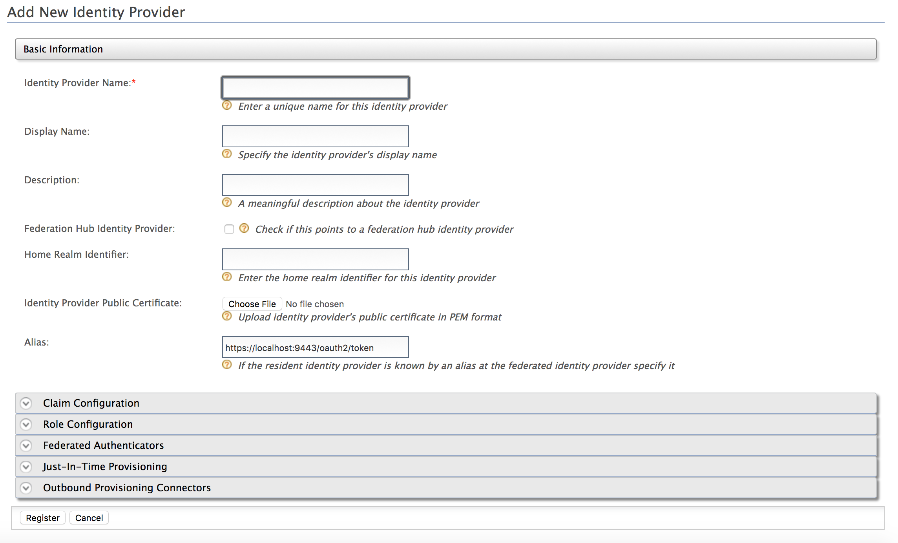
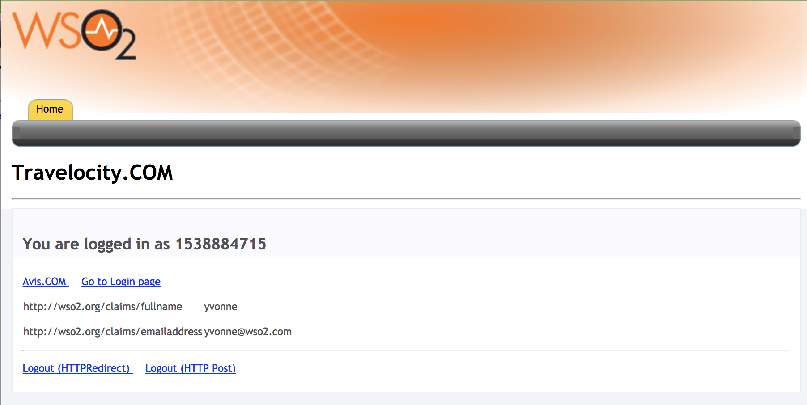

# Configuring Yammer Authenticator

The Yammer authenticator is configured as a federated authenticator in
WSO2 Identity Server to authenticate Yammer users to log in to your
organization’s applications. The diagram below illustrates the flow of
the Yammer federated authenticator.

 

This page provides instructions on how to configure the Yammer
authenticator and WSO2 Identity Server using a sample app. You can find
more information in the following sections.

!!! info 
    This is tested for the Yammer API version 1.0. Yammer Authenticator is
    supported by Identity Server 5.1.0 upwards.

### Deploying Yammer artifacts

1.  Place the authenticator .jar file into the
    `            <IS_HOME>/repository/components/dropins           `
    directory. You can download the
    .jar(org.wso2.carbon.identity.authenticator.yammer) file from the
    [WSO2
    Store](https://store.wso2.com/store/assets/isconnector/details/0e1f0ba7-c4dc-4826-afa7-ba3adef00e7b)
    .

    !!! note
        If you want to upgrade the Yammer Authenticator in your existing
        WSO2 Identity Server pack, please refer [upgrade
        instructions.](../../develop/upgrading-an-authenticator)
    

### Configuring the Yammer App

1.  Log in to [Yammer](https://www.yammer.com/wso2.com/?show_login=true)
    using your account credentials.
2.  Register a new application in
    <https://www.yammer.com/client_applications> .  
     
3.  Fill in the form provided to add your application.  
       
    Fill in the following required fields and click **Continue** :
    -   **Application name** : The name of your application
    -   **Organization** : The organization that the app represents.
    -   **Support e-mail** : The email address used to communicate with
        the app.
    -   **Website** : The website represented by the app.
    -   **Redirect URI** : Use
        `                                          https://localhost:9443/commonauth                                       `
        as the **Redirect URI** when you register the app. This is an
        important step.
4.  Obtain the `           Client ID          ` and the
    `           Client Secret          ` that were generated for your
    application via the App Dashboard.  
       
      

### Deploying [travelocity.com](http://travelocity.com) sample app

Next, [deploy the sample app](../../develop/deploying-the-sample-app) in order to
use it in this scenario.

Once this is done, configure the WSO2 Identity Server by adding an
[identity
provider](../../learn/adding-and-configuring-an-identity-provider)
and [service
provider](../../learn/adding-and-configuring-a-service-provider)
.

### Configuring the identity provider

Now you have to configure WSO2 Identity Server by [adding a new identity
provider](../../learn/adding-and-configuring-an-identity-provider)
.

1.  Download the WSO2 Identity Server from
    [here](http://wso2.com/products/identity-server/) and [run
    it](../../setup/running-the-product).
2.  Log in to the [management
    console](../../setup/getting-started-with-the-management-console)
    as an administrator.
3.  In the **Identity Providers** section under the **Main** tab of the
    management console, click **Add**.
    1.  Give a suitable name for **Identity Provider Name**.  
         
4.  Next, navigate to the **Federated Authenticators \> Yammer
    Configuration**.

    1.  Select the **Enable** and **Default** checkboxes. This will
        enable the Yammer authenticator and make it the default Identity
        provider.

    2.  Enter the following values and click **Register**.

| Field             | Description                                                                                                             | Sample Value                                                                                                               |
|-------------------|-------------------------------------------------------------------------------------------------------------------------|----------------------------------------------------------------------------------------------------------------------------|
| **Client ID**     | This is the `              client ID             ` that wasgenerated for the application you registered via Yammer.     | `              sGdyjvdPadOTAvYc7SZOg             `                                                                         |
| **Client Secret** | This is the `              client secret             ` that wasgenerated for the application you registered via Yammer. | `              AV0acZHX1fPhJdk5VhTdCW6utt0hP7FHxOb72Gznqo             `                                                    |
| **Callback URL**  | This is the service provider's URL to which the code is sent to.                                                        | `                                             https://localhost:9443/commonauth                                          ` |

 

You have now added the identity provider.

### Configuring the service provider

The next step is to configure the service provider.

1.  Return to the management console.

2.  In the **Service Providers** section, click **Add** under the
    **Main** tab.

3.  Since you are using travelocity as the sample, enter
    `                         travelocity.com                       `
    in the **Service Provider Name** text box and click **Register**.

    1.  In the **Inbound Authentication Configuration** section, click
        **Configure** under the **SAML2 Web SSO Configuration** section.

    2.  Now set the configurations as follows:

        -   **Issuer** : [travelocity.com](http://travelocity.com)

        -   **Assertion Consumer URL** :
            <http://localhost:8080/travelocity.com/home.jsp>

    3.  Select the following check-boxes:

        -   Enable Response Signing

        -   Enable Single Logout

        -   Enable Attribute Profile

        -   Include Attributes in the Response Always

    4.  Click **Register** to save the changes.

        

    5.  Now you will be sent back to the **Service Providers** page.

        1.  Navigate to the **Local and Outbound Authentication
            Configuration** section.

        2.  Select the identity provider you created from the dropdown
            list under **Federated Authentication**.

        3.  Ensure that the **Federated Authentication** radio button is
            selected and click **Update** to save the changes.

You have now added and configured the service provider.

### Testing the sample

1.  To test the sample, go to the following URL:
    `             http://<TOMCAT_HOST>:<TOMCAT_PORT>/                           travelocity.com/index.jsp                         `
    E.g., <http://localhost:8080/travelocity.com>

2.  Click “Login with SAML” to log in with SAML from the WSO2 Identity
    Server.

      

3.  Enter your Yammer credentials in the prompted login page to login.
    Once you log in successfully you will be taken to the home page of
    the [travelocity.com](http://travelocity.com) app.

     