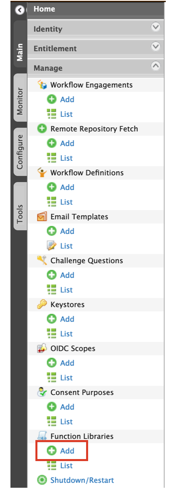
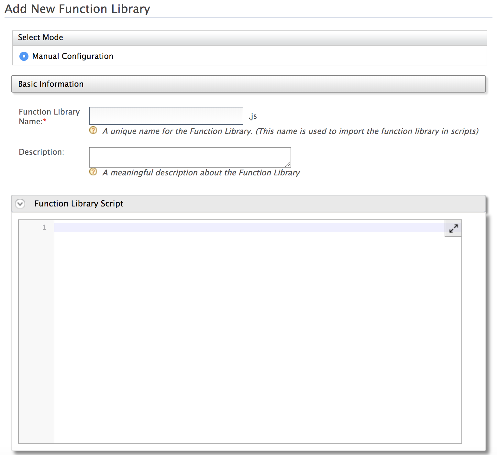

## Add a function library

Follow the steps below to add a function library using the Management Console.

1. Sign in to the [management console](insertlink).

2. Click **Manage > Function Libraries >  Add**.
   
    
   
3. Fill in the **Function Library Name**, provide a brief **Description** and write the **Function Library Script** for the function library.

    

4. Click **Register** to add the new function library.