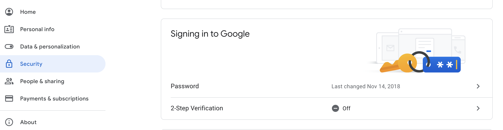
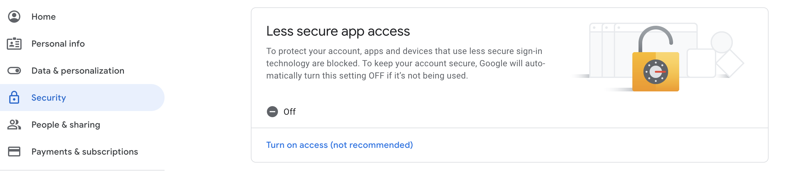

# Email Configurations 

This page lists out all the advanced configurations related to sending email notifications for email-related identity and access management tasks such as EMAIL OTP, account recovery, etc. 

The following code snippet shows a sample email configuration in the `<IS_HOME>/repository/conf/deployment.toml` file. 

```toml
[output_adapter.email]
from_address= "wso2iam@gmail.com"
username= "wso2iam"
password= "Wso2@iam70"
hostname= "smtp.gmail.com"
port= 587
enable_start_tls= true
enable_authentication= true
```

!!! Tip 
    For information about the SMTP package, see
    [here](https://javaee.github.io/javamail/docs/api/com/sun/mail/smtp/package-summary.html).

----
#### from_address 

The email address from which you want to send the notification. It can be any working email address.

----
#### username

Provide the username of the SMTP account i.e., the user name of the email address you have provided as the **from_address**.

----
#### password

Provide the password of the SMTP account i.e., the password of the email address you have provided as the **from_address**.

----
#### host

The SMTP server to connect to.

-----
#### port

The SMTP server port to connect to, if the `connect()` method does not explicitly specify one. Defaults to 25.

-----
#### enable_start_tls

If set to *true*, this parameter enables the use of the `STARTTLS` command (if supported by the before issuing any login commands). Note that an appropriate trust store must be configured so that the client will trust the server's certificate. The default value of this parameter is *false*.

-----
#### enable_authentication

If set to *true*, attempt to authenticate the user using the `AUTH` command. The default value of this parameter is *false*.

-----   

#### Using Google for email notifications

If you are using a Google mail account, note that Google has
restricted third-party apps and less secure apps from sending emails
by default. Therefore, you need to configure your account to disable
this restriction, as WSO2 Identity Server acts as a third-party application when
sending emails to confirm user registrations or notifications for
password reset.     
    
Follow the steps given below to enable your Google mail account to
provide access to third-party applications.

1.  Navigate to <https://myaccount.google.com/security>.

2.  Click **Signing in to Google** on the left menu and make sure
    that the **2-step Verification** is disabled or off.  

    

3.  Click **Connected apps and sites** on the left menu and enable
    **Allow less secure apps**.  

            
    
