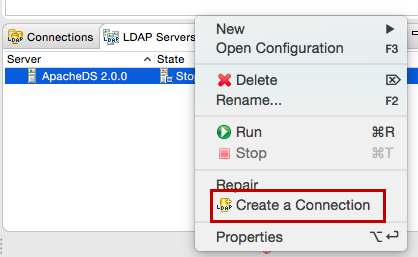

## Create an LDAP Server

1.  Open Apache Directory Studio.

2.  On the **LDAP Servers** tab found on the bottom left corner,click **New Server**.  

    

3.  Select **LDAP server ApacheDS 2.0.0** and click **Finish**.  

    

4.  Right-click on the newly created server and click **Open Configuration**.

    

5.  Port offset the LDAP and LDAP server ports by changing the LDAP port to 10390 and the LDAP server port to 10637. This ensures that the embedded LDAP server running in the prior installation of WSO2 IS does not conflict with the current installation.

    

6.  Right-click on the new server and click **Create a Connection**.  

    

7.  Right-click on the server and click **Run** to start the server.

     