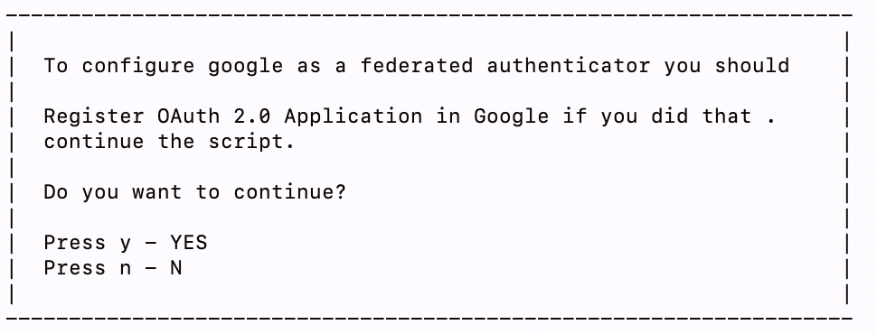

# Quick Start Guide

WSO2 Identity Server is a comprehensive identity and access management
(IAM) solution. It caters to identity management requirements across
many platforms such as enterprise applications, services, and APIs. This
guide gives you a quick walk-through to WSO2 Identity Server using a
sample scenario.

#### Sample Scenario

**Pickup** is a cab company that has many employees who use different
credentials to sign in to different internal enterprise applications.
Following are two such applications:

-   **Pickup Dispatch** : This application helps manage the overall
    operations at Pickup.
-   **Pickup Manager** : This application helps allocate vehicles to
    drivers.

Pickup needs to identify the necessary permission levels to be granted
to the employees and any security vulnerabilities.

**Cameron** is a senior manager at Pickup who is responsible for
resolving these issues using WSO2 Identity Server. **Alex** is a junior manager
attending to day-to-day tasks and **Rowan** is the HR manager.


Let's assume that you are Cameron, and you want to resolve these issues
using WSO2 Identity Server.

### Before you begin

#### Set-up
    
1. Download and install Oracle Java SE Development Kit (JDK) version
   1.7.* or 1.8.
2. Install WSO2 Identity Server 5.9.0 by downloading the [installer](https://wso2.com/identity-and-access-management/install/). 
   The WSO2 Identity Server installation location varies according to the OS as given below.

    |OS     |Home Directory                                |
    |:------|:---------------------------------------------|
    |Mac OS | `/Library/WSO2/IdentityServer/<IS_HOME>`         |
    |Windows| `C:\Program Files\WSO2\IdentityServer\<IS_HOME>` |
    |Ubuntu | `/usr/lib/wso2/IdentityServer/<IS_HOME>`         |
    |CentOS | `/usr/lib64/IdentityServer/<IS_HOME>`           |

    In this guide, the installation location of WSO2 Identity Server is referred to as `<IS_HOME>`.

3. [Download](https://curl.haxx.se/download.html) and install curl. Make
      sure you install the binary type file of the version you choose.

4. Open the `/etc/hosts` file and add the following entry.
    
        127.0.0.1        localhost.com    

    !!! note "Notes"
        * If you are planning to use Single Sign-On (SSO), do not use `localhost` as it will cause the Tomcat naked host issue. Use `localhost.com` instead. If you are using Windows, `localhost.com` is considered as `127.0.0.1`.<br/>
        * Make sure that this is the only such entry available for this IP address in the `/etc/hosts` file to avoid any conflicts.

5. [Start](../../setup/running-the-product) WSO2 Identity Server. You
   are now ready to deploy the sample.

#### Steps to configure and run the samples

1.  Download the samples from [GitHub](https://github.com/wso2/samples-is/releases/download/v4.2.0/is-samples-distribution-4.2.0.zip) and unzip.

    ``` java
    unzip is-samples-distribution-4.2.0.zip
    ```

    !!! note
    
        From this point onwards:
    
        -   `               <IS_HOME>              ` is the directory in
            which the WSO2 Identity Server is installed.
        -   `               <IS_SAMPLE_DISTR>              ` is the directory where downloaded `is-samples-distribution-4.2.0.zip` archive is extracted.
    

2.  Open the server.properties file in `<IS_SAMPLE_DISTR>/IS-QSG/conf/ ` and make sure that `wso2is.host.domain` and `wso2is.host.port` are configured as shown below.             
    ```
    #localhost.com is used to resolve naked hostname validation issue
    wso2is.host.domain=localhost.com
    wso2is.host.port=9443
    server.host.domain=localhost.com
    server.host.port=8080
    ```

3.  Navigate to `<IS_HOME>/bin` using the command prompt and start the server.

    ``` java
        Linux   --> sh wso2server.sh
        Windows --> wso2server.bat
    ```
    Note that the following appears in the command prompt after the server start.
    

    !!! tip "Shutting down the server"
        To shutdown the server, press `Ctrl + C`.
        Note that following log appears in the command prompt after the server shutdown.
        

4.  Navigate to `<IS_SAMPLE_DISTR>/IS-QSG/bin` and execute either of the following commands to start the sample application. 
       
     ``` 
         Linux   --> sh app-server.sh
         Windows --> app-server.bat
    ```

5.  Navigate to `<IS_SAMPLE_DISTR>/IS-QSG/bin`
    and execute the following commands to start the Quick Start samples
    accordingly.

    ``` java
        Linux   --> sh qsg.sh 
        Windows --> qsg.bat 
    ```

    A message appears to pick a scenario, which indicates that the
    samples are deployed and the WSO2 Identity Server is up and running.

6.  When prompted, confirm the configurations.
7. Note that a message appears to pick a scenario, which indicates that
    the samples are deployed and WSO2 Identity Server is up and running.

Let's try out the samples.

### Single Sign-On
##### Problem Scenario

The first problem that Pickup faces is that each employee has to use
separate sets of user names and passwords (credentials) to log in to
Pickup Dispatch and Pickup Manager.


When the number of applications that are used in Pickup increases, the
employees have to maintain more credentials. This is not scalable.
Cameron decides to use Single Sign-On (SSO) to overcome this situation.
With SSO, when a user signs in to one application (authentication), that
user is automatically authenticated to other applications, eliminating
the need to maintain multiple credentials.

Cameron decides to use WSO2 Identity Server to configure SSO.


Let's use the command-line to check the SSO functionality with SAML2 or
OIDC.

##### Configuring SSO with SAML2

If the two applications are using SAML2 as their authentication
protocol, follow the steps below:

1.  Enter `               1              ` as the scenario number at the
    command prompt to:

    1.  Create the two users, Cameron and Alex.
    2.  Create and assign the user role Manager to Cameron.
    3.  Create service providers for Pickup Dispatch and Pickup Manager.
    4.  Configure SAML2 web SSO for Pickup Dispatch and Pickup
        Manager.  
        
    5.  Note that a message with the user and web application details
        appears.  
        

      

    !!! note
        You can also perform the above using the WSO2 Identity Server Management Console.
        For more information, see [Creating users and
        roles](../../learn/configuring-users-roles-and-permissions), [Configuring service
        providers](../../learn/adding-and-configuring-a-service-provider), and
        [Configuring web app for SSO](../../learn/configuring-single-sign-on-saml).
    

2.  Go to the URL
    <http://localhost.com:8080/saml2-web-app-pickup-dispatch.com> using
    a web browser to access the Dispatch application.

3.  Click **Log in**.  
    
4.  Enter either of the following credentials to sign in to the
    application.

    ``` java
    Senior Manager --> Username: cameron | Password: cameron123
    Junior Manager --> Username: alex    | Password: alex123
    ```

    

5.  Select the attributes that you want to share with Dispatch and click
    **Approve**.

    

    !!! note
    
        Obtaining the user consent is one of the fundamental requirements of
        the GDPR regulation. WSO2 Identity Server facilitates this through its **Consent
        Management** features. To know more about GDPR and how WSO2 Identity Server
        handles consent, see [Consent
        Management](../../learn/consent-management)
        .
    

    Note that the Pickup Dispatch home screen appears.

      

    

6.  Similarly, go to the URL
    <http://localhost.com:8080/saml2-web-app-pickup-manager.com> Using
    your browser to access the Pickup Manager application.

7.  Click **Log in**.  
    

8.  Note that the Pickup Manager application opens without having to
    enter the user credentials again.
    
    

9.  To try out other scenarios, navigate back to where you ran the Quick
    Start sample on the command-line and enter
    `              y             ` to clean the setup.  
    

##### **Configuring SSO with OIDC**

If the two applications are using OIDC as their authentication protocol,
follow the steps below:

1.  Enter `               2              ` as the scenario number at the
    command prompt.

    1.  Create the two users: Cameron and Alex.
    2.  Create and assign the user role Manager to Cameron.
    3.  Create service providers for Pickup Dispatch and Pickup Manager.
    4.  Configure SAML2 web SSO for Pickup Dispatch and Pickup Manager.

      
    Note that a message with the user and web application details
    appears.

    

2.  Enter the
    [http://localhost.com:8080/pickup-dispatch](http://localhost:8080/Dispatch/)
    URL on a web browser to access the Pickup Dispatch application.
3.  Click **Log in**.  
    
4.  Enter either of the following credentials to sign in to the
    application.

    ``` java
    Senior Manager --> Username: cameron | Password: cameron123
    Junior Manager --> Username: alex    | Password: alex123
    ```

    

5.  Select the approval type that you wish provide and the attributes
    that you wish to share with the application and click **Continue**
    .  
    

    !!! note
        Obtaining the user consent is one of the fundamental requirements of
        GDPR regulation. WSO2 Identity Server facilitates this through its **Consent
        Management** features. To know more about GDPR and how WSO2 Identity Server
        handles consent, see [Consent
        Management](../../learn/consent-management).
    

    Note that the Pickup Dispatch home screen appears.

    

6.  Similarly, enter
    [http://localhost:8080/pickup-manager](http://localhost:8080/Swift/)
    on a browser to access the Pickup Manager application. Notice that
    the Pickup Manager application opens without having to enter the
    user credentials.  
      
     
    You have set up SSO and your employees are happy with their
    experience as they only have to provide credentials once in order to
    access both Pickup Dispatch and Pickup Manager.
7.  Next, in order to try out other scenarios, navigate back to the
    command prompt where you ran the Quick Start sample and enter
    `              y             ` to clean the setup.  
    
    
----------------
### Multi-factor Authentication
##### Problem Scenario

Pickup has a secure, hassle-free identity management system in place to
better protect the data resources and applications. However, the
traditional authentication mechanism that uses a user ID and
password is not sufficient. Cameron wants to enhance the security
standards by introducing another level of authentication. As a result,
Cameron decides to use the Multi-factor Authentication (MFA) capability
in WSO2 Identity Server using the following factors:

-   **First factor** : password
-   **Second factor** : HARDWARE KEY

Let's use the command-line to check the MFA functionality.

##### Configuring Multi-Factor Authentication

First deploy the sample authenticator dependency and web application in
    WSO2 Identity Server.

   1.  Download the [org.wso2.carbon.identity.sample.extension.authenticators-5.9.0.jar](../../assets/attachments/org.wso2.carbon.identity.sample.extension.authenticators-5.9.0.jar) file and paste inside the
        `              <IS_HOME>/repository/components/dropins             ` directory.

   2.  Download the [sample-auth.war](https://github.com/wso2/samples-is/releases/download/v4.2.0/sample-auth.war) file and paste it inside the `             <IS_HOME>/repository/deployment/server/webapps            `
        folder.  
        This `             .war            ` file contains the WEB UI
        for the sample authenticators used in this tutorial.

3.     Add the followings to the `deployment.tom`l file in the
       `<IS_HOME>/repository/conf` directory and restart the server.
       ```toml
       [[resource.access_control]]
       context = "(.*)/sample-auth/(.*)"
       secure = false
       http_method = "all" 
       ```

Follow the steps below to configure MFA on the Pickup Dispatch and
Pickup Manager applications where HARDWARE KEY is the second authentication
factor.

!!! tip "Before you begin"
    
    If you have run any other samples in this Quick Start Guide, navigate
    back to the `             is-samples-1.0.0/IS-QSG/samples            ` /
    `             QSG-bundle/QSG/bin            ` using the command-line and
    execute either of the following commands to start the Quick Start
    samples.
    
    ``` java
    Linux   --> sudo sh qsg.sh run
    Windows --> sudo qsg.bat run
    ```

A message appears to pick a scenario.


1.  Enter `              3             ` as the scenario number at the
    command prompt.  
    
2.  Enter y to confirm that you have already done the folloing steps.
    
5.  Enter the
    [http://localhost:8080/saml2-web-app-pickup-dispatch.com](http://localhost:8080/saml2-web-app-pickup-dispatch.com)
    URL on a web browser to access the Dispatch application.

6.  Click **Log in**.  
    
7.  Enter either of the following credentials to sign in to the
    application.

    ``` java
    Manager  --> Username: cameron | Password: cameron123
    Employee --> Username: alex    | Password: alex123 
    ```

    

    The HARDWARE KEY login page appears as HARDWARE KEY is the second
    authentication factor.

8.  Enter the DEMO key that appears in the browser and click **Sign In**.
    

    After successful authentication, the **User Consents** form of the
    Dispatch application appears.

9.  Select the attributes that you want to share with Dispatch and click
    **Approve**.

          

    !!! note
    
        Obtaining user consent is one of the fundamental requirements of the
        GDPR regulation. WSO2 Identity Server facilitates this through its **Consent
        Management** features. To know more about GDPR and how WSO2 Identity Server
        handles consent, see [Consent
        Management](../../learn/consent-management)
        .
    

10. Note that the Dispatch home screen appears.

    

11. To try out other scenarios, navigate back to where you ran the Quick
    Start sample on the command-line and enter
    `               y              ` to clean the setup.
    

----------------
### Federated Authentication
##### Problem Scenario

Pickup works with a team of external consultants. Cameron wants to grant
them access to the Pickup Dispatch and Pickup Manager applications.
However, it is a hassle to keep adding and maintaining their accounts in
the employee database as these consultants are temporary and they keep
rotating. Therefore, Cameron decides to use the identity federation
capability of WSO2 Identity Server. This facilitates the external consultants to use
their already existing Google account credentials to sign in to the
Pickup applications.

Let's use the command line utility to check out how an external
consultant uses the command utility to configure federated
authentication.

##### Configuring Federated Authentication

Follow the steps below to configure federated authentication using WSO2
IS:

!!! tip
    
    **Before you begin**
    
    If you have run any other samples in this Quick Start Guide, navigate
    back to the `             is-samples-1.0.0/IS-QSG/samples/QSG-bundle/QSG/bin` on the command prompt and
    execute either of the following commands to start the Quick Start
    samples.
    
    ``` java
    Linux   --> sudo sh qsg.sh run
    Windows --> sudo qsg.bat run
    ```

A message appears to pick a scenario.


1.  Enter `               4              ` as the scenario number at the
    command prompt to:

    1.  Create the two users: Cameron and Alex.
    2.  Create and assign the user role Manager to Cameron.
    3.  Create service providers for Pickup Dispatch and Pickup Manager.
    4.  Configure SAML2 web SSO for Pickup Dispatch and Pickup Manager.

    

2.  Register OAuth 2.0 Application in Google. As the first step, go to
    [Google API Console](https://console.developers.google.com)
    and navigate to the **Credentials** tab from the sidebar. You can
    configure OAuth web application in Google by selecting **OAuth
    Client ID** . You can find more details from
    [here](https://developers.google.com/identity/protocols/OpenIDConnect).
      
    
      
    Select a web application and give it a name (e.g.,
    SampleWebApllication). Enter the Authorized **redirect URI** as
    `                     https://localhost.com:9443/commonauth                   `
    (this is the endpoint in WSO2 Identity Server that accepts the
    response sent by Google).  
    
3. Note down the `API key` and `secret` for later use.

    

    !!! tip
        In order to avoid getting the following error message, add `localhost.com`  to the authorized domains list.   
        ```
        If Invalid Redirect: domain must be added to the authorized domains list before submitting.
        ```


    
2.  Enter `               y              ` to confirm that you have
    already registered an app in Google. (See **Prerequisites** tab)

    


3.  Enter the `               client-id              ` and the secret of
    the Google application when prompted.

    Note that a message with the user and application details appears.

    

4.  Enter the
    [http://localhost:8080/saml2-web-app-pickup-dispatch.com](http://localhost:8080/saml2-web-app-pickup-dispatch.com)
    URL on a web browser to access the Pickup Dispatch application.
5.  Click **Log in**.

      
    The Google login page appears.

6.  Enter your Google `               username              ` and
    `               password              ` and click **Sign In**.

    After a successful authentication, the **User Consents** form of the
    Dispatch application appears.

7.  Select the attributes that you wish to share with Pickup Dispatch
    and click **Approve**.

    

    !!! note
    
        Obtaining the user consent is one of the fundamental requirements of
        GDPR regulation. WSO2 Identity Server facilitates this through its **Consent
        Management** features. To know more about GDPR and how WSO2 Identity Server
        handles consent, see [Consent
        Management](../../learn/consent-management)
        .
    

    Note that the Pickup Dispatch home screen appears.

    
    You have just signed in to the Pickup Dispatch application
    as an external consultant using your Google credentials.

8.  Next, in order to try out other scenarios, navigate back to the
    command prompt where you ran the Quick Start sample and enter
    `              y             ` to clean the setup.  
    

----------------
### Self Sign-up
##### Problem Scenario

Pickup is going through a major expansion and is in the process of
hiring new employees. Currently, when a new employee joins, the Pickup
HR team requests for their details, and creates user accounts and then
asks them to verify, edit and customize their user profiles. This
process sometimes takes few days. Thus, the Rowan and the Pickup HR team
is having a hard time doing this one by one for especially when a larger
number of employees come on-board. Cameron realizes that allowing the
new employees to self sign-up to Pickup web applications will speed up
the onboarding process. As a result Cameron sets this up for Pickup HR
using WSO2 Identity Server.

Let's use the command line utility to check out the self sign-up
functionality.

##### Configuring Self-Sign-up

Follow the steps below to configure self sign-up for Pickup Dispatch and
Pickup Manager applications using WSO2 Identity Server.

!!! tip
    
    **Before you begin**
    
    1.  If you have run any other samples in this Quick Start Guide,
        navigate back to the
        `is-samples-1.0.0/IS-QSG/samples/QSG-bundle/QSG/bin` on the command
        prompt and execute either of the following commands to start the
        Quick Start samples.
    
        ``` java
            Linux   --> sudo sh qsg.sh run
            Windows --> sudo qsg.bat run
        ```

    A message appears to pick a scenario.

2.  Enable the email sending configurations of the WSO2 Identity Server
    as explained [here](../../setup/configuring-email-sending).

4.  Restart WSO2 Identity Server.

    ``` java
        Linux   --> sh wso2server.sh
        Windows --> wso2server.bat
    ```

5.  Navigate to
    `is-samples-1.0.0/IS-QSG/samples/QSG-bundle/QSG/bin` and execute either
    of the following commands to start the Quick Start samples.

    ``` java
        Linux   --> sudo sh qsg.sh run
        Windows --> sudo qsg.bat run
    ```


1.  <a name="qsg-step1"></a> Enter `               5              ` as the scenario number at the
    command prompt.

    

    A prompt appears to choose the user sign-up approach.

    -   **Enable self user registration (without any config)** : This
        enables self sign-up without having to do additional
        configurations. Once registered, the user receives an email to
        the provided email address.
    -   **Enable account lock on creation** : This locks the user
        account during user registration. The user can only sign in to
        the application after clicking the verification link sent to the
        user-provided email address. A confirmation mail is sent to the
        user but user account is locked until the user confirms the
        account by clicking on the account confirmation mail sent by
        WSO2 Identity Server.

    
2.  Enter `               number              ` that matches with the
    approach you would like to try.

    

3.  Enter the
    [http://localhost.com:8080/pickup-dispatch](http://localhost.com:8080/saml2-web-app-pickup-dispatch.com)
    URL on a web browser to access the Dispatch application.

4.  Click **Log in**.  
    
5.  Click **Register Now**.

    

      

6.  Enter a `               username              ` for your user
    account and click **Proceed to Self Register**.

    
    !!! note
    
        If you want a user to self register for a specific tenant, provide
        the `               username              ` in the following format:
        `               <USERNAME>@<TENAND_DOMAIN>              ` .
    

7.  Provide the `               user profile details              `,
    agree to the **Privacy Policy**, and click **Register**.  
    

    A confirmation message appears.

    

8.  Click **Close**.

    1.  If you selected **Enable User Registration (without any
        config)** at [step 1](#qsg-step1), navigate back
        to the Pickup Dispatch application and sign in using the new
        user credentials.

    2.  If you selected **Account Lock on Creation** at [step
        1](#qsg-step1), access your email account to
        view the account registration confirmation mail.

        1.  Click **Confirm Registration** in the email or copy the link
            in the email to your browser and confirm the account
            creation.

            The account gets unlocked and an email is sent.

        2.  Navigate back to the Pickup Dispatch application and sign in
            using the new user credentials.

        

        Note that the Dispatch home screen appears.

        

        You have just self-signed up to a Pickup web
        application.

9.  Next, in order to try out other scenarios, navigate back to the
    command prompt where you ran the Quick Start sample and enter
    `               y              ` to clean the setup.
    

----------------
### Workflows
##### Problem Scenario

After Cameron sets up self registration for Pickup web applications,
Rowan is concerned about the security. Rowan prefers to review and
approve new user accounts before granting access to the Pickup web
applications. Thus, Rowan reaches out to Cameron with these concerns.
Cameron realizes the possibility of creating a workflow using WSO2 Identity Server
and granting role-based authorization, so that each account registration
will be subject to approval.

Let's use the command-line to check out the workflow functionality.

In this workflow, whenever a new user account is created, first it
creates a task for a junior manager (Alex) to approve/reject the account
creation. Upon the junior manager approving the account creation, a task
will be created for the senior manager (Cameron) to approve or reject
the user account.

##### Configuring a Workflow

Follow the steps below to configure a workflow.

!!! tip
    
    **Before you begin**
    
    If you have run any other samples in this Quick Start Guide, navigate
    back to the `             is-samples-1.0.0/IS-QSG/samples            ` /
    `             QSG-bundle/QSG/bin            ` on the command prompt and
    execute either of the following commands to start the Quick Start
    samples.
    
    ``` java
    Linux   --> sudo sh qsg.sh run
    Windows --> sudo qsg.bat run
    ```

A message appears to pick a scenario.


1.  Enter `              6             ` as the scenario number at the
    command prompt.  
    

    Note that a message with the user and web application details
    appears.

    

2.  Enter the
    [http://localhost.com:8080/pickup-dispatch](http://localhost.com:8080/saml2-web-app-pickup-dispatch.com)
    URL on a web browser to access the Pickup Dispatch application.

3.  Click **Log in**.  
    
4.  Click **Register Now**.

    

5.  Enter a `               username              ` for your user
    account and click **Proceed to Self Register**.

    

    !!! note
    
        If you want a user to self register for a specific tenant, provide
        the `               username              ` in the following format:
        `               <USERNAME>@<TENAND_DOMAIN>              ` .
    

6.  Provide the `               user profile details              `,
    agree to the **Privacy Policy**, and click **Register**.  
    

    Even though a new user account is created successfully, it is in
    disabled state. To enable the user, you need to sign in to the WSO2
    user portal and approve the pending workflow requests.

7.  Enter the
    [http://localhost:9443/user portal](http://localhost:9443/user-portal)
    URL on a web browser to access **WSO2 User Portal**.  
    

8.  Enter the following credentials to sign in as Alex and click **Sign
    In**.

    ``` java
    Username: alex    | Password: alex123
    ```

9.  Provide the consents.

    

10. Click **Pending Approvals \> View Details**.  
    

11. Click the **Task ID**.

    

12. Click **Approve** to approve the user account creation.  
    

    Note that a confirmation message appears.  
    

    Click **OK**.

13. Click **Sign out** to sign out of WSO2 User Portal as Alex.  
    

14. Enter the following credentials to sign in as Cameron and click
    **Sign In**.

    ``` java
        Username: cameron    | Password: cameron123
    ```

15. Provide consents.

    

16. Click **Pending Approvals \> View Details**.

    

17. Click the **Task ID**.

    

18. Click **Approve** to approve the user account creation.

    

19. Navigate back to the Pickup Dispatch application and sign in using
    the new user credentials.

    

    Select the attributes that you wish to share with Pickup Dispatch
    and click **Approve**.

    

    !!! note
        Obtaining the user consent is one of the fundamental requirements of
        GDPR regulation. WSO2 Identity Server facilitates this through its **Consent
        Management** features. To know more about GDPR and how WSO2 Identity Server
        handles consent, see [Consent
        Management](../../learn/consent-management)
        .
    
    Note that the Pickup Dispatch home screen appears.

    

----------------
This concludes the Quick Start Guide!

You have set up WSO2 Identity Server and gone through the basic use cases of the
product. For more advanced use cases, check our
[Basic Tutorials](../../learn/tutorials).
