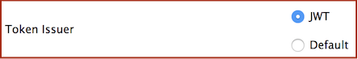

# Get User Claims as a JWT

This page provides instructions on how to get user claims of the authorized user as a [JWT token](insertlink) with the validation response. 

You can configure this for all tenants by configuring the `deployment.toml` file or configure it tenant-wise using the management console. 

{!fragments/register-a-service-provider.md!}

3.  Expand **Inbound Authentication Configuration** and then **OAuth/OpenID Connect Configuration**. 

4. Click **Configure.**   
 
5. Enter the **Callback Url**.

    !!! tip
        For more information on `Callback Url` and other advanced configurations, see [Advanced OpenID Connect Configurations](../../login/oauth-app-config-advanced).

6. Select **JWT** as the **Token Issuer**.
 
    

7.  Click **Add**. 

    Note the **OAuth Client Key** and **Client Secret** that are generated. You will need these values later on when sending the request to the authorization endpoint.

8.  Click **Register**.

-----


## Using file configurations

**Alternatively**, you can enable user claims to be included in the jwt token across all tenants by configuring the `deployment.toml` file. 

**Mandatory configurations**

1. Add and configure the following properties as shown below in the `deployment.toml` file found in the `<IS_HOME>/repository/conf` folder.

    ```toml
    [oauth.token.validation]
    include_validation_context_as_jwt_in_reponse = "true"
    validation_response_signing_algorithm = "SHA256withRSA"
    validation_response_jwt_validity = "15m"
    ```

    ```toml
    [oauth.extensions]
    token_context_generator = "org.wso2.carbon.identity.oauth2.authcontext.JWTTokenGenerator"
    token_context_claim_retriever = "org.wso2.carbon.identity.oauth2.authcontext.DefaultClaimsRetriever"
    token_context_dialect_uri = "http://wso2.org/claims"
    ```

2. Add the following property to the `deployment.toml` file to use the JWT Token Builder instead of the default Token Builder.

    ```toml
    [oauth.token_generation]
    access_token_type = "self_contained"
    ```

**Optional configurations**


1.  See [Extension Points for OAuth](insertlink) for more details about the usage of the `TokenGeneratorImplClass` and `ClaimsRetrieverImplClass`.

2.  **Context Dialect URI**: Defines the URI for the claim dialect under which the user attributes need to be retrieved.

    ```toml
    [oauth.extensions]
    token_context_dialect_uri=  
    ```

3.  **Signature Algorithm**: Defines the algorithm to be used in signing the payload that carries user claims. If you want to disable signing of the JWT token, set this element to `none`.

    ```toml
    [oauth.oidc.user_info]
    jwt_signature_algorithm = "none"
    ```

4.  **JWT Validity**: Defines the expiry time for JWT token in minutes.

    ```toml
    [oauth.token.validation]
    validation_response_jwt_validity=   
    ```

-----

## Get JWT token with claims

**Using the REST API**

1. Use the following curl command to send a request with the required user claims and recieve a JWT token. 

    You can add more required claims as a comma-separated list. 

    ```tab="Request Format"
    curl -k -u <username>:<password> -H 'Content-Type: application/x-www-form-urlencoded' -X POST --data 'token=<access_token>&required_claims=http://wso2.org/claims/emailaddress' https://localhost:9443/oauth2/introspect
    ```

    ```tab="Sample Request"
    curl -k -u admin:admin -H 'Content-Type: application/x-www-form-urlencoded' -X POST --data 'token=fe12a966-5fd5-3b4c-97b1-31ac3e1a31e6&required_claims=http://wso2.org/claims/emailaddress' https://localhost:9443/oauth2/introspect
    ```

**Using the SOAP service**

Alternatively, you can also use the `OAuth2ValidationService` to send the request. 

1. Call the `validate` method of `OAuth2ValidationService` to send a request with the user claims and recieve a JWT token as shown below. For more information, see [OAuth Token Validation Using SOAP Service](../oauth-token-validation)

    Note that the response contains the recieved JWT token under the `<tokenString>` element. 
    If there are no requested claim URIs defined, all the claims that carry values for the user are returned.
    
     

    The header contains the metadata for the token as seen below.

    ```java tab="Header Metadata"
    <header> . <payload> . <signature>

    eyJhbGciOiJSUzI1NiIsIng1dCI6Ik5tSm1PR1V4TXpabFlqTTJaRFJoTlRabFlUQTFZemRoWlRSaU9XRTBOV0kyTTJKbU9UYzFaQSJ9
    .
    eyJodHRwOlwvXC93c28yLm9yZ1wvZ2F0ZXdheVwvYXBwbGljYXRpb25uYW1lIjoiT2F1dGg3IiwiZXhwIjoxNDUyNTk0ODkyLCJzdWIiOiJhZG1pbkBjYXJib24uc3VwZXIiLCJodHRwOlwvXC93c28yLm9yZ1wvZ2F0ZXdheVwvc3Vic2NyaWJlciI6ImFkbWluQGNhcmJvbi5zdXBlciIsImlzcyI6Imh0dHA6XC9cL3dzbzIub3JnXC9nYXRld2F5IiwiaHR0cDpcL1wvd3NvMi5vcmdcL2dhdGV3YXlcL2VuZHVzZXIiOiJhZG1pbkBjYXJib24uc3VwZXIiLCJodHRwOlwvXC93c28yLm9yZ1wvY2xhaW1zXC9yb2xlIjoiYWRtaW4sQXBwbGljYXRpb25cL2Rld3ZkZXcsQXBwbGljYXRpb25cL09hdXRoNyxJbnRlcm5hbFwvZXZlcnlvbmUiLCJodHRwOlwvXC93c28yLm9yZ1wvY2xhaW1zXC9lbWFpbGFkZHJlc3MiOiJhZG1pbkB3c28yLmNvbSIsImlhdCI6MTQ1MjU5MzI1NCwiaHR0cDpcL1wvd3NvMi5vcmdcL2NsYWltc1wvb3JnYW5pemF0aW9uIjoiV1NPMiJ9
    .
    WRo2p92f-pt1vH9xfLgmrPWNKJfmST2QSPYcth7gXKz64LdP9zAMUtfAk9DVRdHTIQR3gX0jF4Ohb4UbNN4Oo97a35oTL1iRxIRTKUkh8L1dpt3H03Z0Ze7Q2giHGZikMIQv3gavHRYKjNMoU\_1MuB90jiK7
    ```

2. Decode the payload. You will notice that the user claim values have been included in the payload. 

    ```java tab="Decoded Payload"
    {  
    "http://wso2.org/gateway/applicationname":"Oauth7",
    "exp":1452594892,
    "sub":"admin@carbon.super",
    "http://wso2.org/gateway/subscriber":"admin@carbon.super",
    "iss":"http://wso2.org/gateway",
    "http://wso2.org/gateway/enduser":"admin@carbon.super",
    "http://wso2.org/claims/role":"admin,Application/dewvdew,Application/Oauth7,Internal/everyone",
    "http://wso2.org/claims/emailaddress":"admin@wso2.com",
    "iat":1452593254,
    "http://wso2.org/claims/organization":"WSO2"
    }
    ```

-----

## Validate the signature

The following code segment is a simple Java program that can be used to validate the ID token signature against the default `wso2carbon.jks` public key in WSO2 Identity Server.

!!! note
    This program uses a third-party library called `nimbusds` to check if the JWT is a signed token or an unsigned token.

``` java
package org.sample;

import java.io.InputStream;
import java.security.KeyStore;
import java.security.cert.Certificate;
import java.security.interfaces.RSAPublicKey;

import com.nimbusds.jose.JWSVerifier;
import com.nimbusds.jose.crypto.RSASSAVerifier;
import com.nimbusds.jwt.SignedJWT;

public class ValidateRSASignature {

    public static void main(String[] args) throws Exception {
        RSAPublicKey publicKey = null;
        InputStream file = ClassLoader
                .getSystemResourceAsStream("wso2carbon.jks");
        KeyStore keystore = KeyStore.getInstance(KeyStore.getDefaultType());
        keystore.load(file, "wso2carbon".toCharArray());

        String alias = "wso2carbon";

        // Get certificate of public key
        Certificate cert = keystore.getCertificate(alias);
        // Get public key
        publicKey = (RSAPublicKey) cert.getPublicKey();

        // Enter JWT String here
        String signedJWTAsString = "eyJhbGciOiJSUzI1NiJ9.eyJzdWIiOiJhbGljZSIsImlzcyI6Imh0d";

        SignedJWT signedJWT = SignedJWT.parse(signedJWTAsString);

        JWSVerifier verifier = new RSASSAVerifier(publicKey);

        if (signedJWT.verify(verifier)) {
            System.out.println("Signature is Valid");
        } else {
            System.out.println("Signature is NOT Valid");
        }
    }
}
```
