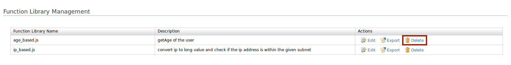

# Adaptive Authentication Using Function Library

Script-based adaptive authentication in WSO2 Identity Server enables changing the 
authentication flow based on conditions in the JavaScript. For this, each service provider 
needs to have its own set of Javascript functions. If the identity admin needs to have 
the same function for several service providers, the same JavaScript function needs to be 
duplicated. As a result, the process of managing authentication scripts gets difficult.

This feature supports a set of function libraries that can be imported in authentication 
scripts. Each function library contains a set of functions. These function libraries can be 
added, deleted, edited, imported, and exported via the WSO2 Identity Server Management Console.

----

This guide assumes you have your own application. If you wish to try out this flow with a sample application, click the button below. 

<a class="samplebtn_a" href="../../../quick-starts/adaptive-auth-with-function-lib-sample"   rel="nofollow noopener">Try it with the sample</a>

----

{!fragments/add-function-library.md!}

----

## Export functions

When adding a function library script, the functions you are supposed to use in authentication 
scripts need to be exported as follows.

For example, when writing more than one function in one library you can use either of the following functions.

**Option 1**

Use this option if a function in the function library calls another function in the same library. 
Make sure to export all the functions.

```
module.exports.<function_name_for_outside> = <function_name_in _the_script>
```

or

```
exports.<function_name_for_outside> = <function_name_in _the_script>
```

```javascript tab="Example"
function getAge(birthDate) {
    var today = new Date();
    var age = today.getFullYear() - birthDate.getFullYear();
    var m = today.getMonth() - birthDate.getMonth();
    if (m < 0 || (m === 0 && today.getDate() <    birthDate.getDate())) {
        age--;
    }
    return age;
};

var validateDOB = function (dob) {
    return dob.match(/^(\d{4})-(\d{2})-(\d{2})$/);
};
    
module.exports.getAge = getAge;
//or 
//exports.getAge = getAge;
module.exports.validateDOB = validateDOB;
//or
//exports.validateDOB = validateDOB;
```

**Option 2**

```javascript
var ageModule = {
    getAge : function (birthDate) {
        var today = new Date();
        var age = today.getFullYear() - birthDate.getFullYear();
        var m = today.getMonth() - birthDate.getMonth();
        if (m < 0 || (m === 0 && today.getDate() < birthDate.getDate())) {
            age--;
        }
        return age;
    },
    
    validateDOB : function (dob) {
        return dob.match(/^(\d{4})-(\d{2})-(\d{2})$/);
    }
};
    
module.exports = ageModule;
```


**Option 3**

```javascript
var ageModule = { };
ageModule.getAge = function (birthDate) {
    var today = new Date();
    var age = today.getFullYear() - birthDate.getFullYear();
    var m = today.getMonth() - birthDate.getMonth();
    if (m < 0 || (m === 0 && today.getDate() < birthDate.getDate())) {
        age--;
    }
    return age;
};

ageModule.validateDOB = function (dob) {
    return dob.match(/^(\d{4})-(\d{2})-(\d{2})$/);
};
    
module.exports = ageModule;
```

----

## Manage function libraries

### View function libraries
Follow the instructions below to view the list of function libraries added in the WSO2 Identity Server.

1. Sign in to the [management console](insertlink).

2. Click **Manage > Function Libraries > List**. 

    Note that the list of function libraries you added appears.

    


### Edit function libraries

Follow the instructions below to edit a function library's details.

1.  Sign in to the [management console](insertlink).

2.  Click **Manage > Function Libraries > List**.

    Note that the list of function libraries you added appears.

3.  Locate the function library you want to edit and click on the corresponding **Edit** link.

    

4. The edit screen appears. The function library name, description, and script can be edited.

    

5. Click **Update**.

6. If you have edited the function library name, click **Yes** to confirm your edit request.


### Delete function libraries

Follow the instructions below to delete a function library.

1. Sign in to the [management console](insertlink).

2. Click **Manage > Function Libraries > List**.

3. The list of function libraries you added appears.

    Locate the function library you want to delete and click on the corresponding **Delete** link.

    

4. To confirm your request, click **Yes**.

-----

{!fragments/register-a-service-provider.md!}

-----

## Include function libraries in adaptive authentication scripts

1. [Register a function library](#add-a-function-library).

2. On the management console, click **Service Providers > List > Edit** on the configured service provider.

3. Expand **Local and Outbound Authentication Configuration** and click **Advanced Configuration**.

4. Write the adaptive authentication script in the editor using the functions written in the added function library.

5. Add the following on top of the script/ before the usage of functions in the function library.

    ```tab="Format"
    var <module_name> = require('<function library name>');
    ```

    ```tab="Example"
    var ageModule = require('age_based.js');)
    ```

6. Use the functions exported in the loaded function library.
    
    ```tab="Example"
    ageModule.getAge(birthday)
    ```
    
!!! info "Related Topics"
    - [Concept: Adaptive-Authentication](TODO:insert-link-to-concept)
    - [Guide: Configure Adaptive Authentication for an Application](../../guides/adaptive-auth/configure-adaptive-auth)
    - [Guide: Ensure Assurance with ACR and AMR](../../guides/adaptive-auth/work-with-acr-amr)
    - [Demo: Adaptive Authentication Scenarios](../../../quick-starts/adaptive-auth-overview)

