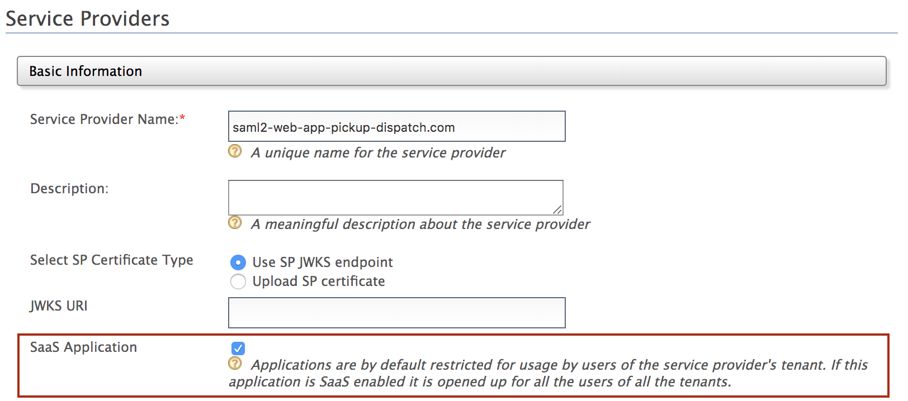
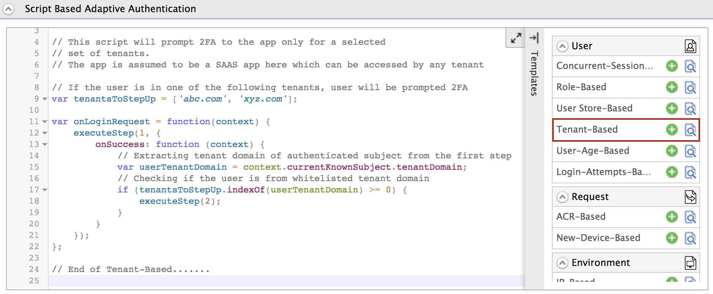

# Configure Tenant-Based Adaptive Authentication

This page guides you through configuring tenant-based adaptive authentication for a sample web application using a sample hardware key authenticator. 

----

## Scenario

Consider a scenario where you wish to add security for users logging in from external tenant domains. Using the tenant-based adaptive authentication template, you can whitelist certain tenant domains so that users from the whitelisted domains are prompted to perform an additional level of authentication, while users from any other tenant domain can simply provide their credentials (basic authentication) to access a resource.

----

{!fragments/adaptive-auth-samples.md!}

----

## Set up tenant

1. Start the server and log in to the WSO2 Identity Server Management Console (`https://<IS_HOST>:<PORT>/carbon`).

2. Click on the **Configure** tab and then click **Multitenancy** > **Add New Tenant**.

3. Enter tenant details as shown below to register a new tenant for the domain " **abc.com** ".

    - **Domain:** abc.com
    - **Usage Plan for Tenant:** Demo
    - **Tenant Admin:** 

         - **First Name:** Alex
         -  **Last Name:** Doe
         - **Admin Username:** alex
         - **Admin Password:** alex321

    - **Email:** alex_d@gmail.com 

    

5. Similarly, register a new tenant for the domain "123.com" with a
    different tenant admin.  

    

----

## Configure tenant-based authentication

1.  Navigate to **Main** > **Identity** > **Service Providers** > **List**.

2.  Click **Edit** on the `saml2-web-app-pickup-dispatch.com` service provider.

3.  Select **SaaS application**. This enables users from other tenant domains such as **abc.com** or **123.com** to log in to the application. 

    

4.  Expand the **Local and Outbound Configuration** section and click **Advanced Authentication**.

5.  Expand **Script Based Conditional Authentication**.

6.  Click **Templates** on the right side of the **Script Based Conditional Authentication** field and then click **Tenant-Based**. 

    

7.  Click **Ok**. The authentication script and authentication steps
    are configured. 
    
    The authentication script prompts the second step of authentication for users that belong to the tenant domains named `abc.com` and `xyz.com`.  

8.  The authentication steps added are `totp` and `fido`. However, these are authentication steps that you would normally use in production. 

    To try out sample authenticators with the sample application, delete the two
    authenticators and add the following sample authenticators instead.

    1.  Click **Delete** to remove the `totp` authenticator from Step 2 (the
        second authentication step).
        
        
        
    2.  Select **Demo Hardware Key Authenticator** and click **Add**.
      
        

9. Click **Update**.

----

## Try it

1. Log out of the management console and log in with the **abc.com** tenant admin's credentials (alex@abc.com).  
    
    

2.  Create a new user in the abc.com tenant named "chris" with login permission.

    For instructions, see [Add a User](../../guides/identity-lifecycles/admin-creation-workflow/).

3.  Access the following sample Pickup Dispatch application URL:

    `http://localhost.com:8080/saml2-web-app-pickup-dispatch.com`

4.  Click **Login** and enter Chris's credentials. 
    
    Enter the username with the appended tenant domain (i.e., chris@abc.com).  
    
      

    Note that you are prompted for hardware key authentication because
    **abc.com** is a whitelisted tenant domain.

5.  Enter the 4-digit key and click **Sign In**. You are successfully
    logged in to the application.  

    

6.  Log out and log in with Kim's credentials. Kim is the admin of the
    **123.com** tenant domain, which is not one of the whitelisted
    domains.  

    

7.  Provide consent.  
    Note that you are successfully logged in to the application after
    going through the basic authentication step only.