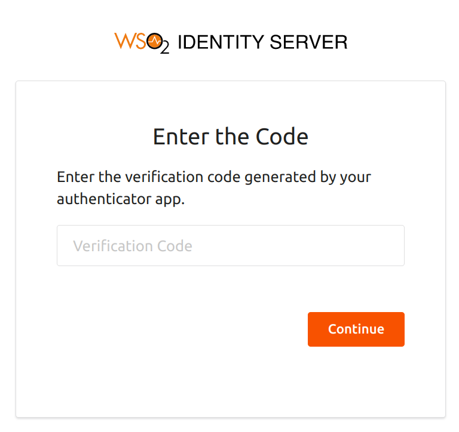

# Configure Userstore-Based Adaptive Authentication

This page guides you through configuring userstore-based adaptive authentication for a sample web application.

This is useful if you want to add security for users logging in from other userstore domains.

Using the user store-based adaptive authentication template, you can allow certain userstore domains so that users from the allowed domains are prompted to perform an additional level of authentication, while users from any other userstore domain can simply provide their credentials (basic authentication) to access a resource.

----

## Scenario

Consider a scenario where you want to step up authentication for users who belong to `EMPLOYEES` and `CONTRACTORS` user store domains. For users assigned to these user store domains, the login flow in applications should be stepped up with TOTP as follows:  

1. Basic authentication (username and password)
2. TOTP or FIDO

----

## Prerequisites

- You need to [set up the sample](../../adaptive-auth/adaptive-auth-overview/#set-up-the-sample) application.
- You need to set-up a database. For this scenario, we will use an LDAP server.
- You need to configure a new userstore:
    1. On the management console, go to **Main > Identity > User Stores > Add**.
    2. Create a user store named `EMPLOYEES`, and add the following values for the fields.

        | Field name    | Value |
        |---------------|-------|
        | **Connection URL**    | ldap://localhost:10390    |
        | **Connection Name**   | uid=admin,ou=system   |
        | **Connection Password**   | secret    |
        | **User Search Base**  | ou=users,ou=system    |
        | **Username Attribute**    | uid   |
        | **User Search Filter**    | (&(objectClass=person)(uid=?))
    |
        | **User List Filter**  | (objectClass=person)
    |
        | **User ID Attribute** | uid   |
        | **User ID Search Filter** | (&(objectClass=person)(uid=?))    |

    3. Expand the **Optional** tab and add the following:

        | Field name    | Value |
        |---------------|-------|
        | **Group Search Base**    | ou=groups,ou=system    |

    4. Click **Update** to save the configurations.

- You need to [add two users](../identity-lifecycles/admin-creation-workflow/) with login permissions, and add their **Domain** as specified:

    1. Username: `Alex`; Domain: `PRIMARY`
    2. Username: `Kim`; Domain: `EMPLOYEES`

## Configure userstore-based authentication

To configure userstore-based authentication:

1. On the management console, go to **Main** > **Identity** > **Service Providers** > **List**.

2. Click **Edit** on the `saml2-web-app-pickup-dispatch.com` service provider.

3. Expand the **Local and Outbound Authentication Configuration** section and click **Advanced Configuration**.

4. You will be redirected to **Advanced Configuration**, expand **Script Based Conditional Authentication**.

5. In the **Templates** section, click on the **`+`** corresponding to **Role-Based** template.

    

6. Click **Ok** to add the authentication script. The authentication script and authentication steps will be configured.

    !!! info
        - The authentication script prompts the second step of authentication for users that belong to the userstores named `EMPLOYEES` and `CONTRACTORS`.
        - By default, `totp` will be added as the second authentication step. You can update this with any authentication method.

7. Click **Update** to save your configurations.

----

{!fragments/create-ldap-server.md!}

----

## Try it out

1. Access the following sample Pickup Dispatch application URL: `http://localhost.com:8080/saml2-web-app-pickup-dispatch.com`

2. Click **Login** and enter Alex's credentials.

    !!! info
        Note that Alex is successfully logged in to the application after going through only the basic authentication step.

3. Log out from the application and login using Kim's credentials. 

    !!! info
        Note that Kim is prompted for a second step of authentication (i.e., TOTP) since she belongs to the userstore domain `EMPLOYEES` which is within the list of user stores which should be stepped up.  

4. Enter the TOTP code and click **Sign In**.  

      

    !!! tip
        Ensure that the LDAP server in Apache DS is running when attempting to log in as Kim.
