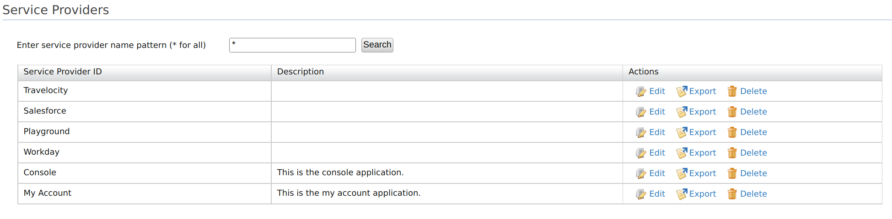

# Introduction

You can connect your application with Identity Server and control the way users login to your app. This guide provides instructions on how to add and configure a [service provider](../../get-started/architecture#service-provider-section) to Identity Server through the management console.

For more information on how the service provider fits into the WSO2 IS architecture, see [Architecture](../../references/architecture/architecture.md).

## Register a service provider

To add a new service provider on WSO2 Identity Server:

1. On WSO2 IS Management Console, go to **Main > Identity > Service Providers > Add**.

2. Enter the following details:

    | Field | Description   |
    |-------|---------------|
    | Service Provider Name | A name for your service provider. This field is required to register an SP.  |
    | Description   | A short description of the service provider    |
    | Management Application    | Select this checkbox if the application is used to access the management APIs.    |

    

    ??? note "Modify validation for service provider name"
           The default javascript regex used to validate the service provider name is `^[a-zA-Z0-9\\s.+_-]*$`.
           This regex can be modified by adding the following configuration to the `deployment.toml` file.

            ``` java
            [service_provider]
            sp_name_java_script_regex = '<required_javascript_regex>'
            ```

3. Click **Register** to complete the registration.

## Configure the service provider

1. On WSO2 IS Management Console, go to **Main > Identity > Service Providers**.
2. Click **List**, select the service provider you want to configure, and click on the corresponding **Edit** link.
3. On the **Service Providers** screen, fill in the required **Basic Information**.

    | Field | Description   |
    |-------|---------------|
    | Select SP Certificate Type | A certificate is used to validate requests from the SP. You can either **Use SP JWKS endpoint** or **Upload SP certificate**.  |
    | JWKS URI    | If you have selected **Use SP JWKS endpoint** in the above field, this field will appear. You need to add the JWKS endpoint URI in this field.        |
    | Application Certificate    | If you have selected **Upload SP certificate** in the above field, paste the public certificate into the given text area or upload the certificate file in **PEM** format.     |
    | SaaS Application   | Enable this to allow users to allow tenants to log in to the application. Disabling this allows only users of the current tenant, (the tenant you use to configure the SP) to login into the application. |
    | Discoverable Application  | Enable this to make the application discoverable to users. |
    | Access URL    | Access URL for the Service Provider.   |
    | Logo URL  | Add a link to the logo for your application here.   |
    | Logout Return URL or regex    | The URL that the users will be redirected during a direct IdP logout   |
    | Management Application    | The selection you made for Management Application during the application creation will be shown here. This cannot be updated. |

    ??? info "Details about public certificates"
        This certificate is used to validate the signatures of the signed
        requests from the application (service provider) to WSO2 IS.

        **When will certificates be used**

        The certificate is used in the following scenarios:

        - To validate the signature of the SAML2 authentication requests and the SAML2 logout requests that are sent by the service provider during [SAML SSO flows](../login/sso-for-saml.md).
        - When [passing OIDC authentication request parameters](../login/oidc-parameters-in-auth-request.md) the certificate is used to:
            - Encrypt the `id_token` sent to the service provider in the OIDC Authentication Response.
            - Validate the signed `Request` `Object` sent in the OAuth2/OIDC Authorization Request.

        **How to obtain the PEM encoded certificate**

        WSO2 IS expects the certificate to be in PEM format.

        The PEM content of a certificate in a JKS file can be obtained by
        following the steps below:

        1\. Export the certificate from the key store using the following command. 

        ``` java
        keytool -export -keystore <keystore-path> -alias <alias-of-the-certificate> -file <path-of-the-expected-certificate-file>
        ```

        e.g. `keytool -export -keystore wso2carbon.jks -alias wso2carbon -file wso2carbon.crt`
        

        2\. The exported certificate will be in binary format. Convert this binary encoded certificate to a PEM encoded certificate by using the following command.

        ``` java
        openssl x509 -inform der -in <path-of-binary-certificate> -out <path-of-expected-pem-content>
        ```
        e.g. `openssl x509 -inform der -in wso2carbon.crt -out wso2carbon.pem`
        
        **What happens if you don't add the certificate**

        If the **Application Certificate** field is left blank, as WSO2 IS is backward compatible and follows the previous implementation to locate the certificates in the keystore.  

        - For a SAML SSO flow, the certificate alias mentioned in SAML inbound authentication configuration will be used when the certificate is not updated via the management console. 
        
        - For an OIDC request object signature validation, the certificate will be retrieved from the default keystore, an alias to the consumer key of the auth application.

4. Click **Update** to save the configurations.

### Advanced configurations

Click the expandables to check and update the advanced configurations.


For more information on advanced configurations, see the following documentation.

- [Configure claims for a service provider](../applications/configure-claims-for-sp.md)
- [Configure roles and permissions for a service provider]
- [Configure local and outbound authentication for a service provider](../applications/local-outbound-auth-for-sp.md)
- [Configure inbound provisioning for a service provider](../applications/inbound-provisioning-for-sp.md)
- [Configure outbound provisioning for a service provider](../applications/outbound-provisioning-for-sp.md)

## Configure a resident SP

WSO2 Identity Server can mediate authentication requests between service providers and identity providers. At the same time, the Identity Server can act as a service provider and an identity provider. When it acts as a service provider it is known as the resident service provider.

The Identity Server mainly acts as a resident service provider while
adding users to the system.

To configure a resident service provider:

1. On WSO2 IS Management Console, go to **Main > Identity > Service Providers > Resident**.
2. On the **Resident Service Provider** page, select the options according to your requirements:

    <table>
        <tr>
            <th>Provisioning Method</th>
            <th>Field</th>
            <th>Description</th>
        </tr>
        <tr>
            <th rowspan="2">Inbound Provisioning Configuration</th>
            <td>User Store Domain</td>
            <td>Select the user store domain to provision users and groups for inbound authentication for SCIM or SOAP requests.</td>
        </tr>
        <tr>
            <td>Enable Dumb Mode for SCIM</td>
            <td>If this is enabled users will not be provisioned to the user store.</td>
        </tr>
        <tr>
            <th>Outbound Provisioning Configuration</th>
            <td>Identity Provider</td>
            <td>Select the [outbound provisioning enabled IdP](../identity-federation/outbound-provisioing-idp.md).</td>
        </tr>
    </table>

    

3. Click **Update** to save the configurations.

## Manage service providers

This section of the guide provides instructions on managing service providers once they are created.

### View a service provider

Follow the instructions below to view the list of service providers
added in the WSO2 Identity Server.

1. On WSO2 IS Management Console, go to **Main > Identity > Service Providers**.
2. Click **List** to list all the service providers registered on the management console.

    

### Edit a service provider

Follow the instructions below to edit a service provider's details.

1. On WSO2 IS Management Console, go to **Main > Identity > Service Providers**.
2. Click **List**, select the service provider you want to configure, and click on the corresponding **Edit** link.
    

### Delete a service provider

Follow the instructions below to delete a service provider.

1. On WSO2 IS Management Console, go to **Main > Identity > Service Providers**.
2. Click **List**, select the service provider you want to configure, and click on the corresponding **Delete** link.  
    
3. Click the **Yes** to confirm your action.  

!!! info "Related Topics"

    See the following topics to configure different applications as service providers in Identity Server.

    -   [Logging in to SaaS applications using Identity Server](../login/log-into-simplesaml-using-is.md)
    -   [Logging in to Salesforce using the Identity Server](../login/log-into-salesforce-using-is.md)
    -   [Logging in to Salesforce with Facebook](../login/log-into-salesforce-using-fb.md)
    -   [Logging in to Salesforce with Integrated Windows Authentication](../login/log-into-salesforce-using-iwa.md)
    -   [Logging in to WSO2 Products via the Identity Server](../../learn/logging-in-to-wso2-products-via-the-identity-server)