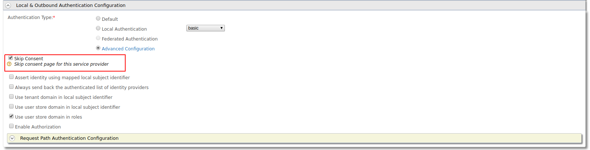

# Authenticate with Basic Auth Request Path Authenticator

This page guides you through using the request path authenticator for basic authentication. 
The Basic Authentication Request Path Authenticator is engaged when user credentials (username and password) 
are sent along with a request for authentication. You can use this authentication mechanism if you wish to skip the login page in the authentication flow.

---

This guide assumes you have your own application. If you wish to try out this flow with a sample application, click the button below. 

<a class="samplebtn_a" href="../../quick-starts/basic-auth-request-path-sample" rel="nofollow noopener">Try it with the sample</a>


----

{!fragments/register-a-service-provider.md!}

----

{!fragments/oauth-app-config-basic.md!}

----
{!fragments/local-outbound-for-request-path.md!}

## Configure the client application

Make the following requests via your application with the `<SEC_TOKEN>` in the authorization header, to the token endpoint. 
Replace the **` <SEC_TOKEN>,CLIENT_ID>`** and **`<REDIRECT_URI>`** tags with the relevant values.

!!! tip
    The `<SEC_TOKEN>` in the Authorize Endpoint will be the `username:password` in Base64
    encoded format. You can use a [Base64 encoder](https://www.base64encode.org/) 
    to encode this. For instance, the username and password admin:admin, is "
    `YWRtaW46YWRtaW4=". 


    
```tab="Request Format"
    curl -v -X POST -H "Authorization: Basic <Base64 encoded value of username:password>" -H "Content-Type: application/x-www-form-urlencoded;charset=UTF-8" -k -d "response_type=<code>&client_id=<client_id>&redirect_uri=<redirect_uri>&scope=openid&prompt=none"  http://<host>:9443/oauth2/authorize
```

```tab="Response Format"
    Location: <callbackurl>?code=8a498de9-1f5d-3bd0-a3c9c06be6e08151&session_state=61cd6d0ac6f73bf2bab6f5d710d446c6592b6bedb01c240c1377312118f3e186.N92JLOL5gufcXSwxh2V4xg
```

!!! note
    RequestPath authentication will only skip the login page and not the consent page.
    You can skip the user consent page. 
    You can use any of the following procedure,
    
    * You can skip consent for a particular request by sending prompt attribute 
    with value `none` in the authorization request
    * You can skip the consent for a service provider by enabling the 'Skip Consent'
     in service provider
    
    * You can provide "approve always" consent for the an application
    and user before sending the request.
    * You can configure the following `<IS_HOME>/repository/conf/deployment.toml` file
     which will disable promt consent for all service providers system wide
    ```xml
    [oauth]
    consent_prompt=false
    ```

!!! troubleshoot  
        If you haven't disabled the consent as pointed above, then the response
        will be as follows:
    
        ```
        Location: https://localhost:9443/authenticationendpoint/oauth2_consent.do?loggedInUser=admin&application=plagroundapp&scope=openid&sessionDataKeyConsent=a14f4a5d-16bb-4e47-9c53-5eacee9828f2&spQueryParams=
        ```
    
        This is the consent page which will require the user interaction to
        either approve or deny the authorization request. You can go to the
        above consent page url via a web browser and provide approve or
        deny.Then the url will be redirected to
        
        ```
        https://curl-app/callback?code=37c79c505960e90d5b25f62ce760c98c&session_state=6d1a72e0f3f6392d6648ec5e6ed0
        ```
        
!!! info "Related Links"
     -   [Enable Authentication with Basic Auth Request Path Authenticator](../../quick-starts/basic-auth-request-path-sample)
           