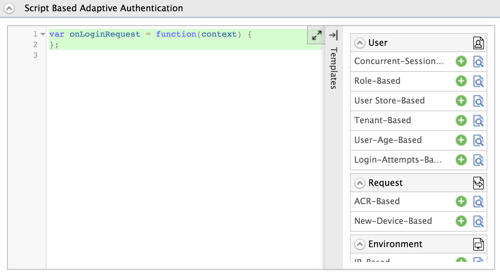

# Configure Adaptive Authentication for an Application

This page guides you through setting up [adaptive authentication](insertlink) for an application. 

-----

This guide assumes you have your own application. If you wish to try out this flow with a sample application, click the button below. 

<a class="samplebtn_a" href="../../../samples/adaptive-auth-samples" target="_blank" rel="nofollow noopener">Try it with the sample</a>

----

{!fragments/register-a-service-provider.md!}

----

## Configure adaptive authentication

The WSO2 IS management console provides an authentication script editor that allows you to define authentication scripts using JavaScript. The script editor provides a set of predefined templates that you can use to easily set up adaptive authentication for some of the most common authentication scenarios. 

3.  Expand the **Local and Outbound Configuration** section and click
    **Advanced Authentication**.

4.  Expand **Script Based Conditional Authentication**.

5.  Click **Templates** on the right side of the **Script Based Conditional Authentication** field.

6.  Click on the relevant template depending on the adaptive authentication usecase you wish to set up. 

    

    !!! tip
        To see a sample flow of each template, see [Adaptive Authentication Scenarios](../../../samples/adaptive-auth-samples).

6.  Click **Ok**. 
    The authentication script and authentication steps are configured. 

----

## Customizing the authentication script

1. Modify the template accordingly if required on the script editor.

2. Click **Update** to save changes. 

If required, you can also use the script editor to introduce new functions and fields to an authentication script based on your requirement, and then engage the script to the service provider’s authentication step configuration. 

A sample authentication script is shown below 

```java
var onLoginRequest = function(context) {
    // Some possible initializations...
    executeStep(1, {
        onSuccess: function (context) {
            // Logic to execute if step 1 succeeded
            executeStep(2, {
                onSuccess: function (context){
                    // Logic to execute if step 2 succeeded
                },
                onFail: function (context){
                    // Logic to execute if step 2 failed
                }
            });
        }
        onFail: function(context){
            // Logic to execute if step 1 failed
            executeStep(3);
        }
    });
}

function someCommonFunction(context) {
    // Do some common things
}
```

- To learn about the functions and fields related to authentication scripts, see [Adaptive Authentication JS API Reference](insertlink).

- To learn about the guidelines on writing custom functions for adaptive authentication, see [Writing Custom Functions for Adaptive Authentication](insertlink).

----