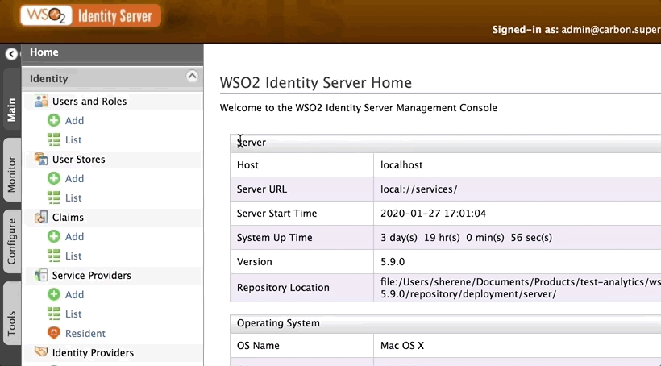

# Configuring Single Sign-On Using OpenID Connect

To configure Single Sign-On (SSO) for an OAuth/OpenID Connect application, follow the steps given on this page. 

----
**To learn more before you begin:** 

 <a class="conceptbtn_a" href="#" target="_blank" rel="nofollow noopener">Read the concept</a><a class="samplebtn_a" href="#" target="_blank" rel="nofollow noopener">Try the sample</a>

 ----

## Register a service provider

1. Log in to the [Management Console](https://localhost:9443/carbon/) using admin/admin credentials. 

2. Click **Service Providers >Add** and enter a **Service Provider Name**. 

    

## Configure OpenID Connect

1. Expand **Inbound Authentication Configuration > OAuth/OpenID Connect Configuration** and click **Configure**.

2. Enter the **Callback URL** and click **Add**. 

    The **Callback URL** is the exact location in the service provider's application where an access token would be sent. 
    
3. To configure more advanced configurations, see [OAuth/OpenID Connect Configurations](../../guides/oauth-oidc-configurations). 

4. Note the **OAuth Client Key** and **Client Secret** that appear. 

   

## What's Next? 

- Configure advanced configurations for the OAuth/OpenID Connect application. For information, see [OAuth/OpenID Connect Configurations](../../guides/oauth-oidc-configurations). 
