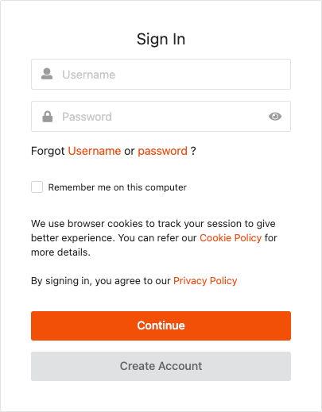

# Manage user consent

Consent management provides users with choice and control over sharing
their personal data with applications and establishes trust between the users and the
service provider.

The following sections explain how WSO2 Identity
Server handles consent management within the single-sign-on (SSO)
authentication flow.

## How it works

This section guides you through the consent management flow for SSO
authentication.

-  When configuring claims for a service provider, the identity admin can specify **requested claims** and **mandatory claims** that determine what user information the service provider requires. This claim configuration governs what user attributes the user is prompted to consent to.

    !!! info
        Learn more about [claims configured for the service provider](../dialects/share-claims-with-apps.md)

    

-  When a user is authenticated for the relevant application, the service provider requests the user information represented by these claims.
-  The user is prompted to provide consent to share the requested personal information with the service provider. Depending on the preference, users can select which attributes to share with the service provider and which attributes they wish to opt out of sharing by selecting/deselecting the relevant claims accordingly. A sample user consent request screen is shown below.
-  Once the user provides approval to share the user attributes, WSO2 Identity Server will store the consent in relation to the user and the application. This means that the user will not be prompted for consent again unless one of the following occurs:
    - The user has revoked consent for the application. For more information on revoking user consent, see [Consent management](../learn/my-account/#consent-management).
    - The application requires new claims that the user has not consented to previously. The application requires new claim that the user has not consented previously. If the service provider is configured to request for any claim values, the user will only be prompted to provide consent for the newly added claims.

## Try it

Follow the instructions given below to try consent management.

### Set up the sample app

Configure the Travelocity sample app as a service provider in WSO2 Identity Server.

### Configure the claims

Edit the above created service provider's **Claim Configuration** to configure the following service provider claims.

- http://<claim\_dialect\>/claims/fullname **(mandatory claim)**
- http://<claim\_dialect\>/claims/email **(mandatory claim)**
- http://<claim\_dialect\>/claims/gender
- http://<claim\_dialect\>/claims/dob

### Log in

Run the Travelocity sample and follow the steps given below.

1.  Access the following URL: <http://wso2is.local:8080/travelocity.com>

    You are directed to the following page.  

    

2.  Click **Click here to login with SAML from Identity Server**. 

    !!! info
        You are redirected to the WSO2 Identity Server for authentication.

3.  Enter the user credentials and click **Submit**.

      

4.  Once you have provided the correct credentials, you are redirected to the consent request screen for approval.  

    !!! tip
        The consent screen appears only if the user has already entered values for the mandatory claims. If any of these values is missing (e.g., if `Email` is a mandatory claim, but the user has not yet provided an email address), a screen appears where the user must enter those values before the consent screen will appear.

    

6.  Select the claims that you consent to share with the Travelocity
    application and click **Approve**.

    !!! tip
        You must select all mandatory claims to successfully complete the authentication. After providing consent, you are redirected to the Travelocity application home page.

        For more information on revoking/accepting user consent, see [Consent management](../../learn/my-account/#consent-management).