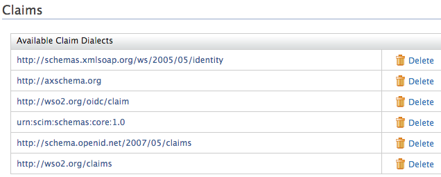
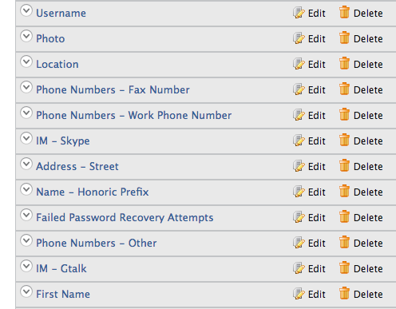

# Delete Claim Mapping

If you want to remove a claim from your list, you can easily do so from
the Management Console. Refer to the steps below for detailed
instructions.

1.  Sign in. Enter your username and password to log on to the
    [Management Console](../../../deploy/get-started/get-started-with-the-management-console).
2.  Click **Main** to access the **Main** menu and click **List** under
    **Claims**.
3.  Click on any available dialect links.  
    
4.  From the **Claim Dialect** view, you can view the claims defined for
    that particular dialect.  
    
5.  Click the " **Remove Claim Mapping** " link to remove the
    appropriate claim mapping.

!!! tip "Alternative"
    
    Alternatively, you also can do this by deleting claim mappings from the
    `claim-config.xml` located in then
    `<IS_HOME>/repository/conf/` folder.
    
    Note that any edits made to the `                   <IS_HOME>/repository/conf/claim-config.xml        ` file get applied only when you start the product for the first time, or for any newly created tenants. With the first startup, claim dialects and claims will be loaded from the file and persisted in the database. Any consecutive updates to the file will not be picked up and claim dialects and claims will be loaded from the database.
    
