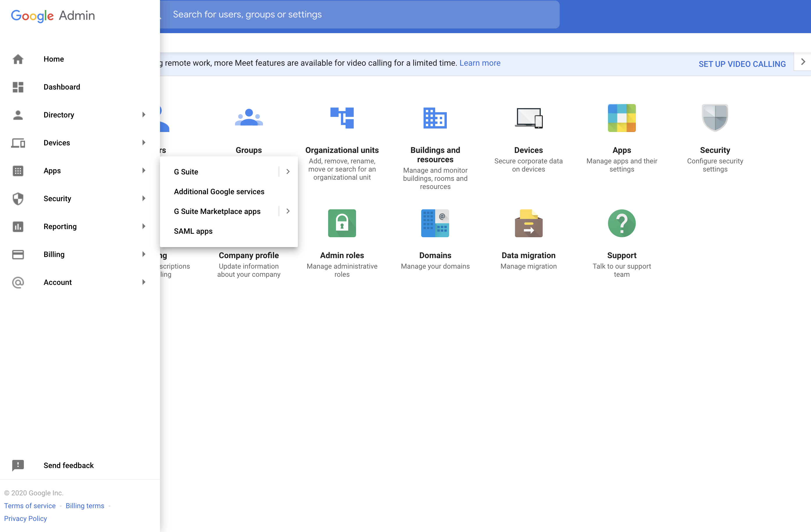

# Configure Google as a Federated Authenticator

This page guides you through configuring Google as a federated authenticator in WSO2 Identity Server. 

---

This guide assumes you have your own application. If you wish to try out this flow with a sample application, click the button below. 

<a class="samplebtn_a" href="../../../quick-starts/google-as-federated-authenticator-sample"   rel="nofollow noopener">Try it with the sample</a>

---

## Set up Google as a SAML IdP

!!! note
    You can skip this section if you have already registered your application on Google. 

1.  Access the Google Admin console by navigating to this URL:
    <https://admin.google.com/>.
2.  Log in using your administrator account.
3.  Click **Admin Console**.
4.  Click **Apps** > **SAML apps** from the left hand panel.
	
	!!! info 
		If you do not see the Apps button on the home page, click **More
		Controls** at the bottom of the page.

	
	

5.  Click on the 
     icon found at
    the bottom-right of the page.
6.  Click **SETUP MY OWN CUSTOM APP**  
    
    
7.  Click **Download** next to the **IDP Metadata** field to download
    the Google identity provider metadata.  
    A `          GoogleIDPMetadata.xml         ` file is downloaded on
    to your machine.  
    
    
    
8.  Click **Next** and enter an **Application Name** and **Description**
    for your application. This is the name and description that your
    users will see.  
    You can also upload an image of your logo.
9.  Click **Next** and enter the app details
10. Click **Next** and then click **Finish**.
11. Once the application is configured, click **Edit Service** and
    change the **Service Status** to **ON**. You can turn on the
    service for everyone or for some users only.

---

## Configure Google as a SAML IdP in WSO2 IS

(insert-admin-portal-link)

---

## Configure the service provider

(insert-admin-portal-link)

---

You have successfully configured Google as your federated authenticator. Now, when you try to login to your application, it should redirect to the Google login page. On successful authentication with your Google credentials, you will be able to access your application. 
