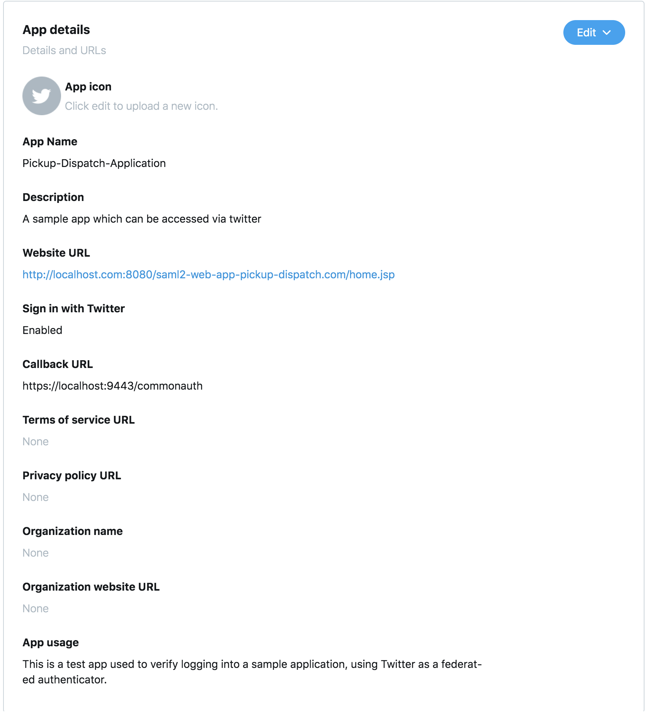

# Configure Twitter as a Federated Authenticator

This page guides you through configuring Twitter as a federated authenticator in WSO2 Identity Server. 

---

This guide assumes you have your own applications. If you wish to try out this flow with a sample application, click the button below. 

<a class="samplebtn_a" href="../../../quick-starts/twitter-as-federated-authenticator-sample" target="_blank" rel="nofollow noopener">Try it with the sample</a>

---

!!! tip "Before you begin"
    
    1.  Create an account in [Twitter](https://twitter.com) if you do not have one already.
    2.  [Install](https://wso2.com/identity-and-access-management/install/) WSO2 Identity Server.
	
	3.  Navigate to `<IS_HOME>/bin` and run the product using one of the following commands. For more information, see [Running the product](insert-link)

		```curl tab="Windows"
		wso2server.bat
		```

		```curl tab="Linux/Mac OS"
		wso2server.sh
		```
---

## Set up a Twitter app

!!! note 
	You can skip this section if you have already registered your application on Twitter. 

1. Login to <https://developer.twitter.com/> using your Twitter credentials. 

2. Click on the downwards arrow adjecent to your profile icon and select **Apps**. '

3. Click on **Create an app**.
    
    

4. Fill in the application details with the following values. 

    - App name - Pickup-Dispatch-Application
    - Application description - A sample app which can be accessed via twitter
    - Website URL - `http://localhost.com:8080/saml2-web-app-pickup-dispatch.com/home.jsp`
    - Select **Enable sign in with Twitter**
    - Callback URLs - https://localhost:9443/commonauth
    - Tell us how this app will be used - This is a test app used to verify logging into a sample application, using Twitter as a federated authenticator

5. Click  **Create**.

    

6. Move to the next tab, **keys and tokens**. 

7. Click on the **Generate** button adjacent to **Access token & access token secret**. 

    

8. Make note of the Access token and Access token secret that appears next. 

    

9. Move to the next tab, **Permissions**. 

10. Select **Read and write** as the Access Permission. 

---

## Configure Twitter as an IdP in WSO2 IS 

(insert-link)

---

## Deploy the Sample App

{! fragments/deploy-pickup-sample.md !}

---

## Configure the service provider

(insert-admin-portal-link)

---

You have successfully configured Twitter as your federated authenticator. Now, when you try to login to your application, it should redirect to the Twitter login page. On successful authentication with your Twitter credentials, you will be able to access your application. 