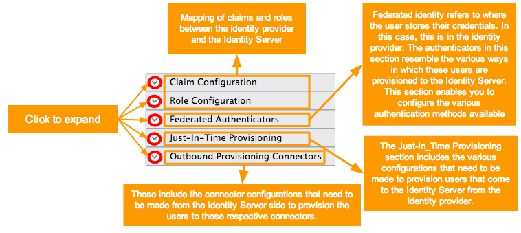

# Introduction

WSO2 Identity Server allows you to add identity providers (IdP) and specify various details that help you link the identity provider to the WSO2 Identity Server. To properly configure the IdPs, you must specify all information required to send the authentication requests and get a response back from the identity provider.

This guide walks you through adding and configuring identity providers based on your requirements.

!!! note
    Adding and configuring an IdP can be performed by administrators only.

## Add an identity provider

To add a new identity provider.

1. On WSO2 Identity Server [Management
    Console](../../setup/getting-started-with-the-management-console), go to **Main > Identity \> Identity Providers**

2. Click **Add**, and enter the details in the **Basic Information** section.  
    

    | Method      | Description                          | Sample Value                         |
    | ----------- | ------------------------------------ | ------------------------------------ |
    | Identity Provider Name       | A unique name used as the primary identifier of the IdP. | `FacebookIdP`
    | Display Name       | This is used to identify the identity provider. If this is left blank, the Identity Provider Name is used. | `Facebook`                       |
    | Description    | A description of the identity provider. | `This is the identity provider configuration for Facebook.`                       |
    | Federation Hub Identity Provider    | Select the Federation Hub Identity Provider check-box to indicate if this points to an identity provider acting as a federation hub. | Selected                        |
    | Home Realm Identifier    | This value is an identifier used when your application uses a federated IdP. If a user selects this IdP and sends an authentication request, the `fidp` query parameter will be populated with this value. (example: `fidp` = googleIdP) | `googleIdP`                         |
    | Choose IDP certificate type    | This is used to authenticate responses from the IdP. You can either **Upload IDP certificate** or use the **Use IDP JWKS endpoint**.       | Selected                        |
    | Identity Provider's JWKS Endpoint:    | If you have selected **Use IDP JWKS endpoint** in the above field, this field will appear. You need to add the JWKS endpoint URL in this field.        | Selected                        |
    | Identity Provider Public Certificate    | If you have selected **Upload IDP certificate** in the above field, this field will appear. You need to upload the public certificate of your IdP in this field.      | Selected                        |
    | Alias    | This is a value with an equivalent value specified in the identity provider we are configuring. This is required for authentication in some scenarios. | http://localhost:9443/oauth2/token                         |
    | Identity Provider's Issuer Name    | This is an optional property that can be used to define the issuer name of the Identity Provider if it is different from the Identity Provider Name. | http://is.wso2.com                        |

    ??? note "Create IdP certificate"

        To create the identity provider certificate, navigate to the ```<IS_HOME>/repository/resources/security/``` directory, open a terminal, and execute the following command:

            keytool -export -alias wso2carbon -file wso2.crt -keystore wso2carbon.jks -storepass wso2carbon
            
        See [Using Asymmetric Encryption](../../deploy/security/use-asymmetric-encryption.md) guide for more information about certificates.

    ??? note "Federation hub and the home realm identifier"
        A federation hub is a collection of multiple IdPs configured on WSO2 Identity Server.

        On the federation hub, each IdP is recognized by the **home realm identifier** of the IdP. This home realm identifier is configured when creating the IdP.

        The following diagrams illustrate the workflow of authentication with a federated hub.

         
                    
        On the application's login page, you can support local and federated authentication or just federated authentication. This can be done by setting the `proxy_mode` configuration in the `deployment.toml` file. Following are the modes available for configuration: 
        
        | `proxy_mode` name | Description   |
        |-------------------|---------------|
        | `smart`           | Allows both local and federated authentication |
        | `dumb`            | Allows only federated authentication. The home realm identifier must be configured to operate in this mode. If it is not configured, a separate screen should be displayed to get it from the user    |
        
        To configure the `proxy_mode`, open the `deployment.toml` file in the `<IS_HOME>/repository/conf` directory 
        and add the following configuration.
        ```               
        [authentication] 
        proxy_mode="smart" 
        ```       

    ??? note "Details about Alias"

        The **Alias** is used in the following authentication scenario.

        

        A SAML identity provider sends a SAML token to a web application for authentication. The SAML token has an audience restriction element that controls access and has a reference to the web application to access it. Authentication takes place by using this token. 
        Now, if the web application needs to access an API protected by OAuth 2.0, the same SAML token is sent to the token endpoint of the Identity Server. 
        The **Alias** value you configure in the Identity Server is associated with this token endpoint. This alias value must be added to the audience restriction element of the SAML token. When this SAML token is sent to the Identity Server, you obtain an access token used to access the API.

        So to configure this, you must add the SAML identity provider as an identity provider in the Identity Server using the instructions on this topic. When configuring this in the Identity Server, you must specify the token alias for this scenario to work. This indicates that any token from the SAML identity provider must have this alias value in the audience restriction element.

3. Click the expandables to check and update the available optional configurations.


    !!! info
        **Identity Provider Name** is the only required field. You can fill in the remaining details if applicable.

        For more information about the other configurations, see the following documentation. 
        
        - [Configure claims for an IdP](../identity-federation/claims-idp.md)
        - [Configure roles for an IdP](../identity-federation/roles-idp.md)
        - [Configure federated authenticators](../identity-federation/configure-ad-fs-as-a-federated-authenticator.md)
        - [Configure just-in-time provisioning](../identity-federation/jit-workflow.md)
        - [Configure outbound provisioning connectors](../identity-federation/outbound-provisioing-idp.md)

4. Click **Register** to add the Identity Provider.

## Configure a resident IdP

WSO2 Identity server can also act as an IdP, which provides identity for applications rather than mediating authentication requests between service providers and identity providers.

In such cases, the Identity Server is known as the **resident identity provider**.

<!-- !!! note
    The resident identity provider configuration helps service providers to send authentication or provisioning requests to WSO2 Identity Server via SAML, OpenID Connect, SCIM, or WS-Trust.

    For an example of how a resident identity provider is used to implement a security token service, see [Configuring WS-Trust Security Token Service](../../learn/configuring-ws-trust-security-token-service).
    
    The Resident identity provider configuration is a one-time configuration for a given tenant. It shows WSO2 Identity Server's metadata, e.g., endpoints. The resident identity provider configurations can be used to secure the WS-Trust endpoint with a security policy.
-->

To configure a resident identity provider:

1. On the WSO2 Identity Server Management Console, go to **Main \> Identity \> Identity Providers \> Resident**.

2. On the expanded **Resident Realm Configurations** tab, enter the required values as given below.
    

    <table>
    <thead>
    <tr class="header">
    <th>Field</th>
    <th>Description</th>
    <th>Sample Value</th>
    </tr>
    </thead>
    <tbody>
    <tr class="odd">
    <td><strong>Home Realm Identifier</strong></td>
    <td>This is the domain name of the identity provider. If you do not enter a value here, when an authentication request comes to WSO2 Identity Server, a user will be prompted to specify a domain. You can enter multiple identifiers as a comma-separated list.</td>
    <td><code>localhost</code></td>
    </tr>
    <tr class="even">
    <td><strong>Idle Session Time Out</strong></td>
    <td>This is the duration in minutes for which an SSO session can be idle for. The default value is <code>15</code> .</td>
    <td><code>15</code></td>
    </tr>
    <tr class="odd">
    <td><strong>Remember Me Period</strong></td>
    <td><div class="content-wrapper">
    <p>This is the duration in weeks for which WSO2 Identity Server should remember an SSO session given that you have selected the <strong>Remember Me</strong> option in the WSO2 Identity Server login screen.</p>
    <p>The default value is <code>2</code> weeks.</p>
    </div></td>
    <td><code>2</code></td>
    </tr>
    </tbody>
    </table>

3. Click **Update** to save the configurations.


### Configure inbound authentication

This section of the guide walks you through how to configure inbound authentication for your resident IdP using the following technologies:

- [SAML2 Web SSO Configuration](#saml2-configurations)
- [OAuth2/OpenID Connect Configuration](#oauth2openid-connect-configurations)

#### SAML2 configurations
1. To configure SAML2 configurations:
    1. Click **SAML2 Web SSO Configuration**.  
        

    2. Enter the required values and learn the fixed values as given below.

        | Field                           | Description                                                                                                                                                                             | Sample/Fixed Value                                                                                                      |
        |---------------------------------|-----------------------------------------------------------------------------------------------------------------------------------------------------------------------------------------|-------------------------------------------------------------------------------------------------------------------------|
        | **Identity Provider Entity ID** | This is for tenant identification. The users who are provisioned through this tenant can be identified using this ID.                                                                   | `localhost`                                                                      |
        | **Destination URLs**            | This defines the destination URL of the identity provider. This helps the service providers that connect to WSO2 Identity Server through a proxy server to locate WSO2 Identity Server. | `https://localhost:9443/samlsso`        |
        | **SSO URL**                     | This is the SAML SSO endpoint of the identity provider.                                                                                                                                 | `https://localhost:9443/samlsso`        |
        | **Logout Url**                  | This is the identity provider's endpoint that accepts SAML logout requests.                                                                                                            | `https://localhost:9443/samlsso`        |
        | **Artifact Resolution URL**     | This is the identity provider's endpoint that resolves SAML artifacts.                                                                                                                  | `https://localhost:9443/samlartresolve` |
        | **Metadata Validity Period**    | This is the duration for which the metadata will be valid.                                                                                                                          | `60`                                                                             |
        | **Enable metadata signing**     | This facilitates enabling or disabling metadata signing                                                                                                                                  | `false`                                                                          |

    3. Click **Update** to save the configurations.

#### OAuth2/OpenID Connect configurations
1. To configure OAuth2 or OIDC:
    1. Click **OAuth2/OpenID Connect Configuration**.  
        

    2. Enter the required values and learn the fixed values as given below.

        | Field                                        | Description                                                                                                                                                                                         | Sample/Fixed Value                                                                                                                     |
        |----------------------------------------------|-----------------------------------------------------------------------------------------------------------------------------------------------------------------------------------------------------|----------------------------------------------------------------------------------------------------------------------------------------|
        | **Identity Provider Entity ID**              | This is for tenant identification. The users who are provisioned through this tenant can be identified using this ID.                                                                               | `localhost`                                                                                         |
        | **Authorization Endpoint URL**               | This is the identity provider's OAuth2/OpenID Connect authorization endpoint URL.                                                                                                                   | `https://localhost:9443/oauth2/authorize`                      |
        | **Token Endpoint URL**                       | This is the identity provider's token endpoint URL.                                                                                                                                                 | `https://localhost:9443/oauth2/token`                          |
        | **Token Revocation Endpoint URL**            | This is the URL of the endpoint at which access tokens and refresh tokens are revoked.                                                                                                               | `https://localhost:9443/oauth2/revoke`                         |
        | **Token Introspection Endpoint URL**         | This is the endpoint URL at which OAuth tokens are validated.                                                                                                                                | `https://localhost:9443/oauth2/introspect`                     |
        | **User Info Endpoint URL**                   | This is the URL of the endpoint through which user information can be retrieved. The information is gathered by passing an access token.                                                               | `https://localhost:9443/oauth2/userinfo`                       |
        | **Session iFrame Endpoint URL**              | This is the URL of the endpoint that provides an iframe to synchronize the session states between the client and the identity provider.                                                                | `https://localhost:9443/oidc/checksession`                     |
        | **Logout Endpoint URL**                      | This is the identity provider's endpoint that accepts SAML logout requests.                                                                                                                         | `https://localhost:9443/oidc/logout`                           |
        | **Web finger Endpoint URL**                  | This is the URL of the OpenID Connect token discovery endpoint from which WSO2 Identity Server's metadata are retrieved.                                                                        | `https://localhost:9443/.well-known/webfinger`                 |
        | **Discovery Endpoint URL**                   | This is the endpoint URL used to discover the end user's OpenID provider and obtain the information required to interact with the OpenID provider, e.g., OAuth 2 endpoint locations. | `https://localhost:9443/oauth2/oidcdiscovery`                  |
        | **Dynamic Client Registration Endpoint URL** | This is the URL of the endpoint at which OpenID Connect dynamic client registration takes place.                                                                                                   | `https://localhost:9443/api/identity/oauth2/dcr/v1.1/register` |
        | **JWKS Endpoint URL**                        | This is the URL of the endpoint that returns WSO2 Identity Server's public key set in JSON Web Key Set (JWKS) format.                                                                               | `https://localhost:9443/oauth2/jwks`                           |

    3. Click **Update** to save the configurations.

    <!-- 3. To secure the WS-Trust endpoint with a security policy, click
        **Security Token Service Configuration** section.  
        
        For more information on security token service (STS), see
        [Configuring WS-Trust Security Token
        Service](../../learn/configuring-ws-trust-security-token-service). -->

### View inbound provisioning configurations

To view the inbound provisioning configs, expand **Inbound Provisioning Configuration** section.


| Field                   | Description                                                                                                                                                    | Sample Value                                                                                              |
|-------------------------|----------------------------------------------------------------------------------------------------------------------------------------------------------------|-----------------------------------------------------------------------------------------------------------|
| **SCIM User Endpoint**  | This is the identity provider's endpoint for SCIM user operations, e.g., creating and managing users.                                                          | `https://localhost:9443/wso2/scim/Users`  |
| **SCIM Group Endpoint** | This is the identity provider's endpoint for the SCIM user role operations, e.g., creating user roles, assigning user roles to users, and managing user roles. | `https://localhost:9443/wso2/scim/Groups` |

??? note "Modify the hostname"
    To modify the hostname of the URLs mentioned above, add the following configuration to the `deployment.toml` file in the `<IS_HOME>/repository/conf` directory.

        ``` xml
        [server]
        hostname = "localhost"
        ```
    
        ``` xml
        [sts.endpoint] 
        idp="https://localhost:9443/samlsso"
        ```
    
    To ensure the client application communicates with the correct identity provider, WSO2 Identity Server compares the destination value in the SAML request with the URL in the above configuration.

### Identity Server as a trusted IdP

To configure WSO2 Identity Server as a trusted identity provider in a service provider application, you must perform the following tasks.
1. Export the SAML2 metadata of the resident identity provider.
2. Import the metadata to the relevant service provider.

!!! tip
    Use **one** of the following approaches to do this.

    -   Start the server and download the SAML2 metadata by accessing this
        URL: <https://localhost:9443/identity/metadata/saml2>.
    -   **Alternatively**, access the management console and follow the
        steps below to download the metadata.

1. Expand the **Inbound Authentication Configuration > SAML2 Web SSO Configuration**.
2. Click **Download SAML Metadata**, to download the `metadata.xml` file.
3. Import the `metadata.xml` file to the relevant service provider.

    <!--  \ -->

## Manage an identity provider

This section provides instructions on how to manage identity providers
once they are created.

### View an identity provider

To view the list of identity providers added to the WSO2 Identity Server:

1. Sign in to the Management Console, go to **Main > Identity > Identity Providers** section.
2. Click **List** to get the list of IdPs created.
    

### Edit identity provider configs

To edit an identity provider's details:

1. On the Management Console, go to **Main > Identity > Identity Providers** section.
2. Click **List**, select the identity provider you want to edit, and click on the corresponding **Edit** link.  
    
4. You will be redirected to the edit screen, where you can modify the details you configured for the identity provider.

### Delete an identity providers

To delete an identity provider:

1. On the Management Console, go to **Main > Identity > Identity Providers** section.
2. Click **List**, select the identity provider you want to delete, and click on the corresponding **Delete** link.  
    
4. Click **Yes** to confirm your action.

### Disable an identity provider

To disable an identity provider:

1. On the Management Console, go to **Main > Identity > Identity Providers** section.
2. Click **List**, select the identity provider you want to disable, and click on the corresponding **Disable** link.

    !!! note
        If you want to enable a disabled IdP, select the disabled identity provider you want to enable and click on the corresponding **Enable** link.


!!! info "Related Topics"

    See the following topics for information on configuring service
    providers using different specifications.

    -   See [Identity Federation](../identity-federation/basic-overview.md) for information on configuring federated authenticators.

    See the following topics to configure different applications as service providers in Identity Server.

    -   [Configuring Shibboleth IdP as a Trusted Identity Provider](../identity-federation/configure-shibboleth-idp-as-a-trusted-identity-provider.md)
    -   [Logging in to Salesforce with Facebook](../login/log-into-salesforce-using-fb.md)
    -   [Logging in to Salesforce with Integrated Windows Authentication](../login/log-into-salesforce-using-iwa.md)
    -   [Logging in to your application via Identity Server using Facebook Credentials](../identity-federation/facebook.md)