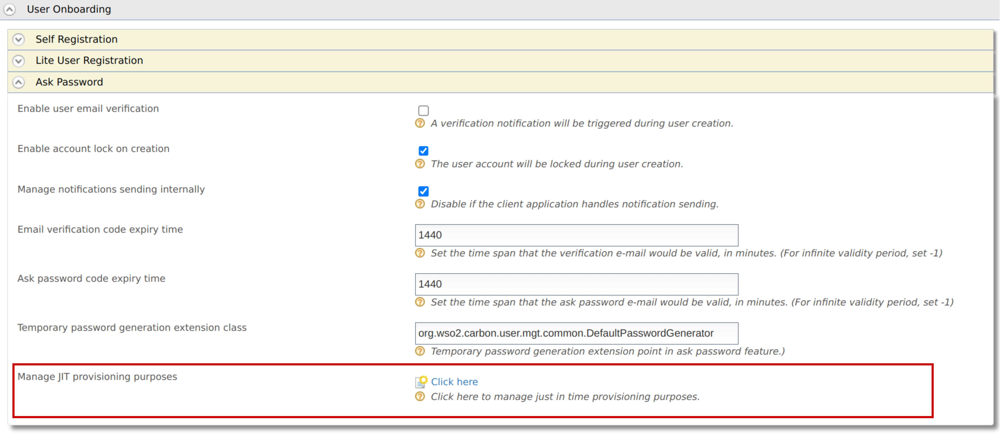

# Configuring Just-In-Time Provisioning Consent Purposes

The provisioning framework of WSO2 Identity Server supports just-in-time (JIT) provisioning, which allows you to provision users to the identity
server at the time of federated authentication. If necessary, you can
also configure purposes, and appropriate user attributes to obtain the user consent at the time of JIT provisioning, depending on your requirement.  

For example, if you want to obtain a user's phone number and email
address for account recovery, You have to get the user's
consent to collect those attributes at the time of JIT provisioning.

To configure JIT provisioning consent purposes and appropriate user attributes:

1. On WSO2 Identity Server management console, go to **Main > Identity > Resident**

2. Expand **User Onboarding > Ask Password** section.

3. Click on the link next to **Manage JIT provisioning purposes** to display the **Consent Purposes** screen.
    

4. Click **Add New Purpose**.
5. Enter values for **Purpose** and **Description**, and then click **Add PII Category** to add the user attributes for the purpose.

    !!! tip

        You can add one or more user attributes to obtain consent for a
        particular purpose.

    

    !!! info "Add mandatory attributes"
        If it is mandatory to obtain consent for a specific user attribute, select the **Mandatory** check box corresponding to that attribute.

6. Click **Finish**.

    !!! info "Add more purposes"
        Depending on your requirement, you can either add another new purpose and related user attributes or click **Finish** if you have added all the necessary purposes.

??? tip "Tips on JIT consent purposes"

    -   When you configure purposes for JIT provisioning, the attributes that you specify for a specific purpose are the only attributes for which users are requested to provide consent.
    -   If mandatory user attributes are set as **Mandatory**, JIT provisioning will happen if the user consented to the attribute.
    -   If a user does not provide consent for any of the non-mandatory attributes, WSO2 Identity Server will not store those attributes.# Just-in-Time User Inbound Provisioning

This page guides you through configuring [Just-in-Time (JIT) provisioning](../../../references/concepts/jit-provisioning) for users from external identity providers into WSO2 Identity Server during federated authentication.

-----

## Prerequisites
You need to [add and configure an identity provider](../identity-federation/add-idp.md) on the Identity Server.

## Enable JIT provisioning

To enable JIT provisioning for an IdP:

1. On WSO2 Identity Server Management Console, go to **Main > Identity > Identity Providers** section.
2. Click **List**, select the identity provider you want to enable JIT provisioning, and click on the corresponding **Edit** link.
3. Expand the **Just-In-Time Provisioning** section and select the JIT provisioning options based on your requirement.

    

4. Select **Always provision to User Store Domain**, and select a required user store domain from the list of available user store domains.

    !!! tip
        The default user store domain you see is the **PRIMARY** user store provided with WSO2 Identity Server.

        If you want to provision users to multiple user stores depending on the user name specified at the time of provisioning, select **As in username** from the dropdown.
                    
        If you select this option and do not specify the user name
        appropriately, the relevant user is provisioned to the
        PRIMARY user store domain.  
        For example,
                    
        -   If you specify the username as `user`, the user is provisioned to the domain.
        -   If you specify the username as `user1`, the user is provisioned to the PRIMARY user store domain.

        Suppose you want to select a user store domain other than the default primary user store domain. In that case, you need to [configure a userstore](../../deploy/configure-the-primary-user-store.md) of your preference for it to appear in the list for you to select.

5. Select the provisioning options depending on how you want to prompt users for relevant credentials at the time of JIT provisioning. The provisioning options are as follows:

    - Prompt for username, password, and consent
    - Prompt for password and consent
    - Prompt for consent
    - Provision silently

    !!! note
        By default, **Provision silently** will be selected. You can change it as you wish.

6. Click **Update** to save your configurations.

!!! note
    Provisioning claims should be compatible with the policies defined in the userstore manager configuration. For example
    user name should match `UsernameJavaRegEx` and `RolenameJavaScriptRegEx` in the [userstore configuration](../../../deploy/configure-user-stores/).

## Disable JIT Provisioning

To disable JIT provisioning for an IdP:

!!! note
    JIT provisioning is disabled by default. If you have enabled JIT provisioning for the IdP, use these instructions to disable it.

1. On WSO2 Identity Server Management Console, go to **Main > Identity > Identity Providers** section.
2. Click **List**, select the identity provider you want to enable JIT provisioning, and click on the corresponding **Edit** link.
3. Expand the **Just-In-Time Provisioning** section and select the JIT provisioning options based on your requirement.  
4. Select **No Provisioning** and click **Update** to disable JIT provisioning.

!!! info "Related topics"

    - [JIT Provisioning Architecture](../../references/architecture/provisioning-architecture.md/#jit-provisioning).

    - [Introduction to Just-in-Time Provisioning](../../../references/concepts/jit-provisioning)
    
    - [Configuring Just-In-Time Provisioning Consent Purposes](../identity-federation/jit-consent-purposes.md).

    - [Customizing Just-In-Time Provisioning User Interfaces](../identity-federation/jit-user-interfaces.md).

<!-- [Guide: Outbound Just-in-Time Provisioning](TODO:link-to-guide) -->

## Enhanced Feature (Optional)

Add the following configuration to deployment.toml in the `/conf` directory.

```xml
[authentication.jit_provisioning]
enable_enhanced_feature = "true"
```

With the JIT provisioned enhanced feature, the following capabilities will be available.

- A Federated unique user id will be set as the username of the JIT provisioned user.
- Second-factor authenticators (Ex:- TOTP, Email OTP) will be able to configure for federated users when JIT provisioning is enabled
- When an IDP is deleted, the Identity Server will delete all provisioned users from that IDP.
- Editing JIT-provisioned user’s attributes will not be allowed.
- Ability to lock JIT provisioned user accounts based on social identity.


## Customize JIT Provisioning User Interfaces

You can customize the default user interface that is displayed to prompt for credentials at the time of just-in-time provisioning.

To customize the user interfaces depending on your requirement, add the following configuration in the `deployment.toml` file.

``` java
[authentication.jit_provisioning]
username_provisioning_url= "/accountrecoveryendpoint/register.do"
password_provisioning_url= "/accountrecoveryendpoint/signup.do"
```

- Update `username_provisioning_url` if you have selected **Prompt for username, password and consent** as the provisioning option.

- Update `password_provisioning_url` if you have selected **Prompt for password and consent** or **Prompt for consent** as the provisioning option.

!!! note
    Learn more about [configuring the provisioning methods](../identity-federation/jit-workflow.md).