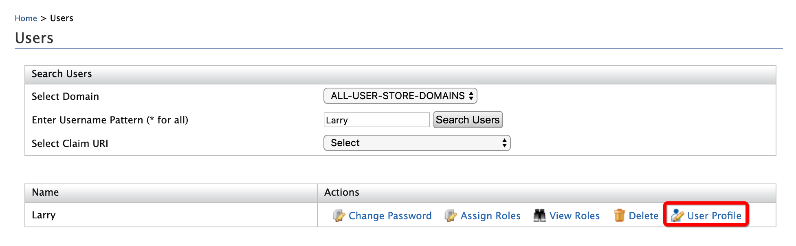

# Admin-initiated Account Locking

Account locking and account disabling are security features in WSO2 Identity Server (IS) that can be used to prevent users from logging in to their account and from authenticating themselves using their WSO2 IS account. The account locking feature is used to **temporarily** block a user from logging in, for example, in instances where there have been many consecutive, unsuccessful login attempts.

!!! tip
	 If a user is assigned the **Internal/system** role, the user can bypass account locking even if the user exceeds the specified number of **Maximum failed login attempts**.

## Enable account locking

To enable account locking from the Management Console:

1. 	Ensure that the identity listener with the
   `              priority=50             ` is set to **false** and
   the identity listener with the `              priority=95             ` is set to
   **true**  by adding the following configuration to the
   `              <IS_HOME>/repository/conf/deployment.toml             ` file.  

	!!! note
		If you haven't changed these configurations previously, you can skip this step since these are the default values. 

		``` xml
		[event.default_listener.identity_mgt]
		priority= "50"
		enable = false
		[event.default_listener.governance_identity_mgt]
		priority= "95"
		enable = true
		```


2.  <a name="lockingaspecificuseraccount"></a>Start the Identity Server and log into the management console (`https://<IS_HOST>:<PORT>/carbon`) using
   your tenant credentials.
      
3.  Click **Main** > **Identity** > **Identity Providers** > **Resident**.
4.  Expand the **Login Attempts Security** tab.
5.  Expand the **Account Lock** tab and select the **Lock user accounts** checkbox. Click **Update** to save changes.  
	
	 

	!!! tip
		If a user is assigned the **Internal/system** role, the user can
		bypass account locking even if the user exceeds the specified number
		of **Maximum failed login attempts**.
   
		!!! note
			 WSO2 Identity Server has the **Internal/ki8system** role configured by
			default. However, generally a new user is not assigned the
			**Internal/system** role by default. Required roles can be assigned
			to a user depending on the set of permission a user needs to have.
			For more information on roles and permission, see [Configuring Roles
			and
			Permissions]({{base_path}}/guides/identity-lifecycles/manage-roles-overview/)

			 Although the **Internal/system** role is configured by default in
			WSO2 Identity Server, you can delete the role if necessary. To allow
			users with the **Internal/system** role to bypass account locking,
			you need to ensure that the role exists in WSO2 Identity Server.
         
         
6.  To enable account locking for other tenants, log out and repeat the
   steps given above from [step 2](#lockingaspecificuseraccount)
   onwards.
    
## Enable claims

1.  Navigate to **Main** > **Identity** > **Claims** > **List** and select the `http://wso2.org/claims` claim dialect.  
    For more information about claims, see [Configure Claims]({{base_path}}/guides/dialects/configure-claims/).
2.  Select the **Account Locked** claim and click **Edit**.  
     
3.  Select the **Supported by Default** check box and click **Update**.

    This is done to make the "Account Locked" status appear in the
    user's profile.  
    
   
4.  Navigate to **Main** > **Identity** > **Users and Roles** > **List** > **Users** and click on **User Profile** of the user you want to lock.
5.  If it is the first time this particular account is being locked, a
    text box will appear in front of the **Account Locked** field as
    seen below.  
    To lock the account, type true in the text box and click **Update**.

    

    !!! note
        If it is not the first time you are locking this user account, there
      will be a check box instead of the text box (as shown above) in front of
      the **Account Locked** field. Select the check box to lock the account
      or deselect it to unlock the account and click **Update**.

## Configure the email sender

[Enable the email sending configurations]({{base_path}}/deploy/configure-email-sending) of the WSO2 Identity Server.

## Try it out

You can lock user accounts using the Management Console or the SCIM2 APIs.

### Use the Management Console

1. Create a user named Alex and assign login permissions.
2.	To lock Alex's user account:

   1. Click **User Profile** option of Alex.

		<!---->

	2.	Enter an email address to which Alex's account locking emails will be sent and select the **User Locked** check box.

		<!---->

	3. 	Click **Update**. 

	4.	An email that informs about the account locking is sent to the given email address.		

		<!---->

	5.	Access the WSO2 Identity Server **My Account** at `https://localhost:9443/myaccount`.

		<!---->	

	6.	Try logging in with Alex's credentials. Note that an error message appears.

	7.	Wait for 15 minutes and try to log in again. The WSO2 Identity Server **My Account** home screen appears.  

3. To unlock Alex's user account:

	1.	Click **User Profile** option of Alex.

	2.	Unselect the **User Locked** check box.

	3.	Click **Update**

	4.	An email that informs about the account unlocking is sent to the given email address.

		<!---->

	5.	Try logging in to the WSO2 Identity Server **My Account** with Alex's credentials. The WSO2 Identity Server **My Account** home screen appears.

### Use the SCIM2 Rest API

1. In order to update the lock status of a user account, we need to obtain the SCIM ID of that particular user. Therefore, we first call the GET users API to get the user details.

    !!! abstract ""
        **Request**
        ```
        curl -v -k --user <username>:<password> 'https://<HOST>:<PORT>/scim2/Users'
        ```
        ---
        **Sample**
        ```
        curl -v -k --user admin:admin 'https://localhost:9443/scim2/Users'
        ```

	Alternatively, you can also obtain it from the management console. 

	1.	Navigate to **Main** > **Identity** > **Claims** > **List**. 

	2.	Select `http://wso2.org/claims`. 

	3.	Edit **User ID**. 

	4.	Select **Supported by Default**. 

	5.	Click **Update**. 

	6.	Navigate to **Main** > **Identity** > **Users and Roles** > **List** and select **Users**. 

	7.	Click **User Profile** adjecent to the user that needs to be enabled or disabled. The **User ID** value will be mentioned by default now. 

2. After obtaining the SCIM ID of the user, invoke below curl command with the `accountLock` attribute set to `true` or `false` to lock or unlock the user account respectively.

	```curl 
	curl -v -k --user admin:admin -X PATCH -d '{"schemas":["urn:ietf:params:scim:api:messages:2.0:PatchOp"],"Operations":[{"op":"replace","value":{"EnterpriseUser":{"accountLock":"true"}}'}}}]}' --header "Content-Type:application/json" https://localhost:9443/scim2/Users/<SCIM-ID>
	```

After setting the lock status to `true` for a particular user, the server should reject any authentication attempts done by that account.

<!--

## Lock user accounts using SOAP

An administrative user (with the permission level /permission/admin/configure/security/usermgt/users ) can lock a user account using the `RemoteUserStoreManagerService`. You can use the `setUserClaimValues` operation to achieve this. The following request is a sample SOAP request that can be sent to the `RemoteUserStoreManagerService` to lock a user account.

```curl 
<soapenv:Envelope xmlns:soapenv="http://schemas.xmlsoap.org/soap/envelope/" xmlns:ser="http://service.ws.um.carbon.wso2.org" xmlns:xsd="http://common.mgt.user.carbon.wso2.org/xsd">
   <soapenv:Header/>
   <soapenv:Body>
      <ser:setUserClaimValues>
         <!--Optional:--\>
         <ser:userName>test</ser:userName>
         <!--Zero or more repetitions:--\>
         <ser:claims>
            <!--Optional:--\>
            <xsd:claimURI>http://wso2.org/claims/identity/accountLocked</xsd:claimURI>
            <!--Optional:--\>
            <xsd:value>true</xsd:value>
         </ser:claims>
         <!--Optional:--\>
         <ser:profileName>default</ser:profileName>
      </ser:setUserClaimValues>
   </soapenv:Body>
</soapenv:Envelope>
```

## Unlock user accounts using SOAP

Similarly, you can use the `setUserClaimValues` operation, `RemoteUserStoreManagerService` AdminService to unlock a locked user account. The following request is a sample SOAP request that can be sent to the `RemoteUserStoreManagerService` to unlock a user account.

```curl
<soapenv:Envelope xmlns:soapenv="http://schemas.xmlsoap.org/soap/envelope/" xmlns:ser="http://service.ws.um.carbon.wso2.org" xmlns:xsd="http://common.mgt.user.carbon.wso2.org/xsd">
   <soapenv:Header/>
   <soapenv:Body>
      <ser:setUserClaimValues>
         <!--Optional:--\>
         <ser:userName>test</ser:userName>
         <!--Zero or more repetitions:--\>
         <ser:claims>
            <!--Optional:--\>
            <xsd:claimURI>http://wso2.org/claims/identity/accountLocked</xsd:claimURI>
            <!--Optional:--\>
            <xsd:value>false</xsd:value>
         </ser:claims>
         <!--Optional:--\>
         <ser:profileName>default</ser:profileName>
      </ser:setUserClaimValues>
   </soapenv:Body>
</soapenv:Envelope>
```
-->

!!! info "Related topics"
	[Guide: Configure Email Notifications for Account Locking]({{base_path}}/guides/tenants/email-account-locking)
    <!--- [Concept: Account Locking](TODO:link-to-concept)-->
    <!-- [Guide: Configure Email Notifications](TODO:link-to-guide)-->
