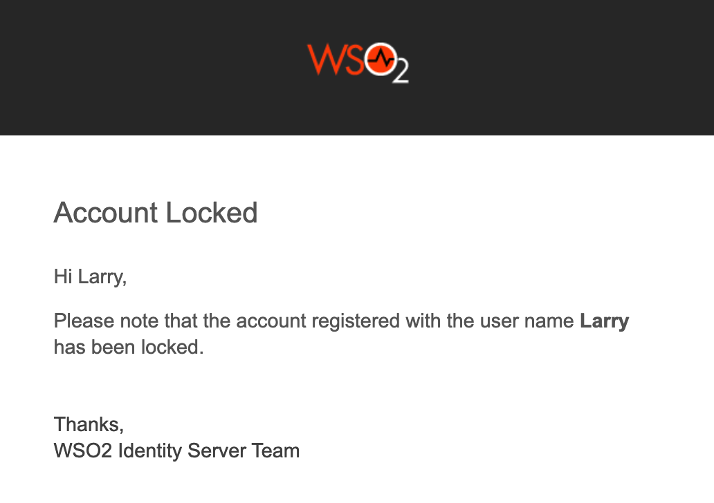

# Lock accounts by failed login attempts

WSO2 Identity Server can be configured to lock a user account when a
number of consecutive failed login attempts are exceeded. First, you
need to configure WSO2 Identity Server for user account locking and
disabling. The following section explain how to configure this.

If you want to configure different settings for another tenant, log out
and follow the same steps to configure these properties for the other
tenants.

!!! note
    - A user account locked by failed login attempts can be unlocked 
    by setting the <strong>Account Unlock Time</strong> period.
    - If the lock time is set to 0, the account has to be unlocked by an admin
    user. For more information about this, see [Lock and Unlock User Accounts]({{base_path}}/guides/identity-lifecycles/lock-account/).
		- If a user is assigned the **Internal/system** role, the user can
		bypass account locking even if the user exceeds the specified number
		of **Maximum failed login attempts**.

## Enable account locking

1. 	Ensure that the identity listener with the
   `              priority=50             ` is set to **false** and
   the identity listener with the `              priority=95             ` is set to
   **true**  by adding the following configuration to the
   `              <IS_HOME>/repository/conf/deployment.toml             ` file.  

	!!! note
		If you haven't changed these configurations previously, you can skip this step since these are the default values. 

		``` xml
		[event.default_listener.identity_mgt]
		priority= "50"
		enable = false
		[event.default_listener.governance_identity_mgt]
		priority= "95"
		enable = true
		```


2.  <a name="lockingaspecificuseraccount"></a>Start the Identity Server and log into the management console (`https://<IS_HOST>:<PORT>/carbon`) using
   your tenant credentials.
      
3.  Click **Main** > **Identity** > **Identity Providers** > **Resident**.
4.  Expand the **Login Attempts Security** tab.
5.  Expand the **Account Lock** tab and select the **Lock user accounts** checkbox. Click **Update** to save changes.  
	
	 

	!!! tip
		If a user is assigned the **Internal/system** role, the user can
		bypass account locking even if the user exceeds the specified number
		of **Maximum failed login attempts**.
   
		!!! note
			WSO2 Identity Server has the **Internal/ki8system** role configured by
			default. However, generally a new user is not assigned the
			**Internal/system** role by default. Required roles can be assigned
			to a user depending on the set of permission a user needs to have.
			For more information on roles and permission, see [Configuring Roles
			and
			Permissions]({{base_path}}/guides/identity-lifecycles/manage-roles-overview/)

			Although the **Internal/system** role is configured by default in
			WSO2 Identity Server, you can delete the role if necessary. To allow
			users with the **Internal/system** role to bypass account locking,
			you need to ensure that the role exists in WSO2 Identity Server.
         
         
6.  To enable account locking for other tenants, log out and repeat the
   steps given above from [step 2](#lockingaspecificuseraccount)
   onwards.

The following table describes the configuration properties and
descriptions you need to configure:

<table>
<thead>
<tr class="header">
<th><p>Configuration</p></th>
<th><p>Description</p></th>
</tr>
</thead>
<tbody>
<tr class="odd">
<td><p>Maximum Failed Login Attempts</p></td>
<td>
 <div class="content-wrapper">
 <p>
   This indicates the number of consecutive attempts that a user can try to log in without the account getting locked. If the value you specify is 2, the account gets locked if the login attempt fails twice.</p>
<div class="admonition tip">
<p class="admonition-title">Tip</p>
Add the following configuration to the <code> &lt;IS_HOME&gt;/repository/conf/deployment.toml </code> file to configure the <strong>Maximum Failed Login Attempts</strong> property by default for all the tenants at tenant creation.
<div class="code panel pdl" style="border-width: 1px;">
    <div class="codeContent panelContent pdl">
    <pre class="html/xml" data-syntaxhighlighter-params="brush: html/xml; gutter: false; theme: Confluence"
    data-theme="Confluence" style="brush: html/xml; gutter: false; theme: Confluence"><code>[identity_mgt.account_locking]<br>allowed_failed_attempts=5</code></pre>
    </div>
  </div>
 </div>
 </div>
</td>
<tr class="even">
<td><p>Lock Timeout Increment Factor</p></td>
<td><div class="content-wrapper">
<p>This indicates how much the account unlock timeout is incremented by after each failed login attempt. For example, according to the values configured in the above screen, when a user exceeds the specified limit of 4 <strong>Maximum Failed Login Attempts</strong>, the account is locked for 10 minutes. This account unlock timeout is calculated as follows.</p>
<p>Account unlock timeout = Configured <strong>Account Unlock Time</strong> * (<strong>Lock Timeout Increment Factor</strong> ^ failed login attempt cycles)</p>
<p>i.e.,10 minutes = 5 * ( 2 ^ 1 )</p>
<div class="admonition tip">
<p class="admonition-title">Tip</p>
Add the following configuration to the <code> &lt;IS_HOME&gt;/repository/conf/deployment.toml </code> file to configure the <strong>Lock Timeout Increment Factor</strong> property by default for all the tenants at tenant creation.
<div class="code panel pdl" style="border-width: 1px;">
    <div class="codeContent panelContent pdl">
    <pre class="html/xml" data-syntaxhighlighter-params="brush: html/xml; gutter: false; theme: Confluence" 
    data-theme="Confluence" style="brush: html/xml; gutter: false; theme: Confluence"><code>[identity_mgt.account_locking]<br>auto_unlock_time_increment_ratio=2</code></pre>
    </div></div>
    </div>
</div>
</div>
<p>If the user attempts to log in with invalid credentials again after the wait time has elapsed and the account is unlocked, the number of login attempt cycles is now 2 and the wait time is 20 minutes.</p>
</div></td>
</tr>
<tr class="odd">
<td><p>Account Unlock Time</p></td>
<td>
  <div class="content-wrapper">
    <p>The time specified here is in minutes. According to the values in the screenshot above, the account is locked for 5 minutes after the user's second failed attempt and authentication can be attempted once this time has passed.</p>
<div class="admonition tip">
<p class="admonition-title">Tip</p>
Add the following configuration to the <code> &lt;IS_HOME&gt;/repository/conf/deployment.toml </code> file to 
configure the <strong>Account Unlock Time</strong> property by default for all the tenants at tenant creation. 
<div class="code panel pdl" style="border-width: 1px;">
    <div class="codeContent panelContent pdl">
    <pre class="html/xml" data-syntaxhighlighter-params="brush: html/xml; gutter: false; theme: Confluence" 
    data-theme="Confluence" style="brush: html/xml; gutter: false; theme: Confluence"><code>[identity_mgt.account_locking]<br>auto_unlock_after=5</code></pre>
    </div>
  </div>
 </div>
 </div>
</td>
</tr>
<tr class="even">
<td><p>Account Lock Enabled</p></td>
<td>
<div class="content-wrapper">
<p>This enables locking the account when authentication fails.</p>
<div class="admonition tip">
<p class="admonition-title">Tip</p>
Add the following configuration to the <code> &lt;IS_HOME&gt;/repository/conf/deployment.toml </code> file to <strong>Enable</strong> Account lock on failed login by default for all the tenants at tenant creation.
<div class="code panel pdl" style="border-width: 1px;">
    <div class="codeContent panelContent pdl">
    <pre class="html/xml" data-syntaxhighlighter-params="brush: html/xml; gutter: false; theme: Confluence"
    data-theme="Confluence" style="brush: html/xml; gutter: false; theme: Confluence"><code>[identity_mgt.account_locking]<br>enable_account_locking=true</code></pre>
    </div>
  </div>
 </div>
</div>
</td>
</tr>
</tbody>
</table>

## Configure the email sender

[Enable the email sending configurations]({{base_path}}/deploy/configure-email-sending) of the WSO2 Identity Server.

## Try it out
To mimic account locking:

1.	Access the WSO2 Identity Server My Account at `https://localhost:9443/myaccount/`.  

    

2.	To mimic three consecutive erroneous login attempts, log in with Alex's user name and the following as passwords sequentially:

    -	`test123`
    -	`test234`
    -	`test345`

3.	An email that informs about the account locking is sent to the given email address.		

      

4.	Wait for 15 minutes and try to log in again with the correct credentials. The WSO2 Identity Server User Portal home screen appears.  

!!! info "Related topics"
    <!---   [Guides: Configure SMS OTP for 2-Factor Authentication]({{base_path}}/guides/mfa/2fa-sms-otp/)-->
    -   [Guides: Customize Automated Emails]({{base_path}}/guides/tenants/customize-automated-mails)
    -   [Guides: Lock and Unlock User Accounts]({{base_path}}/guides/identity-lifecycles/lock-account)